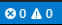

# Contributing Guide

Thank you for your interest in the OWASP Cheat Sheet Series! This guide covers **how to contribute** including the process, project rules, and policies. For guidance on **how to write good cheat sheet content**, see the [Cheat Sheet Writing Guide](GUIDELINE.md).

When contributing:

- Follow our [Code of Conduct](CODE_OF_CONDUCT.md).
- Follow our restrictions on the [use of AI](#use-of-ai) for all issues, pull requests, comments and discussions.

## Types of Contributions

### Minor Fixes

For typos, broken links, or small corrections to existing cheat sheets, a simple pull request is all that's needed. No issue required.

### Updating an Existing Cheat Sheet

1. [Create a new issue](https://github.com/OWASP/CheatSheetSeries/issues/new/choose) using the **update_cheatsheet_proposal** template.
2. Wait for the issue to be discussed and approved.
3. Fork and clone this repository.
4. Make your changes to the target cheat sheet.
5. Submit your [Pull Request](https://help.github.com/articles/creating-a-pull-request/).

### Creating a New Cheat Sheet

1. [Create a new issue](https://github.com/OWASP/CheatSheetSeries/issues/new/choose) using the **new_cheatsheet_proposal** template.
2. Wait for the issue to be discussed and approved.
3. Fork and clone this repository.
4. Create your cheat sheet using the [template](templates/New_CheatSheet.md). See the [Cheat Sheet Writing Guide](GUIDELINE.md) for help with content and structure.
5. Submit your [Pull Request](https://help.github.com/articles/creating-a-pull-request/).

### Important Notes

- :heavy_exclamation_mark: Focus on updating a **single file** in a Pull Request to make the review process simpler for the core team.
- :warning: Pull Requests marked as **WAITING_UPDATE** that do not receive any updates from the author in one month will be closed.
- :warning: If the assignees of an issue do not provide a Pull Request within one month then the issue will go back to the **HELP_WANTED** state and assignees will be removed.
- Verify that the CI checks applied on your Pull Request pass. If you believe they're failing due to something that's not your fault (such as another untouched file), add a comment in the Pull Request.

## Style Guide

### Markdown

- Use the markdown syntax described in this [guide](https://daringfireball.net/projects/markdown/syntax), using python-markdown so check if what you need is [supported](https://python-markdown.github.io/#support).
- Use `**bold**` syntax for **bold** text.
- Lists and nested lists should use `-` strictly.
- Avoid the use of HTML in the cheat sheets (stick to pure Markdown).
- Quotes from other articles should use quote syntax: `> Quote here`
- If you use `{{` or `}}` pattern in code fencing then add a space between both curly braces (ex: `{ {`).
- Cheat Sheet filenames should only contain letters, numbers, hyphens and underscores.
- Store all assets in the **assets** folder and use the following syntax:
    - `` for images (which should be in the PNG format).
    - `[ALTERNATE_NAME](../assets/ASSET_NAME.EXT)` for other types of files.
- Use this [site](https://www.tablesgenerator.com/markdown_tables) for generation of tables.
- Links should be inline with a useful description, such as `[Description](https://example.org)`.
    - Always use HTTPS links where possible
- Code snippets should be short and should be appropriately marked to provide syntax highlighting:

```md
    ```php
    <?php
    echo "Example code";
    ```
```

### Content

The intended audience of the cheat sheets is developers, _not_ security experts. As such, do not assume that the person reading the cheat sheet has a strong understanding of security topics. In depth or academic discussions are generally not appropriate in cheat sheets, and should be linked to as external references where appropriate.

The purpose of the cheat sheets is to provide **useful, practical advice** that can be followed by developers. It is much better to give _good_ practices that can actually be followed than _best_ practices that are completely impractical.

**Prefer architectural guidance over code samples.** Cheat sheets should focus on architectural patterns, design principles, and security decisions rather than language-specific code. Code samples require ongoing maintenance across languages and frameworks, and snippets taken out of context are often not fully secure. Describing _what_ to do and _why_ is more durable and broadly useful than showing _how_ in a single language. When code examples are included, they should be short, clearly illustrative, and not presented as production-ready implementations.

When submitting changes in a PR, consider the following areas:

- The content should be useful to developers.
- The content should be factual and correct.
- Statements should be supported by authoritative references where possible.
- Recommendations should be feasible for the majority of developers to implement.
- Guidance should be architectural and language-agnostic where possible, with code samples used sparingly to illustrate a point.

For detailed guidance on writing effective cheat sheet content, including structure and approach, see the [Cheat Sheet Writing Guide](GUIDELINE.md).

### Structure

- Start with a H1 of the cheat sheet name
- The first section of the cheat sheet should be an introduction which briefly sums up the contents, and provides a short list of key bullet points.
- The table of contents will be automatically generated on the site, so does not need to be added as a section.
- Headings should have a blank line after them.

### Language

- Use US English.
    - Spell check before submitting a PR.
- Try and keep the language relatively simple to make it easier for non-native speakers.
- Define any non-ubiquitous acronyms when they are first used.
    - This is not necessary for extremely common acronyms such as "HTTP" or "URL".

## How to Set Up Your Contributor Environment

Follow these steps:

1. Install [Visual Studio Code (VSCode)](https://code.visualstudio.com/).
2. Install the [vscode-markdownlint plugin](https://github.com/DavidAnson/vscode-markdownlint#install).
3. Open the file [Project.code-workspace](Project.code-workspace) from VSCode via the menu `File > Open Workspace...`.
4. You are ready to contribute :+1:

:alarm_clock: What to verify before pushing the updates?

1. Ensure that the markdown files you have created or modified do not have any warnings/errors raised by the linter. You can see it in this bottom bar when the markdown file is opened in VSCode:



2. Ensure that the markdown file you have created/modified do not have any dead links. You can verify that by using this [plugin](https://www.npmjs.com/package/markdown-link-check). If you cannot use this plugin then, verify that all the links you have changed or added are valid before pushing.
    1. Install [NodeJS](https://nodejs.org/en/download/) to install NPM.
    2. Install the validation plugin via the command `npm install -g markdown-link-check`
    3. Use this command (from the repository root folder) on your markdown file to verify the presence of any dead links:

```bash
markdown-link-check -c .markdownlinkcheck.json [MD_FILE]
```

The should produce output similar to the below. Any identified dead links are shown using a red cross instead of a green tick before the link.

```bash
$ markdown-link-check -c .markdownlinkcheck.json cheatsheets/Transaction_Authorization_Cheat_Sheet.md
FILE: cheatsheets/Transaction_Authorization_Cheat_Sheet.md
[✓] https://en.wikipedia.org/wiki/Time-based_One-time_Password_Algorithm
[✓] https://en.wikipedia.org/wiki/Chip_Authentication_Program
[✓] http://www.cl.cam.ac.uk/~sjm217/papers/fc09optimised.pdf
...

```

### Use of AI

The Cheat Sheet Series is a documentation project, and so the content must be accurate, informative and concise.

The use of AI in the Cheat Sheet project can be useful for summarising content, providing suggestions for improvements and code examples.
There are also down-sides to using AI when it is used to generate content and pull requests for the Cheat Sheets.

Depending on the prompts used, generative AI can produce content that is generalised and verbose; therefore review all output carefully before considering it for issues, pull requests, comments and discussions.
If it is genuinely helpful to use generative AI then it **must** be declared in any pull request, failure to do so can result in the contribution being closed or deleted.

Templates for all issues and pull requests must be used, otherwise it suggests that they have been generated by AI without taking this contributing guidance into account.
Remember that the project maintainers' time is limited, so if a contribution reads like AI-slop then the issue may get closed or the pull request discarded.
