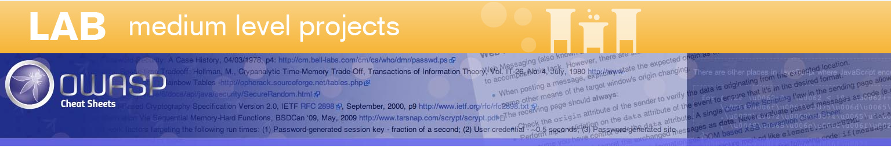
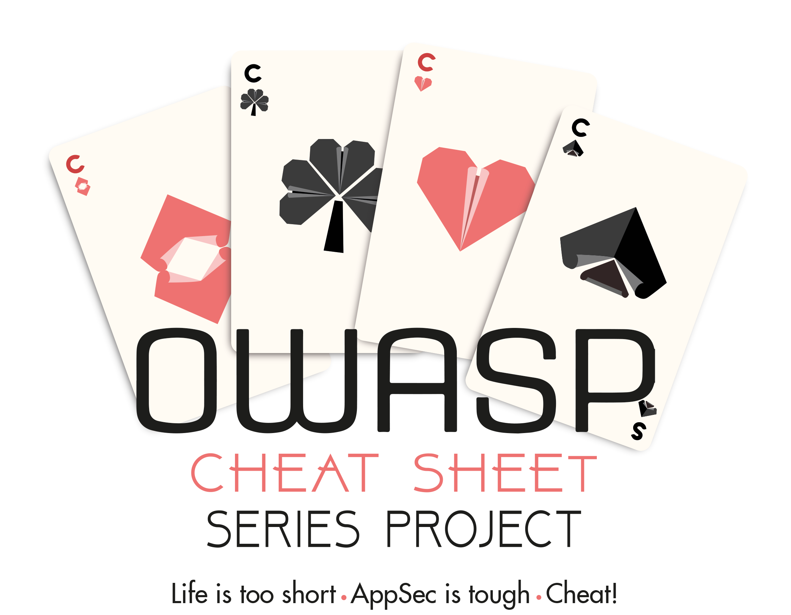

# 

The **OWASP Cheat Sheet Series** was created to provide a concise collection of high value information on specific application security topics. These cheat sheets were created by various application security professionals who have expertise in specific topics.

We hope that this project provides you with excellent security guidance in an easy to read format. :smile:

You can download this site [here](bundle.zip).

An ATOM feed is available [here](News.xml) with the latest updates.

Project leaders:

- [Jim Manico](https://github.com/jmanico)
- [Jakub Maćkowski](https://github.com/mackowski)

Core team:

- [Kevin W. Wall](https://github.com/kwwall)
- [Shlomo Zalman Heigh](https://github.com/szh)

Project links:

- [Homepage](https://owasp.org/www-project-cheat-sheets/)
- [GitHub repository](https://github.com/OWASP/CheatSheetSeries)
- [How to contribute?](https://github.com/OWASP/CheatSheetSeries/blob/master/CONTRIBUTING.md)
- [Logo](https://github.com/OWASP/owasp-swag/tree/master/projects/cheat-sheet-series)
