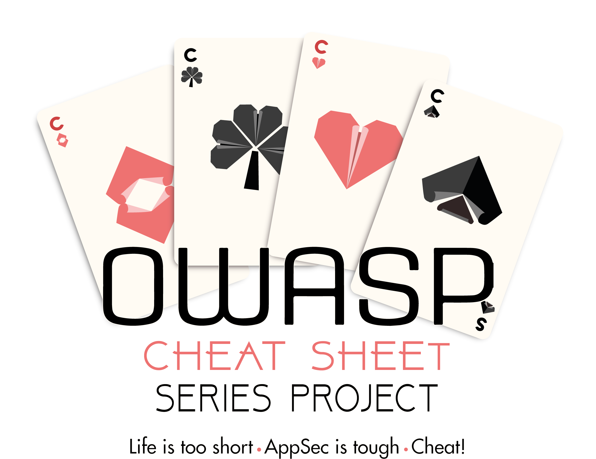

[](https://www.owasp.org/index.php/OWASP_Project_Inventory#tab=Flagship_Projects)


[](https://travis-ci.org/OWASP/CheatSheetSeries)
[](https://circleci.com/gh/OWASP/CheatSheetSeries/tree/master)




# Welcome to OWASP Cheat Sheet Series V2

This repository contains all the cheat sheets of the project and represent the V2 of the **OWASP Cheat Sheet Series** project.

Links:
* [OWASP home page of the project](https://www.owasp.org/index.php/OWASP_Cheat_Sheet_Series)
* [Official website](https://cheatsheetseries.owasp.org)
* [Github repository](https://github.com/OWASP/CheatSheetSeries)

# Table of Contents

- [Reference to the Cheat Sheets](#reference-to-the-cheat-sheets)
- [Cheat Sheets index](#cheat-sheets-index)
- [Special thanks](#special-thanks)
- [Editor & validation policy](#editor--validation-policy)
- [Conversion rules](#conversion-rules)
- [How to setup my contributor environment?](#how-to-setup-my-contributor-environment)
- [How to contribute?](#how-to-contribute)
- [Contributors](#contributors)
- [Offline website](#offline-website)
- [Project leaders](#project-leaders)
- [Core team](#core-team)
- [PR usage for core committers](#pr-usage-for-core-committers)
- [Project logo](#project-logo)
- [Folders](#folders)
- [License](#license)
- [Code of conduct](CODE_OF_CONDUCT.md)
- [DNS configuration for the website](#dns-configuration-for-the-website)
- [Flagship graduation](#flagship-graduation)

# Reference to the Cheat Sheets

When a reference to a cheat sheet needs to be created, then a link pointing to the project (generated) official web site hosted on **https://cheatsheetseries.owasp.org** must be used.

:triangular_flag_on_post: Markdown files are the working sources and are not intended to be referenced in any external documentation/book/website/etc.

# Cheat Sheets index

The following indexes are provided:
* This [index](Index.md) references all released cheat sheets sorted alphabetically.
    * This index is automatically generated by this [script](scripts/Update_CheatSheets_Index.py).
* This [index](IndexASVS.md) references all released cheat sheets using the [OWASP ASVS](https://www.owasp.org/index.php/Category:OWASP_Application_Security_Verification_Standard_Project) project as reading source.
    * This index is manually managed in order to allow contribution along with custom content.
* This [index](IndexProactiveControls.md) references all released cheat sheets using the [OWASP Proactive Controls](https://www.owasp.org/index.php/OWASP_Proactive_Controls) project as the reading source.
    * This index is manually managed in order to allow contribution along with custom content.

The official website provides a search bar (top left corner) that can be used.

# Project leaders

* [Jim Manico](https://github.com/jmanico).
* [Elie Saad](https://github.com/ThunderSon).

# Core team

**Any GitHub member is free to add a comment on any Proposal (issue) or PR.**

However, we have created an official core team (core committers) in order to:
* Review all PR/Proposal in a consistent/regular way using [GitHub's review feature](https://help.github.com/en/articles/reviewing-proposed-changes-in-a-pull-request).
* Extend the field of technologies known by the review team.
* Allow several technical opinions on a Proposal/PR, all exchanges are public because we use the GitHub comment feature.

A decision from a member of the core team has the same weight to those of the project's leaders, so if a core team member rejects a PR (*rejection must be technically documented and explained*), then the project's leaders will carry on that same decision.

Members:
* [Elie Saad](https://github.com/ThunderSon).
* [Jakub Maćkowski](https://github.com/mackowski).
* [Robin Bailey](https://github.com/rbsec).
* [Jim Manico](https://github.com/jmanico).

# PR usage for core committers

For the following kind of modifications, the PR system will be used by the core committers in order to allow peer review using the GitHub PR review system:
* Addition of a new cheat sheet.
* Deep modification of an existing cheat sheet.

Below are the steps to properly submit a PR:
1. Clone the project.
2. Move on to the `master` branch: 
    > `git checkout master`
3. Ensure that you have the latest files:
    > `git pull`
4. Create a branch named `CSS-[ID]` where **[ID]** is the number of the linked issue opened prior to the PR to follow the contribution process:
    > `git checkout -b CSS-[ID]`
5. Switch to this new branch (normally it's already the case):
    > `git checkout CSS-[ID]`
6. Do the expected work.
7. Push the new branch:
    > `git push origin CSS-[ID]`   
8. When the work is ready for the review, create a pull request by visiting this link:
    > `https://github.com/OWASP/CheatSheetSeries/pull/new/CSS-[ID]`
9. Implement the modifications requested by the reviewers. Once the reviewers approve the PR, it is then merged to the `master` branch.
10. Once merged, delete the branch using this [GitHub feature](https://help.github.com/en/articles/creating-and-deleting-branches-within-your-repository#deleting-a-branch).

See project current [branches](https://github.com/OWASP/CheatSheetSeries/branches).

# Project logo

The project's official logo files are hosted [here](https://github.com/OWASP/owasp-swag/tree/master/projects/cheat-sheet-series).

# Folders

**cheatsheets_excluded**:
* Contains the cheat sheets markdown files converted with PANDOC. Before inclusion into V2 of this project, a discussion must occur to decide if this content is still relevant, as it has not been recently updated. See this [discussion](https://github.com/OWASP/CheatSheetSeries/issues/13). 

**cheatsheets**: 
* Contains the final cheat sheets files. 
* Any `.md` file present in this folder is considered released.

**assets**: 
* Contains the assets used by the cheat sheets (images, PDF's, ZIP files etc.).
    * Naming convention is `[CHEAT_SHEET_MARKDOWN_FILE_NAME]_[IDENTIFIER].[EXTENSION]`
    * Use `PNG` format for the images.

**scripts**:
* Contains all the utility scripts used to operate the project (markdown linter audit, dead link identification etc.).    

**templates**:
* Contains templates used for different kinds of files (cheatsheets etc.).

**.github**:
* Contains materials used to configure different behaviors of GitHub.

**.circleci** / **.travis.yml** (file):
* Contains the definition of the integration jobs used to control the integrity and consistency of the whole project:
    * **[TravisCI](https://travis-ci.org/OWASP/CheatSheetSeries)** is used to perform compliance check actions at each Push/Pull Request. **It must be/stay the fastest possible** (currently inferior to 2 minutes) in order to provide a rapid compliance feedback about the Push/Pull Request.
    * **[CircleCI](https://circleci.com/gh/OWASP/CheatSheetSeries)** is used to perform operations taking *longer time* like build, publish and deploy actions.

# Offline website

Unfortunately, a PDF file generation is not possible because the content is cut in some cheat sheets, for example, the abuse case one.

However, to propose the possibility the consult, in a full offline mode, the collection of all cheat sheets, a script to generate an offline site using [GitBook](https://toolchain.gitbook.com/) has been created. The script is [here](scripts/Generate_Site.sh).

* **book.json**: Gitbook configuration file.
* **Preface.md**: Project preface description applied to the generated site.

:information_source: It is this generated content that is hosted on the [official web site](https://cheatsheetseries.owasp.org) of the project.

## Automated build

This [link](https://cheatsheetseries.owasp.org/bundle.zip) allows you to download a build (ZIP archive) of the offline website.

## Manual build

Use the commands below to generate the site:

```bash
# Your python version must be >= 3.5
$ python --version
Python 3.5.3
# Dependencies:
#  sudo apt install -y nodejs
#  sudo npm install gitbook-cli -g
$ cd scripts
$ bash Generate_Site.sh
Generate a offline portable website with all the cheat sheets...
Step 1/5: Init work folder.
Step 2/5: Generate the summary markdown page.
Index updated.
Summary markdown page generated.
Step 3/5: Create the expected GitBook folder structure.
Step 4/5: Generate the site.
info: found 45 pages
info: found 86 asset files
info: >> generation finished with success in 14.2s !
Step 5/5: Cleanup.
Generation finished to the folder: ../generated/site
$ cd ../generated/site/
$ ls -l
drwxr-xr-x 1 Feb  3 11:05 assets
drwxr-xr-x 1 Feb  3 11:05 cheatsheets
drwxr-xr-x 1 Feb  3 11:05 gitbook
-rw-r--r-- 1 Feb  3 11:05 index.html
-rw-r--r-- 1 Feb  3 11:05 search_index.json
```

# Conversion rules

* Use the markdown syntax described in this [guide](https://guides.github.com/features/mastering-markdown/).
* Use this [sheet](https://gist.github.com/molomby/9bc092e4a125f529ae362de7e46e8176) for superscript and subscript characters.
* Use this [sheet](https://meta.askubuntu.com/a/7383) for arrows (left, right, top, down) characters.
* Store all assets in the **assets** folder and use the following syntax:
    * `` for the insertion of an image. Use `PNG` format for the images (this [software](https://www.gimp.org/downloads/) can be used to handle format conversion).
    * `[ALTERNATE_NAME](../assets/ASSET_NAME.EXT)` for the insertion of other kinds of media (PDF, ZIP etc.).
* Use ATX style (`#` syntax) for section head. 
* Use `**bold**` syntax for **bold** text.
* Use `*italic*` syntax for *italic* text.
* Use `TAB` for nested lists and not spaces.
* Use [code fencing syntax along syntax highlighting](https://help.github.com/articles/creating-and-highlighting-code-blocks/) for code snippet (prevent when possible horizontal scrollbar).
* If you use `{{` or `}}` pattern in code fencing then add a space between both curly braces (ex: `{ {`) otherwise it will break the GitBook generation process.
* Same remark about the cheat sheet file name, only the following syntax is allowed: `[a-zA-Z_]+`.
* No HTML code is allowed, only markdown syntax is allowed.
* Use this [site](https://www.tablesgenerator.com/markdown_tables) for generation of tables.
* Use a single new line between a section head and the beginning of its content.

# Editor & validation policy

[Visual Studio Code](https://code.visualstudio.com/) is used for the work on the markdown files. It is also used for the work on the scripts.

The file **Project.code-workspace** is the workspace file in order to open the project in VSCode.

The following [plugin](https://github.com/DavidAnson/vscode-markdownlint) is used to validate the markdown content.

The file **.markdownlint.json** defines the central validation policy applied at VSCode (IDE) and TravisCI (CI) levels.

Details about rules can be found [here](https://github.com/DavidAnson/markdownlint/blob/master/doc/Rules.md).

The file **.markdownlinkcheck.json** defines the configuration used to validate using this [tool](https://github.com/tcort/markdown-link-check), at TravisCI level, all web and relatives links used in cheat sheets.

# How to setup my contributor environment?

See [here](CONTRIBUTING.md#how-to-setup-my-contributor-environment).

# How to contribute?

See [here](CONTRIBUTING.md#how-to-contribute).

# Contributors

* **From 2014 to 2018:** [V1](CONTRIBUTOR-V1.md) - Initial version of the project hosted on the [OWASP WIKI](https://www.owasp.org).
* **From 2019:** [V2](https://github.com/OWASP/CheatSheetSeries/graphs/contributors) - Hosted on [GitHub](https://github.com/OWASP/CheatSheetSeries).

# Special thanks

A special thank you to the following people for their help provided during the migration:

* [Dominique Righetto](https://github.com/righettod): For his special leadership and guidance.
* [Elie Saad](https://github.com/ThunderSon): For valuable help in updating the OWASP Wiki links for all the migrated cheat sheets.
* [Jakub Maćkowski](https://github.com/mackowski): For valuable help in updating the OWASP Wiki links for all the migrated cheat sheets.

# License

The entire project content is under the **[Creative Commons v3.0](https://creativecommons.org/licenses/by-sa/3.0/)** license.

# DNS configuration for the website

| Type | Record | Value |
|------|--------|-------|
| CNAME | cheatsheetseries.owasp.org | owasp.github.io |
| A | owasp.github.io | 185.199.108.153 |
| A | owasp.github.io | 185.199.109.153 |
| A | owasp.github.io | 185.199.110.153 |
| A | owasp.github.io | 185.199.111.153 |

The custom subdomain then needs to be [configured on GitHub](https://help.github.com/en/github/working-with-github-pages/about-custom-domains-and-github-pages).

# Flagship graduation

The result of the project review, by the foundation, is available [here](assets/README_FlagshipCombinedReviews.pdf).
