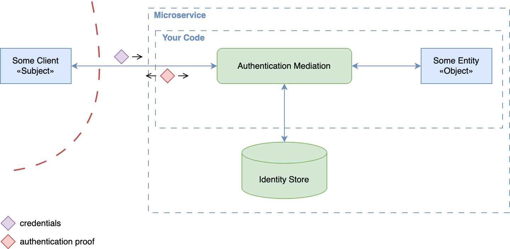
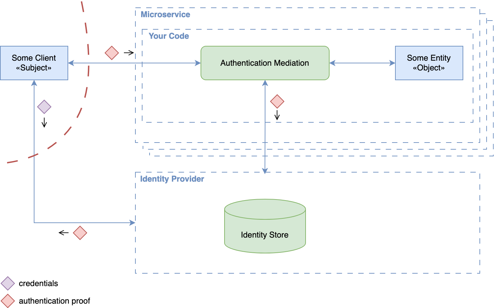
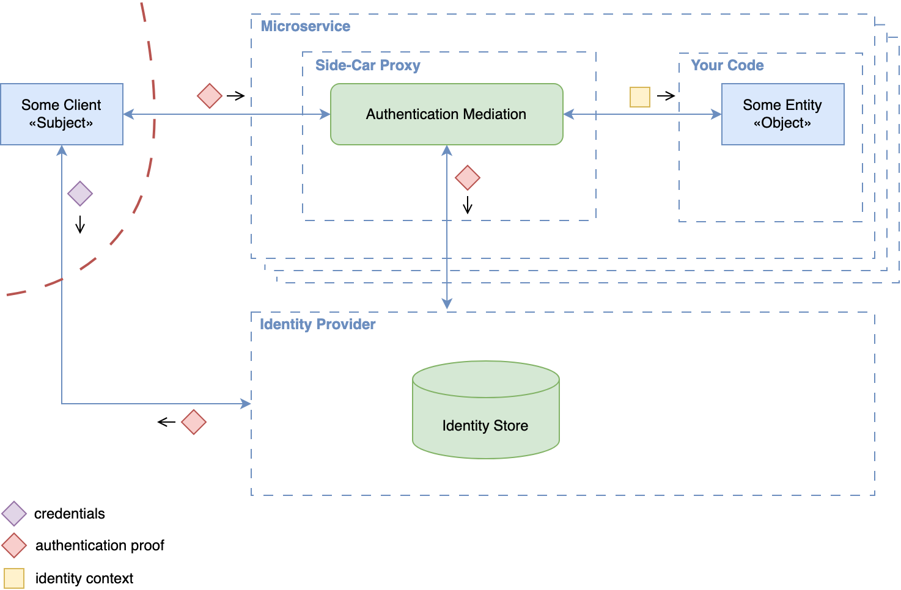
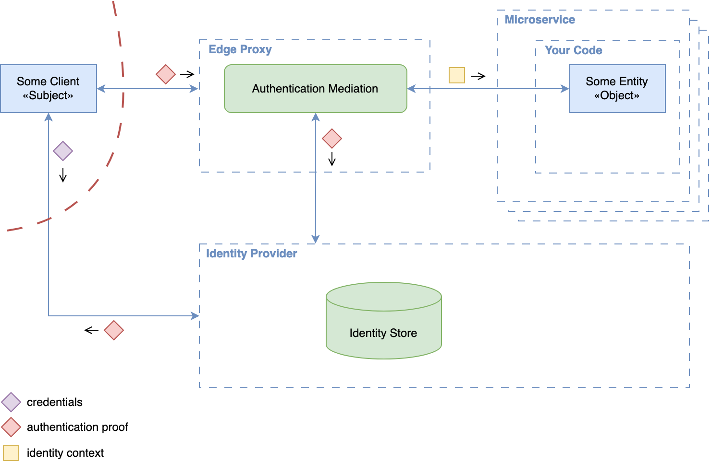
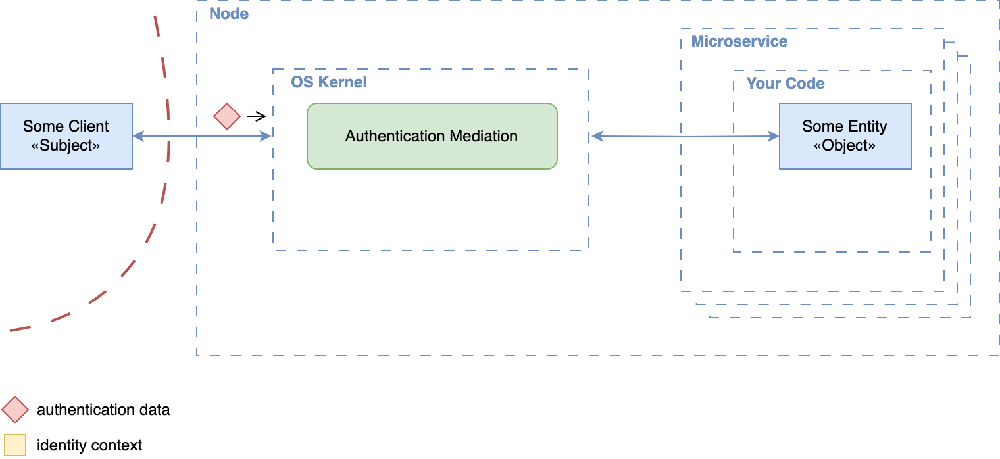

# Authentication Patterns Cheat Sheet

## Introduction

Authentication can be enforced at different layers of a system's architecture. This cheat sheet compares the main patterns, where verification happens in each, and what that means for trust boundaries:

- **Service-Level:** each service verifies identity itself, or delegates it to a proxy tightly coupled to it.
- **Edge-Level:** authentication is centralized in a shared component at the system boundary.
- **Network-Layer (Node-Level):** peers are authenticated cryptographically at the network layer, transparently to applications.

The patterns apply to **external** actors (end users and client applications outside the system) and to **internal** actors (services, other workloads, and the nodes they run on), although the mechanisms and trust assumptions differ. Most systems authenticate in two phases:

- **Primary authentication** verifies a credential and links it to a known identity: a password, a signed challenge such as a [WebAuthn assertion](https://developer.mozilla.org/en-US/docs/Web/API/Web_Authentication_API), or, for internal actors, a machine certificate or a workload identity such as a [SPIFFE ID](https://spiffe.io/docs/latest/spiffe-about/overview/).
- **Authentication proof verification** checks the reusable artifact issued after primary authentication (a session cookie, token, or assertion at the application layer; a TLS session key or IPsec Security Association at lower layers) so that primary authentication is not repeated on every request. [NIST SP 800-63B](https://pages.nist.gov/800-63-4/sp800-63b.html#sessmgmt) describes this as session management based on a session secret.

Where the distinction does not matter, this cheat sheet uses **authentication data** for both. The patterns differ in **what** is verified (credentials or proofs), **where** verification happens, and **which** implications this has for system design and trust boundaries.

For authorization and for propagating an authenticated identity between services, see the [Microservices Security Cheat Sheet](Microservices_Security_Cheat_Sheet.md), in particular its [edge-level](Microservices_Security_Cheat_Sheet.md#edge-level-authorization), [identity propagation](Microservices_Security_Cheat_Sheet.md#external-entity-identity-propagation), and [service-to-service authentication](Microservices_Security_Cheat_Sheet.md#service-to-service-authentication) sections.

## Service-Level Embedded Authentication

In this pattern, each service handles primary authentication itself: it manages identities and credentials, verifies them, and implements the authentication workflows, typically with username/password or API keys. All authentication logic and subject data storage live inside the service, in custom code or built-in libraries. If you have to maintain such a service, the credential handling must follow the [Authentication Cheat Sheet](https://cheatsheetseries.owasp.org/cheatsheets/Authentication_Cheat_Sheet.html) and the [Password Storage Cheat Sheet](https://cheatsheetseries.owasp.org/cheatsheets/Password_Storage_Cheat_Sheet.html).

### Pros

- **Simplicity:** Each service is self-contained and needs no external authentication infrastructure.
- **Customization freedom:** Authentication behavior can be adapted to service-specific requirements without external constraints.
- **Support for external and internal actors:** Because the service controls all authentication functionality, it can orchestrate different authentication contexts (internal services and external users), at the price of significant complexity (see the authentication orchestration con below).

### Cons

- **Inconsistency:** Authentication behavior, credential storage, and flows differ across services, which fragments the system, degrades the user experience, and rules out Single Sign-On (SSO).
- **Security risk:** Authentication code is duplicated across services, increasing the risk of vulnerabilities and complicating audits.
- **Maintenance burden:** Changing authentication methods (for example, introducing multi-factor authentication (MFA)) requires updates across all affected services.
- **Limited scalability:** Each service manages its own identities, which does not scale to service-to-service authentication across a large system.
- **Limited observability and governance:** Without centralized monitoring, credential reuse, account compromise, or brute-force attacks against one service remain invisible to the others, hindering coordinated detection and response.
- **Authentication orchestration:** Supporting multi-principal subjects (multiple authentication configurations, protocol chaining, and subject-specific variations for contexts such as first- and third-party access, or external clients next to service-to-service calls) adds significant complexity.
- **Coupling of external authentication data with internal trust assumptions:** Using the same authentication data for external clients and internal services increases the risk of leakage and unauthorized access. If an internal service is exposed through a misconfiguration, or an attacker gains internal access, the leaked authentication data grants access to sensitive resources.

## Service-Level Code-Mediated Authentication

This pattern addresses key limitations of [Service-Level Embedded Authentication](#service-level-embedded-authentication): fragmented identity management, duplicated credential stores, and lack of SSO. The service no longer verifies credentials directly. Instead, an external Identity Provider (IdP) authenticates the subject and issues authentication proofs; the service verifies these itself and extracts identity attributes for request processing.

### Pros

- **SSO support:** Identity and credential lifecycle is consolidated in the IdP, enabling SSO and reducing duplication.
- **Lower security risks:** Centralized authentication reduces the attack surface related to credential handling.
- **Improved user experience:** Consistent authentication flows and session handling across services.
- **Interoperability:** Widely adopted protocols like [OpenID Connect (OIDC)](https://openid.net/specs/openid-connect-core-1_0.html) and [SAML](https://www.oasis-open.org/standard/saml/) provide flexibility and broad integration possibilities with various IdPs.
- **Customization freedom:** Services can still tailor authentication behavior to specific needs, for example where standards like OIDC are not applicable.
- **Support for external and internal actors:** As in the [embedded pattern](#service-level-embedded-authentication), with the same orchestration complexity.

### Cons

- **Protocol handling overhead:** Each service must implement and maintain logic for authentication proof verification and protocol-specific behavior.
- **Misconfiguration risks:** Incorrect verification logic, such as missing expiration checks or improper use of cryptography, can introduce severe security vulnerabilities.
- **Authentication orchestration:** Same complexity as in the [embedded pattern](#service-level-embedded-authentication).
- **Coupling of external authentication data with internal trust assumptions:** Same risk as in the [embedded pattern](#service-level-embedded-authentication).

## Service-Level Proxy-Mediated Authentication

This pattern builds on the [previous pattern](#service-level-code-mediated-authentication) but moves authentication logic out of the service into a dedicated proxy deployed as a sidecar alongside it. The proxy sits in front of the application, verifies authentication proofs with the Identity Provider (IdP), injects identity context into the request (typically as headers), and forwards it locally to the service.

### Pros

- **All benefits of the code-mediated pattern:** SSO, centralized credential handling, a consistent user experience, and standards-based interoperability (see [above](#service-level-code-mediated-authentication)).
- **Separation of concerns:** Removes authentication logic from application code, simplifying service development and reducing maintenance effort.
- **Consistent behavior:** Identity verification and protocol handling in the proxy ensure uniform behavior across services.
- **Improved security posture:** Consolidating authentication logic into a dedicated, hardened component reduces the risk of implementation flaws.
- **Authentication orchestration:** Some proxies support multiple authentication configurations, including protocol chaining and subject-specific variations, which covers first- and third-party access or a mix of external clients and internal services.
- **Strong foundation for service-to-service trust:** Enables [Zero Trust](https://csrc.nist.gov/pubs/sp/800/207/final) networking with workload identity, typically realized with [SPIFFE/SPIRE](https://spiffe.io/), which issues workload identities as [X.509 certificates](https://www.rfc-editor.org/rfc/rfc5280) used for mutual TLS ([mTLS](https://www.rfc-editor.org/rfc/rfc8446)) between services.

### Cons

- **Operational complexity:** Requires deploying and maintaining an additional component per microservice, with higher resource usage and cost.
- **Header spoofing risk:** The application trusts identity headers set by the sidecar, so any path that lets a caller set those headers yields a forged identity: a client reaching the application port directly, or the proxy forwarding identity headers it received from the caller. Countermeasures: the sidecar must strip or overwrite every inbound identity header before injecting its own (Envoy, for example, [sanitizes `x-forwarded-client-cert` by default](https://www.envoyproxy.io/docs/envoy/latest/configuration/http/http_conn_man/headers#x-forwarded-client-cert)); the application must accept traffic only from its sidecar (bind to loopback, or enforce a network policy that only allows the sidecar to reach the application port); or, where that isolation cannot be guaranteed, the sidecar must sign the injected headers with [HTTP Message Signatures](https://www.rfc-editor.org/rfc/rfc9421) so the application can verify their origin. Define a signature profile that binds the identity to the intended service and relevant request components. The application must verify the trusted signer's signature and enforce freshness and replay checks. [NIST SP 800-204](https://nvlpubs.nist.gov/nistpubs/SpecialPublications/NIST.SP.800-204.pdf) (MS-SS-13) recommends layer 3 network segmentation for sensitive applications precisely to counter callers bypassing the sidecar proxy.
- **Configuration consistency:** All proxies across the service landscape must be configured uniformly; inconsistencies lead to confusing user flows or security vulnerabilities.
- **Coupling of external authentication data with internal trust assumptions:** Same risk as in the [embedded pattern](#service-level-embedded-authentication), because the external authentication data still travels to every service's sidecar for verification.

## Edge-Level Authentication

In this pattern, authentication is handled at the system boundary by a shared component such as an API gateway or ingress proxy. This component authenticates incoming requests from external clients before they reach internal services. It uses [OIDC](https://openid.net/specs/openid-connect-core-1_0.html) or [SAML](https://www.oasis-open.org/standard/saml/) with an identity provider for user authentication, validates [OAuth 2.0](https://www.rfc-editor.org/rfc/rfc6749) access tokens for API access, or uses [mTLS](https://www.rfc-editor.org/rfc/rfc8446) for certificate-based client authentication. It propagates verified identity information, typically via headers, to downstream services.

This consolidates authentication into a single enforcement point and removes per-service authentication handling. It corresponds to the gateway or portal placement of the policy enforcement point described in [NIST SP 800-207 (Zero Trust Architecture)](https://csrc.nist.gov/pubs/sp/800/207/final).

### Pros

- **Improved consistency:** Authentication is performed uniformly at a single entry point, reducing fragmentation and configuration drift and improving auditability.
- **Simplified service logic:** Internal services are relieved from implementing authentication and focus on authorization and business functionality.
- **Faster service onboarding:** New services rely on the existing infrastructure for authentication and need minimal additional setup.
- **Protocol-agnostic identity propagation:** The edge verifies the external authentication data once and propagates identity to internal services in a trusted, implementation-independent format: a newly issued [JSON Web Token (JWT)](https://www.rfc-editor.org/rfc/rfc7519), headers protected with [HTTP Message Signatures](https://www.rfc-editor.org/rfc/rfc9421), or a signed proprietary structure. Unlike the service-level patterns, where every service or its sidecar must receive and verify the external authentication data, internal services only ever see the internal representation.

### Cons

- **Limited granularity:** Fine-grained or per-endpoint authentication policies (for example, step-up authentication) are harder to implement and may require coordination with downstream services, depending on the capabilities of the edge proxy.
- **Identity propagation challenges:** Secure and reliable propagation of identity context (for example, via headers) requires strict validation and an explicit trust model between the edge and internal services. Use one of the protected formats above, and make internal services verify the signature and reject requests whose identity context is missing or unsigned.
- **Single point of failure:** The ingress proxy or gateway is already a central component in most architectures, but authenticating at the edge makes it a critical part of the security infrastructure. Misconfiguration or compromise affects the integrity of authentication decisions system-wide.
- **Not suitable for service-to-service authentication:** Edge-level authentication only covers incoming external requests. Internal service-to-service calls need their own mechanism, and any component that can reach a service directly bypasses the gateway entirely; [NIST SP 800-204](https://nvlpubs.nist.gov/nistpubs/SpecialPublications/NIST.SP.800-204.pdf) (MS-SS-2) recommends mutual authentication to prevent such direct, anonymous connections. Routing internal traffic through the edge is technically possible but introduces severe performance bottlenecks.

## Network-Layer (Node-Level) Authentication

This pattern authenticates peers at the [network layer](https://en.wikipedia.org/wiki/Network_layer) (layer 3), inside the operating system kernel, using cryptographic identities attached to a node or host rather than to an application. Implementations are built on [IPsec](https://www.rfc-editor.org/rfc/rfc6071) or [WireGuard](https://www.wireguard.com/): the identity of a peer is bound to keys configured on each node, and every packet is cryptographically authenticated. Enforcement is transparent to applications, which makes it a good complement for securing traffic between workloads, but not a replacement for application-layer authentication.

### Pros

- **Transparent to applications:** Services need no authentication logic; the kernel enforces peer identity for all traffic.
- **Protocol-agnostic:** Applies to all traffic types, not just HTTP.
- **Low overhead:** Kernel implementation and lightweight handshakes keep latency low while providing strong isolation between nodes.
- **Provides node (host) identity:** Each node holds its own key material and every packet is authenticated, which resists spoofing and replay at the network layer and supports [Zero Trust](https://csrc.nist.gov/pubs/sp/800/207/final) segmentation between nodes.

### Cons

- **Not suitable for application-level (layer 7) authentication:** Identities belong to nodes or hosts, not to individual users, external clients, or, usually, individual workloads. Every workload on a node shares the node's identity, and user-specific attributes cannot be conveyed.
- **Limited observability:** Monitoring is confined to connection-level data (source and destination nodes), with no insight into user-driven actions inside the application.
- **Infrastructure complexity:** Requires robust automation for key and identity management and OS- or kernel-level policy enforcement (for example, via [eBPF](https://ebpf.io/)).

## Operational and Security Considerations

The patterns differ primarily in *where* and *how* authentication is performed, but they also have significant implications for operations and authorization. Choosing a pattern comes down to balancing development flexibility, operational effort, and risk tolerance.

### Operational Considerations

| Pattern                          | Configuration & Implementation Burden | Operational Overhead    | Observability Scope        |
| -------------------------------- | ------------------------------------- | ----------------------- | -------------------------- |
| **Service-Level Embedded**       | High                                  | High                    | Application-specific       |
| **Service-Level Code-Mediated**  | Medium                                | Medium                  | IdP + Application-specific |
| **Service-Level Proxy-Mediated** | Medium                                | High (infra cost)       | Proxy + Application        |
| **Edge-Level**                   | Low                                   | Low                     | Centralized (Proxy)        |
| **Network-Layer (Node-Level)**   | Low-Medium                            | High (infra complexity) | Network-level only         |

Patterns with decentralized authentication (like [Service-Level Embedded Authentication](#service-level-embedded-authentication)) typically incur more operational overhead due to inconsistencies, duplicated configuration, and monitoring complexity. Centralized patterns reduce duplication but introduce infrastructure dependencies and require resilient design.

### Security Considerations

Security risks increase significantly when authentication logic and credentials are handled directly within application code. Centralized enforcement, whether at the IdP, at the edge, or in the kernel, limits exposure, enforces stronger boundaries, and reduces the risk of misconfiguration. However, trust leakage must be prevented, because it directly undermines the principle of least privilege. This depends not only on where authentication occurs, but also on how identity information is propagated and verified downstream. Without trustworthy, tamper-resistant propagation, even strong initial authentication can be undermined, weakening trust boundaries and the system's ability to make reliable authorization decisions. The [Identity Propagation Patterns Cheat Sheet](Identity_Propagation_Patterns_Cheat_Sheet.md) compares forwarding, token exchange, and trusted internal assertions, including their validation requirements and limitations.

**Note:** Token theft, replay protection, session lifecycle, and reauthentication are critical when implementing any of these patterns. They are covered in the [Authentication Cheat Sheet](https://cheatsheetseries.owasp.org/cheatsheets/Authentication_Cheat_Sheet.html) and the [Session Management Cheat Sheet](https://cheatsheetseries.owasp.org/cheatsheets/Session_Management_Cheat_Sheet.html).

## Recommendations

- **Authenticate external actors at the edge.** Centralize external authentication in a gateway or ingress proxy, as described in [NIST SP 800-207](https://csrc.nist.gov/pubs/sp/800/207/final) and [NIST SP 800-204](https://nvlpubs.nist.gov/nistpubs/SpecialPublications/NIST.SP.800-204.pdf) (MS-SS-2). Normalize different authentication mechanisms into a signed internal assertion when needed. Forward an external access token only to its [intended recipients](https://www.rfc-editor.org/rfc/rfc9700.html#section-2.3), with the required validation and proof at each receiving service; otherwise exchange it or issue a suitable internal assertion. See [Identity Propagation Patterns](Identity_Propagation_Patterns_Cheat_Sheet.md) for these requirements.
- **Authenticate internal service calls with proxy-mediated mTLS and workload identity.** Give every workload its own cryptographic identity, for example an X.509 SVID issued through [SPIFFE](https://spiffe.io/docs/latest/spiffe-about/overview/), and have the sidecar enforce mutual authentication with [TLS](https://www.rfc-editor.org/rfc/rfc8446) client certificates on every service-to-service connection, as NIST SP 800-204 (MS-SS-4) recommends. See also [Client Certificates and Mutual TLS](Transport_Layer_Security_Cheat_Sheet.md#client-certificates-and-mutual-tls).
- **Do not embed authentication in new systems.** Service-level embedded authentication fragments identity, duplicates credential stores, and rules out SSO. Reserve it for legacy code you cannot change, and even then follow the [Authentication Cheat Sheet](Authentication_Cheat_Sheet.md).
- **Treat network-layer (node-level) authentication as a transport complement, never as the sole control.** It authenticates nodes, not users or workloads, and [NIST SP 800-207](https://csrc.nist.gov/pubs/sp/800/207/final) is explicit that network location alone does not imply trust. Combine it with edge-level or proxy-mediated authentication; NIST SP 800-204 (MS-SS-13) likewise positions layer 3 segmentation as a complement to service mesh controls.

## References

- [NIST SP 800-204: Security Strategies for Microservices-Based Application Systems](https://nvlpubs.nist.gov/nistpubs/SpecialPublications/NIST.SP.800-204.pdf)
- [NIST SP 800-207: Zero Trust Architecture](https://csrc.nist.gov/pubs/sp/800/207/final)
