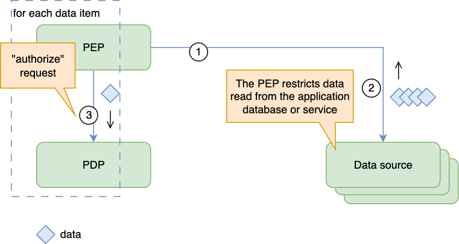
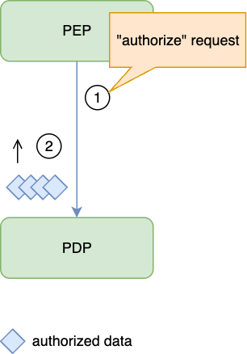
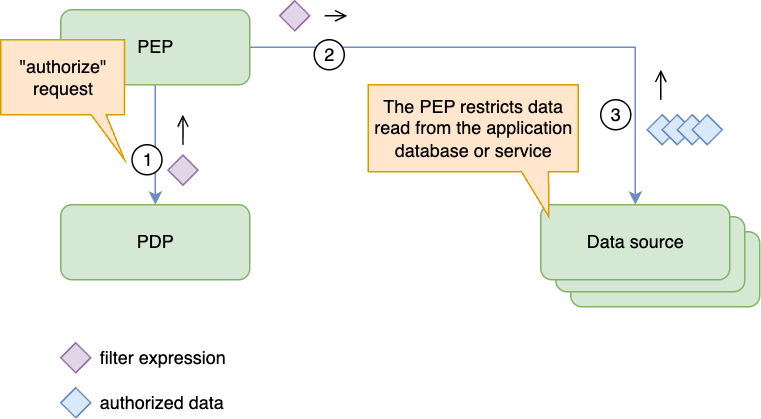

# Authorization Decisions and Output Handling Cheat Sheet

## Introduction

A **Policy Decision Point (PDP)** evaluates access; a **Policy Enforcement Point (PEP)** applies the result before releasing data or performing an action. [OpenID AuthZEN Authorization API 1.0](https://openid.net/specs/authorization-api-1_0.html) defines single and multiple evaluations, as well as search interfaces. This sheet covers enforcing individual decisions, authorized resource lists, and query filters. See [Authorization Patterns](Authorization_Patterns_Cheat_Sheet.md) for placement and [Policy and Data Distribution](Authorization_Policy_And_Data_Distribution_Cheat_Sheet.md) for trustworthy inputs.

## Single and Batch Decisions

Bind each decision to the authenticated subject, action, resource, tenant, and relevant context. [AuthZEN's evaluation interfaces](https://openid.net/specs/authorization-api-1_0.html#section-6) carry the information used to evaluate access. Supplying verified role or relationship attributes is legitimate when the policy requires them; accepting a client's assertion of its own privileges is not.

A batch groups separate access checks. Match each response to its corresponding request using the ordering or identifiers defined by the API, and deny an item whose result is missing, invalid, or an error. Do not apply one item's permit to the entire batch. UI checks can determine which buttons to display, but the operation itself still requires [server-side authorization](Authorization_Cheat_Sheet.md#validate-the-permissions-on-every-request).

## Enforcing Access to Collections

Choose by the PDP's documented output semantics and the data store's supported integration, not by labels such as relationship-based access control (ReBAC). [OpenFGA's ListObjects documentation](https://openfga.dev/docs/interacting/relationship-queries#listobjects) and [Cerbos's query-plan API](https://docs.cerbos.dev/cerbos/latest/api/#resources-query-plan) illustrate different contracts.

### Check Each Candidate

The PEP retrieves a bounded candidate set and evaluates each item, individually or in a batch.

Use this for small sets when a list or filter interface is unavailable. Keep candidate data inside the trusted service until checks complete; exclude denied and unresolved items. Apply the same restriction to counts, exports, and other outputs that could reveal protected data.

### Retrieve Authorized Resource Identifiers

The PDP returns identifiers that the subject may access for a particular action. The application restricts its data retrieval to those identifiers and its own tenant and business predicates.

Treat the result as complete only when the API guarantees completion. OpenFGA documents deadline and result-count limits for ListObjects; do not assume every implementation provides a pagination cursor or unlimited streaming. A truncated authorized subset can be displayed as partial when the API guarantees each returned item is permitted, but cannot establish the complete authorized set. Never interpret an empty or incomplete list as permission to remove the restriction. Recheck authorization for subsequent operations or when the relevant state changes.

### Apply an Authorization Filter

The PDP returns a predicate or query plan that the data layer enforces while retrieving resources.

Use a maintained adapter for the exact PDP and data store. [Cerbos PlanResources](https://docs.cerbos.dev/cerbos/latest/api/#resources-query-plan) distinguishes always-allowed, always-denied, and conditional plans; [OPA's Compile API](https://www.openpolicyagent.org/docs/rest-api#compile-api) supports partial evaluation. Capabilities depend on the implementation and policy language, not a universal restriction on ReBAC or other model families.

## Security Considerations

An output is useful only if the PEP enforces its full meaning. [AuthZEN's response-integrity and trust requirements](https://openid.net/specs/authorization-api-1_0.html#section-11) apply to the channel and components carrying decisions.

- **Cover every data path.** Enforce the restriction on list, search, export, count, aggregate, and direct-object reads. An authorized list does not authorize a later update or delete.
- **Intersect predicates.** Combine authorization restrictions with application and tenant predicates using logical AND. An always-allowed authorization result does not remove those other restrictions; always-denied must return no protected data.
- **Preserve query semantics.** Reject unsupported operators or incomplete translations. Check adapter behavior for nulls, missing attributes, joins, and collection membership against the policy's meaning. Do not silently omit an expression that cannot be translated.
- **Keep values separate from syntax.** Bind filter values as parameters and allow-list structural choices such as field names and operators. Do not execute a returned debug string as a query. See [SQL Injection Prevention](SQL_Injection_Prevention_Cheat_Sheet.md#defense-option-1-prepared-statements-with-parameterized-queries).
- **Fail closed.** Deny protected operations on PDP errors, timeouts, or unusable output. Apply [Deny by Default](Authorization_Cheat_Sheet.md#deny-by-default), including when a filter is absent; a missing filter is not an unrestricted result.
- **Bound reuse.** Cache only for the same subject, action, resource scope, tenant, and relevant policy/input state, within the approved freshness limit. Account for changes between evaluation and use; a cached permit must not outlive a required revocation deadline.

Verify integrations with permitted and denied resources, tenant boundaries, each explicit filter result kind, incomplete batches or lists, and PDP failure. Compare a filter's selected resources with individual decisions for representative policy cases. These checks validate the adapter and enforcement paths, not just successful communication with the PDP.

Batching and filtering can reduce work, but do not trade away enforcement or freshness to meet a latency target. Prefer a documented query-filter integration for large queryable collections; use bounded per-item checks when that integration is unavailable or cannot preserve the policy's meaning.

## References

- [OpenID AuthZEN Authorization API 1.0](https://openid.net/specs/authorization-api-1_0.html)
- [OpenFGA relationship queries and ListObjects limitations](https://openfga.dev/docs/interacting/relationship-queries#listobjects)
- [Cerbos resource query plans](https://docs.cerbos.dev/cerbos/latest/api/#resources-query-plan)
