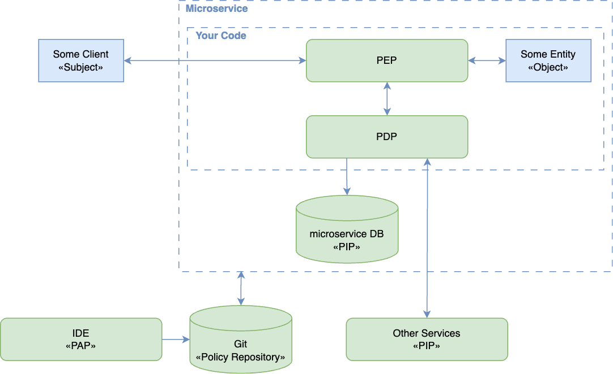
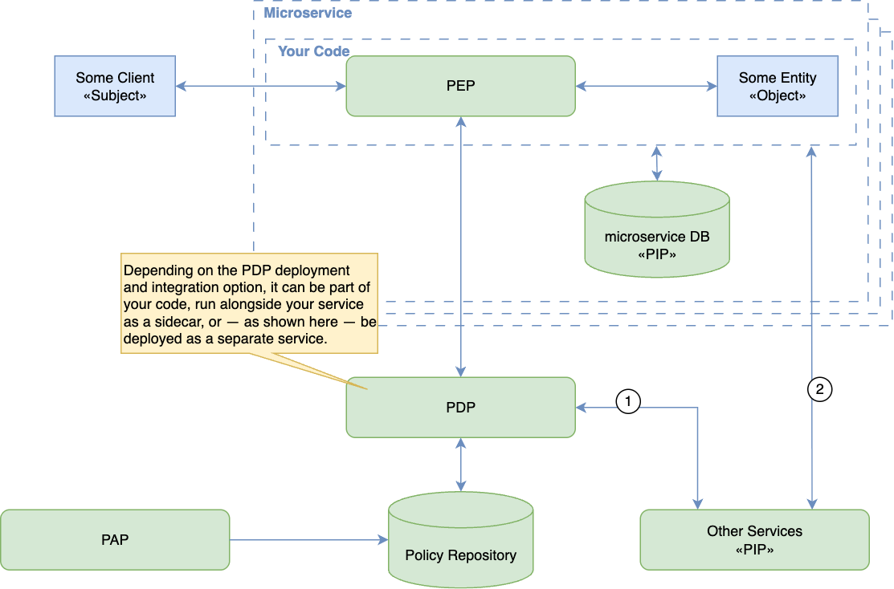
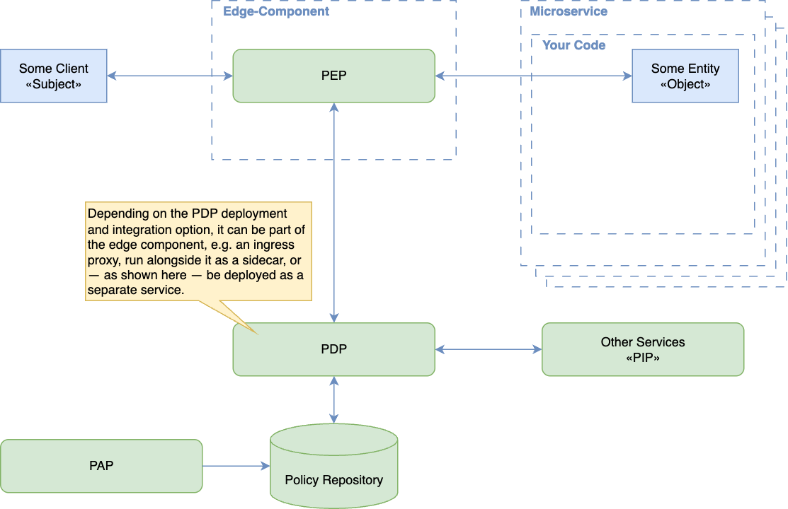
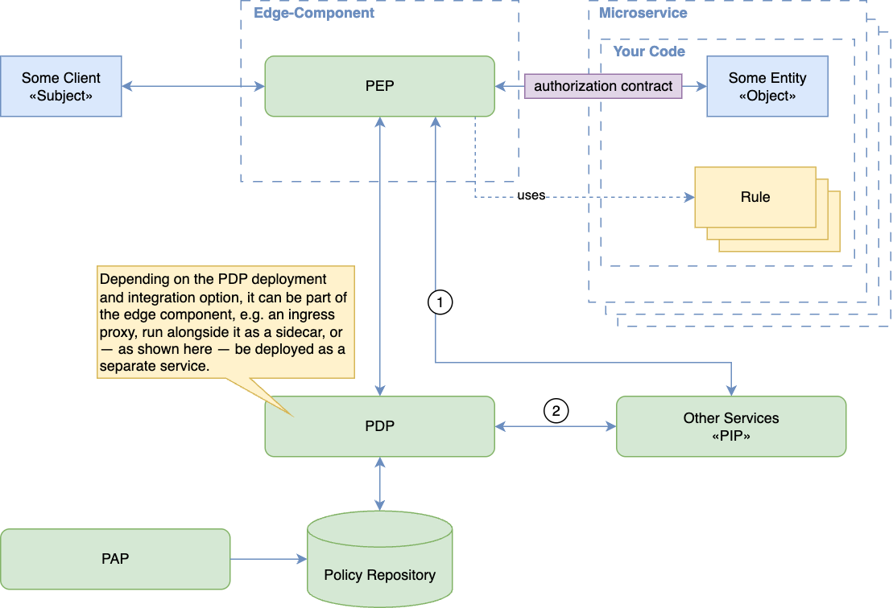

# Authorization Patterns Cheat Sheet

## Introduction

Authorization patterns determine where an application decides and enforces access. A **Policy Enforcement Point (PEP)** protects an operation; a **Policy Decision Point (PDP)** evaluates the applicable policy. [OpenID AuthZEN](https://openid.net/specs/authorization-api-1_0.html) defines an interface between these components. Use the [Authorization Cheat Sheet](Authorization_Cheat_Sheet.md) for baseline controls and [Identity Propagation Patterns](Identity_Propagation_Patterns_Cheat_Sheet.md) for trustworthy caller context.

In the diagrams, a **Policy Administration Point (PAP)** manages rules and a **Policy Information Point (PIP)** supplies attributes used to evaluate them.

## Service-Level Authorization

Keep enforcement close to the protected resource so it can check the requested action, object, and tenant. Deny by default and [validate permissions on every request](Authorization_Cheat_Sheet.md#validate-the-permissions-on-every-request). Separating policy evaluation from enforcement does not transfer the PEP's responsibility to enforce the result; the [AuthZEN trust model](https://openid.net/specs/authorization-api-1_0.html#section-11.4) explicitly relies on that responsibility.

### Policies in Application Code

The service implements both decision and enforcement logic, using a framework's authorization facilities where possible.

This can suit a small application with a limited policy surface. Centralize checks within the application's authorization layer and test every protected entry point. Scattered conditional checks make omissions and inconsistent policies harder to detect; changing these rules requires deploying application code. Code-based policies are not inherently fail-open.

### Separately Managed Policies

The service remains the PEP but asks a PDP to evaluate policies managed independently of business code. The PDP may be embedded, local, or remote; central policy ownership does not require a single central runtime.

Use this separation when several services need consistent rules and a shared review process. Supply authenticated subject context and authoritative resource attributes, enforce the returned decision before accessing the resource, and deny the operation if no valid decision is available. See [Policy and Data Distribution](Authorization_Policy_And_Data_Distribution_Cheat_Sheet.md) for keeping inputs current and [Decisions and Output Handling](Authorization_Decisions_And_Output_Handling_Cheat_Sheet.md) for enforcing results.

## Gateway and Proxy Enforcement

A gateway can enforce coarse access rules before forwarding a request. A service-local proxy can perform similar checks on calls to one service. [Envoy's external authorization filter](https://www.envoyproxy.io/docs/envoy/v1.36.9/configuration/http/http_filters/ext_authz_filter) illustrates delegation to a PDP and documents how routing changes after authorization can invalidate an earlier check.

Treat complete traffic coverage as a deployment requirement, not an automatic property of a gateway. Authenticate permitted callers, restrict direct access to services, and cover internal calls and alternate endpoints. Keep object-level and business-specific checks in the service when the proxy lacks the necessary context. Reevaluate authorization if the effective resource or action changes after a check.

### Propagating an Authorization Context

A gateway may attach signed context describing an authenticated subject or an authorization decision for downstream use.

Downstream services must validate the trusted issuer, integrity, audience, expiry, and the context's applicability to the actual request. Reject direct calls that lack the required context. Strip client-supplied copies of trusted headers before populating them. A signature alone neither prevents bypass nor authorizes a different resource, tenant, or action; follow the [JWT validation guidance](https://www.rfc-editor.org/rfc/rfc8725#section-3) and retain service-level enforcement.

## PDP Deployment and Failure Behavior

Choose deployment independently of the access control model. For example, [OPA supports HTTP, library, and WebAssembly integration](https://www.openpolicyagent.org/docs/integration); a product name does not imply one deployment mode or a particular access control standard.

| Deployment | Security benefit | Required control |
|------------|------------------|------------------|
| Embedded library | Evaluation can continue without a remote PDP connection | Keep policy and data current; verify enforcement on every entry point |
| Local sidecar or daemon | Shared decision implementation near the service | Restrict its API and handle process failure; locality alone does not establish trust |
| Remote service | Shared evaluation and centralized policy administration | Authenticate and authorize PEPs, protect responses, and deny when a valid decision is unavailable |

All modes depend on the policy and data they use. A local PDP with stale revocation data can still permit access incorrectly. Log the decision and its enforcement, with enough policy/version context to investigate discrepancies and without exposing sensitive attributes.

Configure PDP errors and timeouts to deny protected operations. [Envoy's failure-mode setting](https://www.envoyproxy.io/docs/envoy/v1.39.0/api-v3/extensions/filters/http/ext_authz/v3/ext_authz.proto) makes this choice explicit: allowing requests when authorization fails bypasses the control. A previously loaded policy may continue to be evaluated only within the freshness requirements described in [Policy and Data Distribution](Authorization_Policy_And_Data_Distribution_Cheat_Sheet.md#freshness-and-outages).

Prefer service-level enforcement with shared, separately reviewed policies as the system grows. Add gateway checks for early rejection and traffic control; verify that protected operations remain covered when a gateway, policy source, or PDP is unavailable.

## References

- [OpenID AuthZEN Authorization API 1.0](https://openid.net/specs/authorization-api-1_0.html)
- [OPA integration documentation](https://www.openpolicyagent.org/docs/integration)
- [Envoy external authorization security considerations](https://www.envoyproxy.io/docs/envoy/v1.36.9/configuration/http/http_filters/ext_authz_filter#security-considerations)
