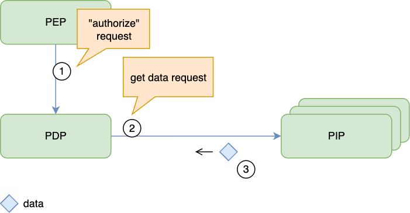
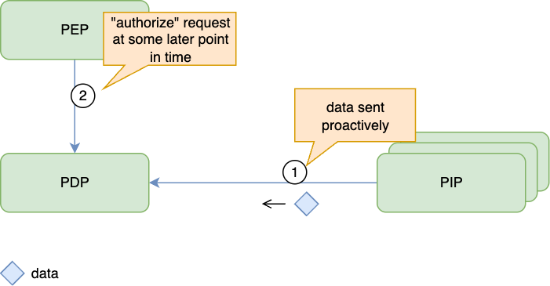
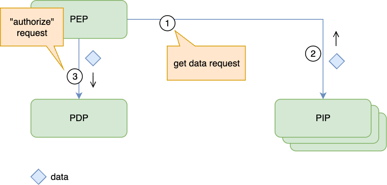
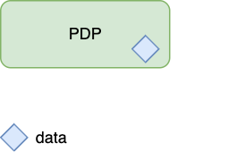

# Authorization Policy and Data Distribution Cheat Sheet

## Introduction

An authorization decision is only as reliable as its policy and input data. A **Policy Decision Point (PDP)** evaluates rules using attributes supplied by a **Policy Enforcement Point (PEP)** or an authoritative **Policy Information Point (PIP)**. [OPA's external data guidance](https://www.openpolicyagent.org/docs/external-data) describes common ways to deliver those inputs. See [Authorization Patterns](Authorization_Patterns_Cheat_Sheet.md) for component placement.

## Define Ownership and Freshness Requirements

Record who may change each policy and attribute, which service is authoritative for it, and the maximum delay before a change must affect decisions. Distinguish policy changes, such as a new restriction, from data changes, such as revoking a user's membership. Neither organizational ownership nor update frequency determines acceptable delay: a central policy can require an emergency update, while another can have a scheduled effective date.

Choose delivery against those requirements. [OPA bundles](https://www.openpolicyagent.org/docs/management-bundles) can carry both policies and data, but distribution is eventually consistent. A successful publication is not proof that every PDP has activated the update.

| Requirement | Suitable starting point | Security condition |
|-------------|------------------------|--------------------|
| Emergency restriction or revocation | Dynamic updates or authoritative lookup | Measure the propagation bound and deny affected operations when it cannot be met |
| Scheduled, stable rules | Versioned deployment or dynamic distribution | Activate the required revision before its effective deadline |
| Frequently changing resource or relationship data | Synchronization or lookup from its authoritative source | Account for replication lag and cached decisions |
| Request-specific attributes | Validated context passed by the PEP | Authenticate the PEP and establish where each security-relevant value came from |

## Deliver Policies and Data

A **Policy Administration Point (PAP)** manages policy changes. Distribute approved policies independently of application releases when restrictions must take effect sooner than a deployment can reliably complete. Delivery may use push or pull; [OPA bundle downloads](https://www.openpolicyagent.org/docs/management-bundles) are an example of pull-based updates outside the decision request. Embedding policies in a release is suitable only when its deployment process meets the required update deadline.

For input data, select among these approaches using the source's consistency guarantees and the PDP's actual capabilities. Model names alone do not establish which mechanisms a product supports.

### Lookup During Evaluation

The PDP retrieves required attributes from an authoritative PIP.

Use this when the source can satisfy the decision's availability and freshness requirements. A lookup does not guarantee current data if the source, replica, or intermediate cache is stale. Deny affected operations when a required attribute cannot be obtained reliably.

### Replicated Data

Updates reach a PDP's local data store before evaluation.

This removes the PIP from the immediate request path but creates a revocation delay. Monitor synchronization progress and handle missed, repeated, and reordered updates. Do not describe local availability as a freshness guarantee.

### Request-Time Data

The PEP collects attributes and includes them in its decision request.

The [AuthZEN security considerations](https://openid.net/specs/authorization-api-1_0.html#section-11) address PEP authentication and trust. An authenticated PEP must still derive user identity, roles, ownership, and tenant membership from trusted sources; copying values from an end user request does not make them authoritative. Validate resource identifiers against the actual target and distinguish user-supplied context from verified attributes.

### Embedded Data

Stable data is packaged with the PDP or policy release.

Use this only when changing the data through a deployment meets its freshness requirement. Avoid embedding mutable account status or revocation data in releases that cannot update promptly.

## Protect Distribution and Administration

Protect network-exposed decision APIs and the APIs that read or modify policy and data. Authenticate PEPs and administrators, restrict each to the tenants and operations they need, and prevent service teams from replacing organization-wide restrictions. [OPA's API security documentation](https://www.openpolicyagent.org/docs/security) describes authentication and authorization for these interfaces. An in-process PDP shares the application's trust boundary; it does not require a separate network authentication exchange.

Verify policy artifacts before activation. For bundles, require a signature from a configured trusted publisher and verify all covered files; [OPA documents the verification and activation rules](https://www.openpolicyagent.org/docs/management-bundles#signature-verification). Protect transport and signing keys as well. A valid signature proves origin and integrity, not that a policy is correct or current.

Pin deployments to reviewed policy and schema versions, and record which revision each PDP actually activates. Reject unexpected or obsolete revisions; allow a rollback only through the reviewed release process. Test that service-owned rules cannot override mandatory restrictions. These controls are needed for embedded releases as well as dynamic delivery.

## Freshness and Outages

Distinguish loss of the policy distribution service from loss of a usable authorization decision. [OPA retains its existing bundle when a new bundle fails verification](https://www.openpolicyagent.org/docs/management-bundles#signature-verification); this preserves availability but does not establish that the old bundle is still fresh enough.

- Continue evaluating a previously verified policy only while its policy, data, and any decision-cache freshness requirements remain satisfied.
- At startup, do not serve protected operations until the required policy and data are available and valid.
- Deny affected operations when required inputs are missing, invalid, or older than the allowed bound. Do not turn a timeout or undefined result into a permit; follow [Deny by Default](Authorization_Cheat_Sheet.md#deny-by-default).
- Exercise revocation, delayed updates, invalid artifacts, unavailable sources, and recovery. Verify the effective decision at the PEP, not just delivery to the PDP.

Prefer reviewed, versioned policies and an explicit freshness budget for each security-relevant input. Select the simplest delivery mechanism that meets those limits and stop granting affected access when it cannot.

## References

- [OPA external data integration](https://www.openpolicyagent.org/docs/external-data)
- [OPA policy and data bundles](https://www.openpolicyagent.org/docs/management-bundles)
- [OpenID AuthZEN security considerations](https://openid.net/specs/authorization-api-1_0.html#section-11)
