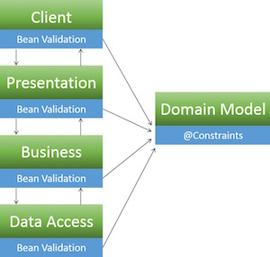

# Bean Validation Cheat Sheet

## Introduction

This article is focused on providing clear, simple, actionable guidance for providing Java Bean Validation security functionality in your applications.

Bean validation (JSR303 aka [Bean Validation 1.0](https://beanvalidation.org/1.0/spec/) /JSR349 aka [Bean Validation 1.1](https://beanvalidation.org/1.1/spec/)) is one of the most common ways to perform [input validation](https://cheatsheetseries.owasp.org/cheatsheets/Input_Validation_Cheat_Sheet.html) in Java. It is an application layer agnostic validation spec which provides the developer with the means to define a set of validation constraints on a domain model and then perform validation of those constraints through out the various application tiers.

One advantage of this approach is that the validation constraints and the corresponding validators are only written once, thus reducing duplication of effort and ensuring uniformity:

### Typical Validation


### Bean Validation



## Setup

The examples in this guide use Hibernate Validator (the reference implementation for Bean Validation 1.1).

Add Hibernate Validator to your **pom.xml**:

```xml
<dependency>
   <groupId>org.hibernate</groupId>
   <artifactId>hibernate-validator</artifactId>
   <version>5.2.4.Final</version>
</dependency>
```

Enable bean validation support in Spring's **context.xml**:

```xml
<beans:beans ...
   ...
   <mvc:annotation-driven />
   ...
</beans:beans>
```

For more info, please see the [setup guide](https://hibernate.org/validator/documentation/getting-started/)

## Basics

In order to get started using Bean Validation, you must add validation constraints (`@Pattern`, `@Digits`, `@Min`, `@Max`, `@Size`, `@Past`, `@Future`, `@CreditCardNumber`, `@Email`, `@URL`, etc.) to your model and then utilize the `@Valid` annotation when passing your model around in various application layers.

Constraints can be applied in several places:

- Fields
- Properties
- Classes

For Bean Validation 1.1 also on:

- Parameters
- Return values
- Constructors

For the sake of simplicity all the examples below feature field constraints and all validation is triggered by the controller. Refer to the Bean Validation documentation for a full list of examples.

When it comes to error handling, the Hibernate Validator returns a `BindingResult` object which contains a `List<ObjectError>`. The examples below feature simplistic error handling, while a production ready application would have a more elaborate design that takes care of logging and error page redirection.

## Predefined Constraints

### @Pattern

**Annotation**:

`@Pattern(regex=,flag=)`

**Data Type**:

`CharSequence`

**Use**:

Checks if the annotated string matches the regular expression regex considering the given flag match. Please visit [OWASP Validation Regex Repository](https://owasp.org/www-community/OWASP_Validation_Regex_Repository) for other useful regex's.

**Reference**:

[Documentation](https://docs.jboss.org/hibernate/validator/5.2/reference/en-US/html/ch02.html#section-builtin-constraints)

**Model**:

```java
import org.hibernate.validator.constraints.Pattern;

public class Article  {
 //Constraint: Alpha Numeric article titles only using a regular expression
 @Pattern(regexp = "[a-zA-Z0-9 ]")
 private String articleTitle;
 public String getArticleTitle()  {
  return  articleTitle;
 }
 public void setArticleTitle(String  articleTitle)  {
   this.articleTitle  =  articleTitle;
  }

  ...

}
```

**Controller**:

```java
import javax.validation.Valid;
import com.company.app.model.Article;

@Controller
public class ArticleController  {

 ...

 @RequestMapping(value = "/postArticle",  method = RequestMethod.POST)
 public @ResponseBody String postArticle(@Valid  Article  article,  BindingResult  result,
 HttpServletResponse  response) {
  if (result.hasErrors()) {
   String errorMessage  =  "";
   response.setStatus(HttpServletResponse.SC_BAD_REQUEST);
   List<ObjectError> errors = result.getAllErrors();
   for(ObjectError  e :  errors) {
    errorMessage += "ERROR: " +  e.getDefaultMessage();
   }
   return  errorMessage;
  } else {
   return  "Validation Successful";
  }
 }
}
```

### @Digits

**Annotation**:

`@Digits(integer=,fraction=)`

**Data Type**:

`BigDecimal`, `BigInteger`, `CharSequence`, `byte`, `short`, `int`, `long` and the respective wrappers of the primitive types; Additionally supported by HV: any sub-type of Number

**Use**:

Checks whether the annotated value is a number having up to integer digits and fraction fractional digits

**Reference**:

[Documentation](https://docs.jboss.org/hibernate/validator/5.2/reference/en-US/html/ch02.html#section-builtin-constraints)

**Model**:

```java
import org.hibernate.validator.constraints.Digits;

public class Customer {
  //Constraint: Age can only be 3 digits long or less
  @Digits(integer = 3, fraction = 0)
  private int age;

  public String getAge()  {
    return age;
  }

  public void setAge(String age)  {
      this.age = age;
    }

    ...
}
```

**Controller**:

```java
import javax.validation.Valid;
import com.company.app.model.Customer;

@Controller
public class CustomerController  {

 ...

 @RequestMapping(value = "/registerCustomer",  method = RequestMethod.POST)
 public @ResponseBody String registerCustomer(@Valid Customer customer, BindingResult result,
 HttpServletResponse  response) {

  if (result.hasErrors()) {
   String errorMessage = "";
   response.setStatus(HttpServletResponse.SC_BAD_REQUEST);
   List<ObjectError> errors = result.getAllErrors();

   for( ObjectError  e :  errors) {
    errorMessage += "ERROR: "  +  e.getDefaultMessage();
   }
   return  errorMessage;
  } else {
   return  "Validation Successful";
  }
 }
}
```

### @Size

**Annotation**:

`@Size(min=,` `max=)`

**Data Type**:

`CharSequence`, `Collection`, `Map` and `Arrays`

**Use**:

Checks if the annotated element's size is between min and max (inclusive)

**Reference**:

[Documentation](https://docs.jboss.org/hibernate/validator/5.2/reference/en-US/html/ch02.html#section-builtin-constraints)

**Model**:

```java
import org.hibernate.validator.constraints.Size;

public class Message {

   //Constraint: Message must be at least 10 characters long, but less than 500
   @Size(min = 10, max = 500)
   private String message;

   public String getMessage() {
      return message;
   }

   public void setMessage(String message) {
      this.message = message;
   }

...
}
```

**Controller**:

```java
import javax.validation.Valid;
import com.company.app.model.Message;

@Controller
public class MessageController {

...

@RequestMapping(value="/sendMessage", method=RequestMethod.POST)
public @ResponseBody String sendMessage(@Valid Message message, BindingResult result,
HttpServletResponse response){

   if(result.hasErrors()){
      String errorMessage = "";
      response.setStatus(HttpServletResponse.SC_BAD_REQUEST);
      List<ObjectError> errors = result.getAllErrors();
      for( ObjectError e : errors){
         errorMessage+= "ERROR: " + e.getDefaultMessage();
      }
      return errorMessage;
   }
   else{
      return "Validation Successful";
   }
}
}
```

### @Past / @Future

**Annotation**:

`@Past,` `@Future`

**Data Type**:

`java.util.Date`, `java.util.Calendar`, `java.time.chrono.ChronoZonedDateTime`, `java.time.Instant`, `java.time.OffsetDateTime`

**Use**:

Checks whether the annotated date is in the past / future

**Reference**:

[Documentation](https://docs.jboss.org/hibernate/validator/5.2/reference/en-US/html/ch02.html#section-builtin-constraints)

**Model**:

```java
import org.hibernate.validator.constraints.Past;
import org.hibernate.validator.constraints.Future;

public class DoctorVisit {

   //Constraint: Birthdate must be in the past
   @Past
   private Date birthDate;

   public Date getBirthDate() {
      return birthDate;
   }

   public void setBirthDate(Date birthDate) {
      this.birthDate = birthDate;
   }

   //Constraint: Schedule visit date must be in the future
   @Future
   private String scheduledVisitDate;

   public String getScheduledVisitDate() {
      return scheduledVisitDate;
   }

   public void setScheduledVisitDate(String scheduledVisitDate) {
      this.scheduledVisitDate = scheduledVisitDate;
   }

...
}
```

**Controller**:

```java
import javax.validation.Valid;
import com.company.app.model.DoctorVisit;

@Controller
public class DoctorVisitController {

   ...

   @RequestMapping(value="/scheduleVisit", method=RequestMethod.POST)
   public @ResponseBody String scheduleVisit(@Valid DoctorVisit doctorvisit, BindingResult result,
   HttpServletResponse response){

      if(result.hasErrors()){
         String errorMessage = "";
         response.setStatus(HttpServletResponse.SC_BAD_REQUEST);
         List<ObjectError> errors = result.getAllErrors();
         for( ObjectError e : errors){
            errorMessage+= "ERROR: " + e.getDefaultMessage();
         }
         return errorMessage;
      }
      else{
         return "Validation Successful";
      }
   }
}
```

### Combining Constraints

Validation annotations can be combined in any suitable way. For instance, to specify a valid reviewRating value between 1 and 5, specify the validation like this :

**Annotation**:

`@Min(value=),` `@Max(value=)`

**Data Type**:

`BigDecimal`, `BigInteger`, `byte`, `short`, `int`, `long` and the respective wrappers of the primitive types; Additionally supported by HV: any sub-type of `CharSequence` (the numeric value represented by the character sequence is evaluated), any sub-type of Number

**Use**:

Checks whether the annotated value is higher/lower than or equal to the specified minimum

**Reference:**

[Documentation](https://docs.jboss.org/hibernate/validator/5.2/reference/en-US/html/ch02.html#section-builtin-constraints)

**Model**:

```java
import org.hibernate.validator.constraints.Min;
import org.hibernate.validator.constraints.Max;

public class Review {

 //Constraint: Review rating must be between 1 and 5
 @Min(1)
 @Max(5)
 private int reviewRating;

 public int getReviewRating() {
   return reviewRating;
 }

 public void setReviewRating(int reviewRating) {
   this.reviewRating = reviewRating;
}
 ...
}
```

**Controller**:

```java
import javax.validation.Valid;
import com.company.app.model.ReviewRating;

@Controller
public class ReviewController {

   ...

   @RequestMapping(value="/postReview", method=RequestMethod.POST)
   public @ResponseBody String postReview(@Valid Review review, BindingResult result,
   HttpServletResponse response){

      if(result.hasErrors()){
         String errorMessage = "";
         response.setStatus(HttpServletResponse.SC_BAD_REQUEST);
         List<ObjectError> errors = result.getAllErrors();
         for( ObjectError e : errors){
            errorMessage+= "ERROR: " + e.getDefaultMessage();
         }
         return errorMessage;
      }
       else{
         return "Validation Successful";
      }
   }
}
```

### Cascading Constraints

Validating one bean is a good start, but often, beans are nested or in a complete graph of beans. To validate that graph in one go, apply cascading validation with [@Valid](https://docs.jboss.org/hibernate/validator/5.2/reference/en-US/html/ch03.html#_cascaded_validation)

### Additional Constraints

In addition to providing the complete set of JSR303 constraints, Hibernate Validator also defines some additional constraints for convenience:

- `@CreditCardNumber`
- `@EAN`
- `@Email`
- `@Length`
- `@Range`
- `@ScriptAssert`
- `@URL`

Take a look at this [table](https://docs.jboss.org/hibernate/validator/5.2/reference/en-US/html/ch02.html#table-custom-constraints) for the complete list.

Note that `@SafeHtml`, a previously valid constraint, has been deprecated according to the [Hibernate Validator 6.1.0.Final and 6.0.18.Final release blogpost](https://in.relation.to/2019/11/20/hibernate-validator-610-6018-released/). Please refrain from using the `@SafeHtml` constraint.

## Custom Constraints

One of the most powerful features of bean validation is the ability to define your own constraints that go beyond the simple validation offered by built-in constraints.

Creating custom constraints is beyond the scope of this guide. Please see this [documentation](https://docs.jboss.org/hibernate/validator/5.2/reference/en-US/html/ch06.html).

## Error Messages

It is possible to specify a message ID with the validation annotation, so that error messages are customized :

```java
@Pattern(regexp = "[a-zA-Z0-9 ]", message="article.title.error")
private String articleTitle;
```

Spring MVC will then look up a message with ID *article.title.error* in a defined MessageSource. More on this [documentation](https://www.silverbaytech.com/2013/04/16/custom-messages-in-spring-validation/).
