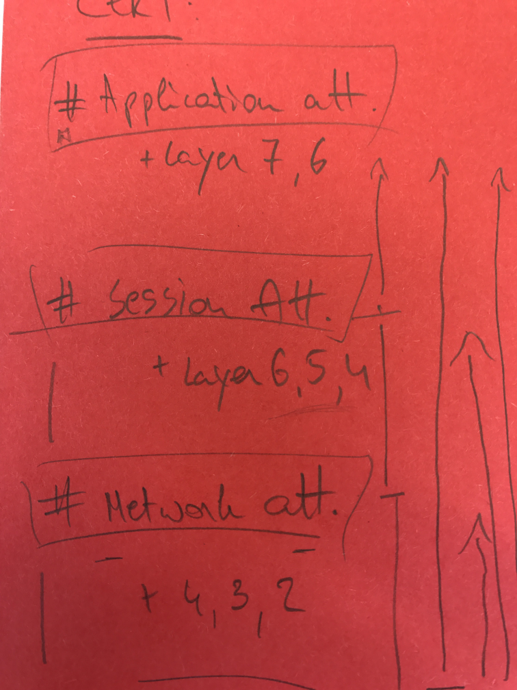

# Denial of Service Cheat Sheet

## Introduction

This sheet is focused on providing an overall, common overview with an informative, straight to the point guidance to propose angles on how to battle denial of service (DoS) attacks on different layers. It is by no means complete, however, it should serve as an indicator to inform the reader and to introduce a workable methodology to tackle this issue.

### Fundamentals

Considering that anti-DoS approaches are not one-step solutions, it becomes apparent that, for it to be implemented, it's necessary to involve different profiles within your organization to assess the actual situation and to apply countermeasures accordingly. These profiles are: developers and architects in the area of application and infrastructure.

Key concepts within information security evolve around criteria or properties such as the [CIA triad](https://whatis.techtarget.com/definition/Confidentiality-integrity-and-availability-CIA). The letter **A**, which stands for availability, is our focal point. The core essence of a DoS is to affect, by any means, the availability of instances or objects and to eventually render it inaccessible. Thus, for any information system to serve its purpose, it must be available at any time. Hence why every computing system within the interoperability flow must function correctly to achieve that.

To remain resilient and resistant, it's imperative - and suggested - to outline and to conduct a thorough analysis on components within your inventory based on functionality, architecture and performance (i.e. application-wise, infrastructure and network related).

The outcome of this research should identify potential causes of a DoS which highlight single point of failures ranging from programming related errors to resource exhaustion..

From a prevention point of view, it's important to have a clear picture on how to tackle your appropriate components to address the issue at stake (e.g. bottlenecks, etc.). That's why a solid understanding of your environment is essential to develop a suitable defence mechanism. These could be aligned with:

1. scaling options (**up** = inner hardware components, **out** = the number of complete components)
2. existing conceptual / logical techniques (such as applying redundancy measurements, bulk-heading, etc. - which expands your in-house capabilities)
3. a cost analysis applied to your situation

Within this document we will adhere to a particular guidance structure to illustrate on how to analyse this subject based on your situation. It is by no means a complete approach but we ought to create fundamental blocks which should be utilized to assist you in constructing anti-DoS concepts fitting to your needs.

### General Categories and Basic Controls

In this cheat sheet, we will adhere to the DDOS classification as documented by CERT-EU. The document categorizes the 7 OSI model layers into three main attack categories, namely application, Session and Network.

**TODO:** Add Diagram

Application attacks focus on rendering applications unavailable by exhausting resources or by making it unusable in a functional way. Session (or protocol) attacks focus on consuming server resources, or resources of intermediary equipment like firewalls and load-balancers. Network (or volumetric) attacks focus on saturating the bandwidth of the network resource. It is important to understand that each of these three attack categories needs to be considered when designing a DoS resilient solution.

Note that OSI model layer 1 and 2 are not included in this categorization. In the spirit of providing a complete overview of all DoS type of attacks, we will shortly discuss these layers and how DoS applies to them.

The physical layer consists of the networking hardware transmission technologies of a network. It is a fundamental layer underlying the logical data structures of the higher-level functions in a network. Typical DoS scenarios are destruction, obstruction, malfunction. An example is a case where a Georgian elderly woman sliced through an underground cable, resulting in loss of internet for the whole of Armenia.

The data layer is the protocol layer that transfers data between adjacent network nodes in a wide area network (WAN) or between nodes on the same local area network (LAN) segment. Typical DoS scenarios are MAC flooding (targeting switch MAC tables) and ARP poisoning.

In MAC flooding attacks, a switch is flooded with packets, each with a different source MAC address. The intention is to consume the limited memory used by a switch to store the MAC and physical port translation table (MAC table). The result is that valid MAC addresses are purged and the switch enters a fail-over mode where it will act as a network hub. All data is then forwarded to all ports, resulting in a data leakage. TODO impact in relation to DoS TODO document compact remediation

In ARP poisoning attacks a malicious actor sends spoofed ARP (Address Resolution Protocol) messages over the wire. The result is that the attacker's MAC address can be linked to the IP address of a legitimate device on the network. This allows an attacker to intercept, modify or stop data in transit, that was intended for the victim IP address. The ARP protocol is specific to the local area network and could cause a DoS on the wire communication.

Packet filtering technology can be used to inspect packets in transit to identify and block offending ARP packets. Another approach is to use static ARP tables but they prove difficult to be maintained.

## Application attacks

Application layer attacks focus on rendering applications unavailable by exhausting resources or by making it unusable in a functional way. These attacks do not have to consume the network bandwidth to be effective. Rather they place an operational strain on the application server in such a way that the server becomes unavailable, unusable or non-functional. All attacks exploiting weaknesses on OSI layer 7 protocol stack are generally categorised as application attacks. They are most challenging to identify/mitigate.

**TODO:** List all attacks per category. Because we cannot map remediations one on one with an attack vector, we will first need to list them before discussing the action points

**Slow HTTP** is a DoS attack type where HTTP requests are send very slow and fragmented, one at a time. Until the HTTP request was fully delivered, the server will keep resources stalled while waiting for the missing incoming data. At one moment, the server will reach the maximum concurrent connection pool, resulting in a DoS. From an attacker's perspective, slow HTTP attacks are cheap to perform because they require minimal resources.

### Software Design Concepts

- **Cheap validation first**: Validation that is cheap in resources should be considered first. More (CPU, memory and bandwidth) expensive validation should be performed afterward. The reason is obvious, we want to reduce impact on these resources as soon as possible.
- **Graceful Degradation** is the ability of maintaining functionality when portions of a system or application break. DoS caused by application termination is a widespread problem. Implementing a fault tolerant design enables a system or application to continue its intended operation, possibly at a reduced level, rather than failing completely, when some part of the system fails. Graceful degradation is a core concept to follow during application design phase, in order to limit impact of DoS.
- **Prevent single point of failure**
- **Avoid highly CPU consuming operations**
- **Keep Queues short**
- **Handle Exceptions**
- **Protect overflow and underflow**
- **Threading**: Avoid operations which must wait for completion of large tasks to proceed. Asynchronous operations
- Identify resource intensive pages and plan ahead.

### Session

- **Limit server side session time based on inactivity and a final timeout**: (resource exhaustion) While sessions timeout is most of the time discussed in relation to session security and preventing session hijacking, it is also an important measure to prevent resource exhaustion.
- **Limit session bound information storage:** the less data is linked to a session, the less burden a user session has on webserver's performance.

### Input validation

- **Limit file upload size and extensions** (resource exhaustion) to prevent DoS on file space storage or other web application functions which will use the upload as input (e.g. image resizing, PDF creation, etc.)        - [Checklist](https://owasp.org/www-community/vulnerabilities/Unrestricted_File_Upload).
- **Limit total request size** (resource exhaustion) to make it harder for resource consuming DoS attack to succeed.
- **Prevent input based resource allocation** (resource exhaustion).
- **Prevent input based function and threading interaction** (resource exhaustion). User input could influence how many times a function needs to be executed, or how intensive the CPU consumption becomes. Depending on (unfiltered) user input for resource allocation could allow a DoS scenario through resource exhaustion.
- **Input based puzzles** like captchas or simple math problems are often used to 'protect' a web form. They serve a purpose to protect against functionality abuse. The classic example is a webform that will send out an email after posting the request. A captcha could then prevent the mailbox from getting flooded by a malicious attacker or spambot. Notice that this kind of technology will not help defend against DoS attacks.

### Access control

- **Authentication as a means to expose functionality**
- **User lockout** is a scenario where an attacker can take advantage of the application security mechanisms to cause DoS by abusing the login failure.

## Network attacks

**TODO:** (Develop text) Attacks where network bandwidth gets saturation. Volumetric in nature. Amplification techniques make these attacks effective.

**TODO:** (list attacks) NTP amplification, DNS amplification, UDP flooding, TCP flooding

### Network Design Concepts

- **Preventing single point of failure**
- **Pooling**
- **Caching** is the concept that data is stored so future requests for that data can be served faster. The more data is served via caching, to more resilient the application becomes to bandwidth exhaustion.
- **Static resources hosting on a different domain** will reduce the number of http requests on the web application. Images and JavaScript are typical files that are loaded from a different domain.  

### Rate limiting

Rate limiting is the process of controlling traffic rate from and to a server or component. It can be implemented on infrastructure as well as on an application level. Rate limiting can be based on (offending) IPs, on IP block lists, on geolocation, etc.

- **Define a minimum ingress data rate limit**, and drop all connections below that rate. Note that if the rate limit is set too low, this could impact clients. Inspect the logs to establish a baseline of genuine traffic rate. (Protection against slow HTTP attacks)
- **Define an absolute connection timeout**
- **Define a maximum ingress data rate limit**, and drop all connections above that rate.
- **Define a total bandwidth size limit** to prevent bandwidth exhaustion
- **Define a load limit**, which specifies the number of users allowed to access any given resource at any given time.

### ISP-Level remediations

- **Filter invalid sender addresses using edge routers**, in accordance with RFC 2267, to filter out IP-spoofing attacks done with the goal of bypassing block lists.
- **Check your ISP services in terms of DDOS beforehand** (support for multiple internet access points, enough bandwidth (xx-xxx Gbit/s) and special hardware for traffic analysis and defence on application level

### Global-Level remediations: Commercial cloud filter services

- Consider using a filter service in order to resist larger attacks (up to 500GBit/s)
- **Filter services** support different mechanics to filter out malicious or non compliant traffic
- **Comply with relevant data protection/privacy laws** - a lot of providers route traffic through USA/UK

## Related Articles

- [CERT-EU Whitepaper](http://cert.europa.eu/static/WhitePapers/CERT-EU-SWP_14_09_DDoS_final.pdf)
