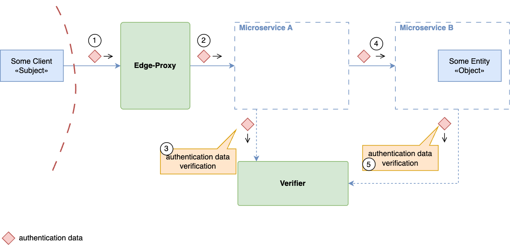
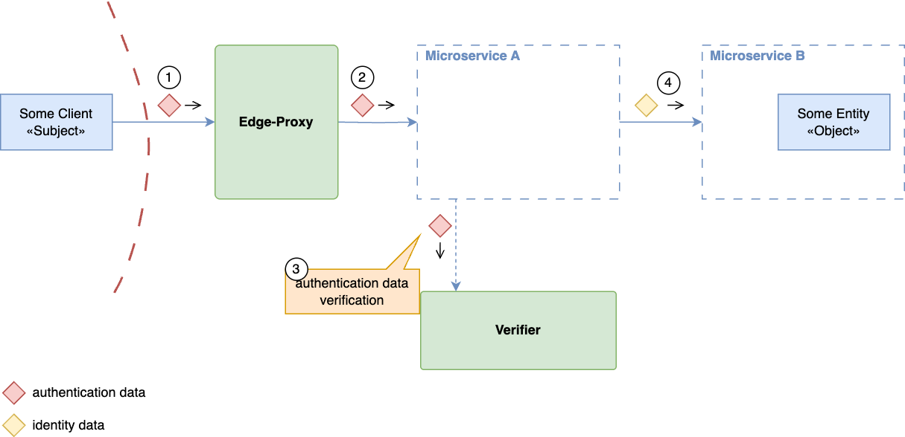
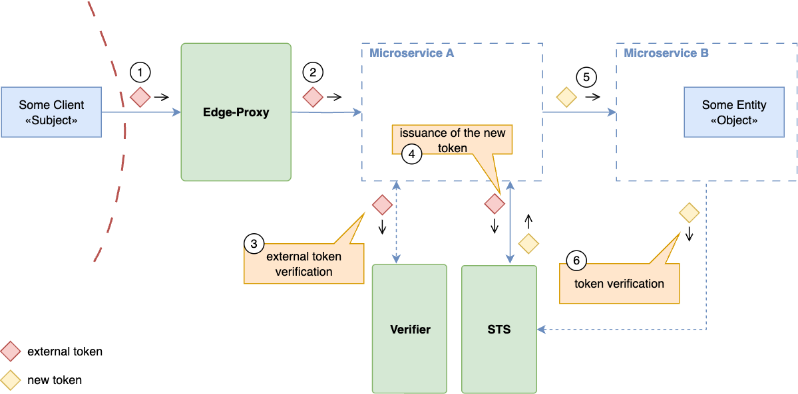
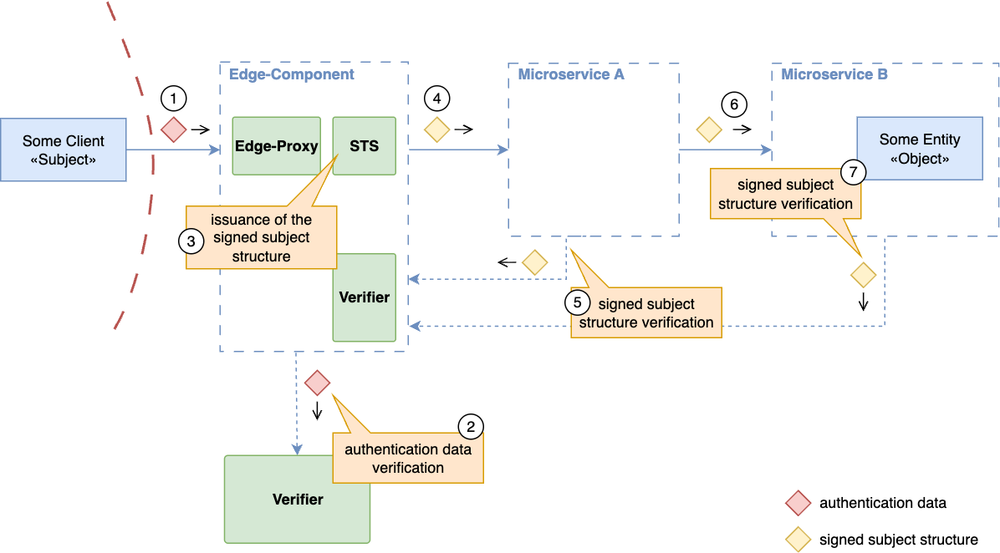

# Identity Propagation Patterns Cheat Sheet

## Introduction

Identity propagation carries authenticated user context between services. Choose a representation that each recipient can validate and that limits where credentials can be used; [OAuth security guidance](https://www.rfc-editor.org/rfc/rfc9700.html#section-2.3) recommends restricting access tokens to their intended resources and actions. See [Authentication Patterns](Authentication_Patterns_Cheat_Sheet.md) for authenticating the original request and [Authorization Patterns](Authorization_Patterns_Cheat_Sheet.md) for enforcing access decisions.

## Validation at Each Boundary

Separate the identity of the calling service from the user on whose behalf it acts. Authenticate service connections using the controls in [Microservices Security](Microservices_Security_Cheat_Sheet.md#service-to-service-authentication); possession of user context alone does not establish the caller's service identity.

- Accept identity assertions only from configured issuers authorized to make those assertions. For JSON Web Tokens (JWTs), validate the signature, allowed algorithm, issuer, audience, token type, and validity period according to the applicable token profile. [RFC 8725](https://www.rfc-editor.org/rfc/rfc8725#section-3) explains why signature verification alone is insufficient.
- For opaque access tokens, use the issuer's supported validation mechanism. A token's representation does not determine whether it grants access to a particular operation.
- Do not treat an [OpenID Connect ID token](https://openid.net/specs/openid-connect-core-1_0.html#IDTokenValidation) as an API access token. Forwarding a certificate also does not preserve [proof of private-key possession on a TLS connection](https://www.rfc-editor.org/info/rfc8705/). Preserve each protocol's validation and proof requirements.
- Reject missing or invalid context. Each receiving service must still authorize the requested action and resource. A valid signature establishes the issuer and integrity of an assertion, not permission for every request.

The diagrams below illustrate the flow of identity data. Their verification steps include these checks; a component labeled "Verifier" need not be a separate online service.

## Propagation Patterns

### External Identity Propagation

The edge passes an external access token to a service that is an intended recipient. Each recipient validates it before use.

This is reasonable when services share the token's validation profile and the token is intended for those services. Do not widen token audiences merely to make forwarding work. [Audience restriction](https://www.rfc-editor.org/rfc/rfc9700.html#section-4.10.2) limits the impact of a leaked token; forwarding a bearer token to more services increases the places from which it can leak. Forwarding is not inherently incompatible with Zero Trust, but it does not provide isolation between recipients that accept the same credential.

### Simple Service-Level Identity Forwarding

A service extracts user attributes and forwards a JSON object, header, or assertion that it signs itself.

Avoid making arbitrary application services identity issuers. An authenticated channel, or a signature made by the forwarding service, can identify the sender and protect transit integrity; neither proves that the sender is entitled to assert a user's identity or privileges. Every service trusted to supply these attributes can misrepresent them. If using a trusted proxy header, remove client-supplied copies, authenticate the proxy, and prevent requests from bypassing it. Prefer an assertion from a designated issuer when context crosses multiple service boundaries.

### Token Exchange

A service presents an incoming token to a Security Token Service (STS) and requests a token for a downstream recipient. [RFC 8693](https://www.rfc-editor.org/rfc/rfc8693#section-2) defines this exchange, including subject and actor tokens, requested audiences, and scopes. The STS must authorize the exchange and constrain the issued privileges; requesting a narrower token is not a substitute for issuer-side enforcement.

Use exchange when a downstream call needs a different audience or explicit delegation. Preserve the distinction between the user and the acting service where the policy depends on it. Exchange adds an issuance dependency; plan for STS outages without accepting invalid credentials. RFC 8693 does not require all input credentials to be OAuth access tokens or all issued tokens to be signed JWTs.

### Protocol-Agnostic Identity Propagation

The edge validates the external credential and obtains a normalized internal assertion from a trusted issuer. Internal services validate that assertion instead of implementing each external authentication protocol.

Prefer this approach when several external authentication mechanisms must feed the same internal services. Keep issuance privileges separate from verification privileges, and limit the assertion's recipients and lifetime. Signing protects integrity; it does not hide claims, prevent bearer-token replay, or compensate for a compromised issuer.

The [Transaction Tokens draft](https://datatracker.ietf.org/doc/html/draft-ietf-oauth-transaction-tokens-11#section-12.2) is one developing example: an ingress or initiating workload obtains a transaction token and workloads normally propagate it unmodified within a trust domain. Recipients validate its signature, trust-domain audience, and expiry, then authorize their own operation. The draft also permits [constrained replacement by the token service](https://datatracker.ietf.org/doc/html/draft-ietf-oauth-transaction-tokens-11#section-13.15). Its tokens are not replay resistant; this is not a fresh audience-specific exchange at every service hop.

## Privacy and Recommendation

Send only the identity attributes a recipient needs. Use pseudonymous identifiers where appropriate and protect tokens in transit; [RFC 8693's privacy considerations](https://www.rfc-editor.org/rfc/rfc8693#section-6) describe these controls. Mapping an external identifier to an internal one does not by itself prevent correlation, and signing does not provide confidentiality. Keep internal assertions out of client responses and follow the [Logging Cheat Sheet](Logging_Cheat_Sheet.md#data-to-exclude) when recording identity events.

Start with a token that each intended recipient can validate. Use exchange for recipient-specific delegation, or a trusted internal issuer to normalize external credentials. In every pattern, validate context at each receiving service and enforce least privilege there.

## References

- [RFC 9700: OAuth 2.0 Security Best Current Practice](https://www.rfc-editor.org/rfc/rfc9700.html)
- [RFC 8725: JSON Web Token Best Current Practices](https://www.rfc-editor.org/rfc/rfc8725)
- [RFC 8693: OAuth 2.0 Token Exchange](https://www.rfc-editor.org/rfc/rfc8693)
