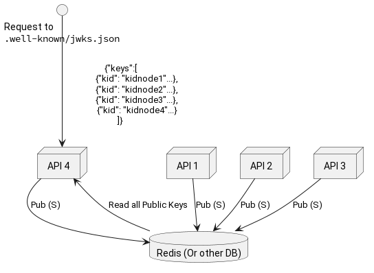

# JWT Cheat Sheet

## Introduction

Many applications use **JSON Web Tokens** (JWT) to allow the client to indicate its identity for further exchange after
 authentication and to securely transmit data.

From [JWT.IO](https://jwt.io/introduction):

> JSON Web Token (JWT) is an open standard ([RFC 7519](https://tools.ietf.org/html/rfc7519)) that defines a compact and
> self-contained way for securely transmitting information between parties as a JSON object. This information can be
> verified and trusted because it is digitally signed. JWTs can be signed using a secret (with the **HMAC** algorithm)
> or a public/private key pair using **RSA** or **ECDSA**.

JSON Web Token is used to carry information related to the identity and characteristics (claims) of a client. This
 information should signed by the server in order for it to detect whether it was tampered with after sending it to the
 client. This will prevent an attacker from changing the identity or any characteristics (for example, changing the role
 from simple user to admin or change the client login).

This token is created during authentication (is provided in case of successful authentication) and is verified by the
 server before any processing. It is used by an application to allow a client to present a token representing the user's
 "identity card" to the server and allow the server to verify the validity and integrity of the token in a secure way,
 all of this in a stateless and portable approach (portable in the way that client and server technologies can be
 different including also the transport channel even if HTTP is the most often used).


### Verification

Your application, absolutely should verify that the tokens it recieves are valid. You can do this with a symmetric scheme, where
a secret between all parties out of band. For more on how to manage secrets please refer to the [secrets management cheat sheet](Secrets_Management_Cheat_Sheet.md). Or you can use an asymmetric key to signe your tokens.  you have the option of signing your
tokens with a centrally signed certificate but, a system [Json Web Key Sets](https://datatracker.ietf.org/doc/html/rfc7517) a
reasonably well supported system that integrates well with most JWT libraries and allows you the benefits of asymmetric encryption
while being able to take advantage of modern TLS solutions that prevent your application from needing access to the same certificate
that's encrypting traffic in transit. There are concerns on how to do this with multi-node systems; but in general use of a data
store like redis can be used to keep track of the largely ephemeral keys you would create.



### JWKS Startup Examples

=== "Python Example (`jwcrypto`)"
    --8<-- "JWTCSA/1-jwks.md:jwcrypto"

## Token Structure

Token structure example taken from [JWT.IO](https://jwt.io/#debugger):

`[Base64(HEADER)].[Base64(PAYLOAD)].[Base64(SIGNATURE)]`

```text
eyJhbGciOiJIUzI1NiIsInR5cCI6IkpXVCJ9.
eyJzdWIiOiIxMjM0NTY3ODkwIiwibmFtZSI6IkpvaG4gRG9lIiwiYWRtaW4iOnRydWV9.
TJVA95OrM7E2cBab30RMHrHDcEfxjoYZgeFONFh7HgQ
```

Chunk 1: **Header**

```json
{
  "alg": "HS256",
  "typ": "JWT"
}
```

Chunk 2: **Payload**

```json
{
  "sub": "1234567890",
  "name": "John Doe",
  "admin": true
}
```

Chunk 3: **Signature**

```javascript
HMACSHA256( base64UrlEncode(header) + "." + base64UrlEncode(payload), KEY )
```

And example of this jwt can be found [here](https://jwt.io/) on JWT.io signed with a symmetric key called `test` (obviously
 weak).

## Objective

This cheatsheet provides tips to prevent common security issues when using JSON Web Tokens (JWT).

## Consideration about Using JWT

Even if a JWT token is "easy" to use and allow to expose services (mostly REST style) in a stateless way, it's not the
 solution that fits for all applications because it comes with some caveats, like for example the question of the
 storage of the token (tackled in this cheatsheet) and others.

If your application does not need to be fully stateless, you can consider using traditional session system provided by
 all web frameworks and follow the advice from the dedicated [session management cheat sheet](Session_Management_Cheat_Sheet.md).
 Especially for authenticating users, the use of tools like Oauth2 or OIDC backed by SAML has become an industry best
 practice, as it allows one SAML implementation/Server to integrate a large number of authentication best practices.
 Some of those tools use JWT's under the hood.

## Issues

### None Hashing Algorithm

#### Symptom

This attack, described [here](https://auth0.com/blog/critical-vulnerabilities-in-json-web-token-libraries/), occurs
 when an attacker alters the token and changes the hashing algorithm to indicate, through the *none* keyword, that the
 integrity of the token has already been verified. As explained in the link above *some libraries treated tokens signed
 with the none algorithm as a valid token with a verified signature*, so an attacker can alter the token claims and
 the modified token will still be trusted by the application.

#### How to Prevent

First, use a JWT library that is not exposed to this vulnerability, or use a library that allows you to specify which
 algorithms are considered acceptable and do not include (or explicitly exclude) the `none` algorithm. For example in
 [`pyjwt.decode`](https://pyjwt.readthedocs.io/en/stable/api.html#jwt.decode) (python) you can explicitly state which
 signature(s) is acceptable. Most libraries have fixed this issue, but as a rule, if you're using a symmetric key you
should explicitly set which libraries are allowed.

Second (and not shown) is to use an asymmetric key to sign your jwts. In general, it should be seen as a best practice
 to use an asymetrc key to sign jwts rather than a symmetric key.

#### Implementation Example Symmetric Key

=== "Java Example"
    --8<-- "JWTCSA/0-verification.md:java"

=== "Python Example (`pyjwt`)"
    --8<-- "JWTCSA/0-verification.md:pyjwt"

=== "JavaScript Example (`jose`)"
    --8<-- "JWTCSA/0-verification.md:jose"

### Token Sidejacking

#### Symptom

This attack occurs when a token has been intercepted/stolen by an attacker and they use it to gain access to the system
 using targeted user identity. In part, this attack really can't be mitigated "in platform" as JWTs are generically stateless
 by design.

#### How to Prevent

If you're using a jwt as a session token in the context of a webapp you should follow the
 [Session Management Cheat Sheet](Session Management Cheat Sheet). But a more generic fix might be to use JWTs in conjunction
 with OIDC/OAUTH2 and utilize the replay protections those meta libraries provide. However, if you're looking to implement
 a similar solution you can utilize a `nonce`.

Additionally, depending on your application and security designs; it might make sense to have your JWT tokens valid for
 short periods of time; especially in a "service to service" context where the service can regenerate a token at any time.
 There may be a performance concern associated with signing a jwt token on each request; but modern CPUs should be able to
 generate tokens without much consideration for all but the most abnormal workloads. This wouldn't eliminate the problem
 of token sidejacking, but it would limit the amount of time a successful sidejacking could be utilized.

/// details | Stateful Considerations
    type: warning

Using a nonce in a multi-node environment will require state to be shared between each node. Generally this is done with
 a database table or a tool like [redis](https://redis.io/). If you're application is designed to be stateless, or if it's
 a microservices type architecture this approach may not be ideal, or might be somewhat difficult to utilize.
///

So in this example you're server would return a jwt with the `nonce` claim (along with the normal `nbf`,
 `iat`, `exp` time based claims).

/// details | ToDo: Nonce Recommendation
    type: ToDo

Find the "right way" to implement a nonce. Finding conflicting information about how it should work (just server verify,
 just client verify, both verify); protections for simultaneous API calls etc...
///

### No Built-In Token Revocation by the User

#### Symptom

This problem is inherent to JWT because a token only becomes invalid when it expires. The
 [`jti`](https://www.rfc-editor.org/rfc/rfc7519#section-4.1.7) component of the specification is supposed to allow for the
 ability for token revocation on the server side. Additionally, if a public certificate is used and the library supports it,
 a signing certificate should be able to be revoked  and that should invalidate the jwt token(s) signed with it.

#### How to Prevent

/// details | Stateful Considerations
type: warning

Using a `jti` in a multi-node environment will require token IDs to be shared between each node. Generally this is done
 with a database table or a tool like [redis](https://redis.io/). If you're application is designed to be stateless, or
 if it's a microservices type architecture this approach may not be ideal, or might be somewhat difficult to utilize.
///

Use a `jti`.

Use a publicly signed certificate to sign jwts and check for certificate revocation on validation.

### Validate Common Claims

So you have a REST or similar api, it accepts JWTs. How to you validate both A, that the jwt is who it says it's from and B, that
the things in the JWT are nominally "correct". There's a couple of options..

#### Identity Verification Symmetric vs. Asymmetric


### Implement Buisness Logic post Validation

TODO

## Further Reading

- [{JWT}.{Attack}.Playbook](https://github.com/ticarpi/jwt_tool/wiki) - A project documents the known attacks and potential security vulnerabilities and misconfigurations of JSON Web Tokens.
- [JWT Best Practices Internet Draft](https://datatracker.ietf.org/doc/draft-ietf-oauth-jwt-bcp/)
- [JWT.io Discussion Forum](https://community.auth0.com/c/jwt/8) (Hosted by [Auth0](https://auth0.com/))
- [JWT Overview on Wikipedia](https://en.wikipedia.org/wiki/JSON_Web_Token)
- [OpenID](https://openid.net/) - A larger framework to provide ways to connect JWT based authentication with other authentication
  systems.
- [JSON Web Encryption (JWE) RFC 7516](https://datatracker.ietf.org/doc/html/rfc7516) - A JWT like specification that includes
  payload encryption.
