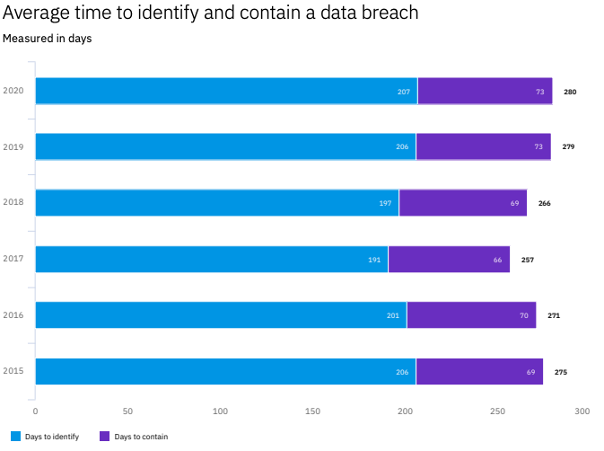

# Application Logging Vocabulary Cheat Sheet

This document proposes a standard vocabulary for logging security events. The intent is to simplify monitoring and alerting such that, assuming developers trap errors and log them using this vocabulary, monitoring and alerting would be improved by simply keying on these terms.

## Overview

Each year IBM Security commissions the Ponemon Institute to survey companies around the world for information related to security breaches, mitigation, and the associated costs; the result is called the Cost of a Data Breach Report.

In addition to the millions of dollars lost due to breaches the report finds that the **mean time to identify** a breach continues to hover around **200 days**. Clearly our ability to monitor applications and alert on anomalous behavior would improve our time to identify and mitigate an attack against our applications.



> IBM Cost of a Data Breach Study 2020, Fig.34, pg.52, [https://www.ibm.com/security/data-breach]

This logging standard would seek to define specific keywords which, when applied consistently across software, would allow groups to simply monitor for these events terms across all applications and respond quickly in the event of attack.

## Assumptions

- Observability/SRE groups must support the use of this standard and encourage developers to use it
- Incident Response must either ingest this data OR provide a means by which other monitoring teams can send a notification of alert, preferably programmatically.
- Architects must support, adopt, and contribute to this standard
- Developers must embrace this standard and begin to implement (requires knowledge and intent to understand potential attacks and trap those errors in code).

## Getting Started

As a reminder, the goal of logging is to be able to alert on specific security events. Of course, the first step to logging these events is good error handling, if you're not trapping the events, you don't have an event to log.

### Identifying Events

In order to better understand security event logging a good high-level understanding of threat modeling would be helpful, even if it's a simple approach of:

1. **What could go wrong?**

- Orders: could someone order on behalf of another?
- Authentication: could I log in as someone else?
- Authorization: could I see someone else' account?

2. **What would happen if it did?**

- Orders: I've placed an order on behalf of another... to an abandoned warehouse in New Jersey. Oops.
- Then I bragged about it on 4Chan.
- Then I told the New York Times about it.

3. **Who might intend to do this?**

- Intentional attacks by hackers.
- An employee "testing" how things work.
- An API coded incorrectly doing things the author did not intend.

## Format

_NOTE: All dates should be logged in [ISO 8601](https://en.wikipedia.org/wiki/ISO_8601) format **WITH** UTC offset to ensure maximum portability_

```
{
    "datetime": "2021-01-01T01:01:01-0700",
    "appid": "foobar.netportal_auth",
    "event": "AUTHN_login_success:joebob1",
    "level": "INFO",
    "description": "User joebob1 login successfully",
    "useragent": "Mozilla/5.0 (Macintosh; Intel Mac OS X 10_14_6) AppleWebKit/537.36 (KHTML, like Gecko) Chrome/78.0.3904.108 Safari/537.36",
    "source_ip": "165.225.50.94",
    "host_ip": "10.12.7.9",
    "hostname": "portalauth.foobar.com",
    "protocol": "https",
    "port": "440",
    "request_uri": "/api/v2/auth/",
    "request_method": "POST",
    "region": "AWS-US-WEST-2",
    "geo": "USA"
}
```

## The Vocabulary

What follows are the various event types that should be captured. For each event type there is a prefix like "authn" and additional data that should be included for that event.

Portions of the full logging format are included for example, but a complete event log should follow the format above.

---

## Authentication [AUTHN]

### authn_login_success[:userid]

**Description**
All login events should be recorded including success.

**Level:**
INFO

**Example:**

```
{
    "datetime": "2019-01-01 00:00:00,000",
    "appid": "foobar.netportal_auth",
    "event": "authn_login_success:joebob1",
    "level": "INFO",
    "description": "User joebob1 login successfully",
    ...
}
```

---

### authn_login_successafterfail[:userid,retries]

**Description**
The user successfully logged in after previously failing.

**Level:**
INFO

**Example:**

```
{
    "datetime": "2019-01-01 00:00:00,000",
    "appid": "foobar.netportal_auth",
    "event": "authn_login_successafterfail:joebob1,2",
    "level": "INFO",
    "description": "User joebob1 login successfully",
    ...
}
```

---

### authn_login_fail[:userid]

**Description**
All login events should be recorded including failure.

**Level:**
WARN

**Example:**

```
{
    "datetime": "2019-01-01 00:00:00,000",
    "appid": "foobar.netportal_auth",
    "event": "authn_login_fail:joebob1",
    "level": "WARN",
    "description": "User joebob1 login failed",
    ...
}
```

---

### authn_login_fail_max[:userid,maxlimit(int)]

**Description**
All login events should be recorded including failure.

**Level:**
WARN

**Example:**

```
{
    "datetime": "2019-01-01 00:00:00,000",
    "appid": "foobar.netportal_auth",
    "event": "authn_login_fail_max:joebob1,3",
    "level": "WARN",
    "description": "User joebob1 reached the login fail limit of 3",
    ...
}
```

---

### authn_login_lock[:userid,reason]

**Description**
When the feature exists to lock an account after x retries or other condition, the lock should be logged with relevant data.

**Level:**
WARN

**Reasons:**

- maxretries: The maximum number of retries was reached
- suspicious: Suspicious activity was observed on the account
- customer: The customer requested their account be locked
- other: Other

**Example:**

```
{
    "datetime": "2019-01-01 00:00:00,000",
    "appid": "foobar.netportal_auth",
    "event": "authn_login_lock:joebob1,maxretries",
    "level": "WARN",
    "description": "User joebob1 login locked because maxretries exceeded",
    ...
}
```

---

### authn_password_change[:userid]

**Description**
Every password change should be logged, including the userid that it was for.

**Level:**
INFO

**Example:**

```
{
    "datetime": "2019-01-01 00:00:00,000",
    "appid": "foobar.netportal_auth",
    "event": "authn_password_change:joebob1",
    "level": "INFO",
    "description": "User joebob1 has successfully changed their password",
    ...
}
```

---

### authn_password_change_fail[:userid]

**Description**
An attempt to change a password that failed. May also trigger other events such as `authn_login_lock`.

**Level:**
INFO

**Example:**

```
{
    "datetime": "2019-01-01 00:00:00,000",
    "appid": "foobar.netportal_auth",
    "event": "authn_password_change_fail:joebob1",
    "level": "INFO",
    "description": "User joebob1 failed to changing their password",
    ...
}
```

---

### authn_impossible_travel[:userid,region1,region2]

**Description**
When a user is logged in from one city and suddenly appears in another, too far away to have traveled in a reasonable timeframe, this often indicates a potential account takeover.

**Level:**: CRITICAL

**Example:**

```
{
    "datetime": "2019-01-01 00:00:00,000",
    "appid": "foobar.netportal_auth",
    "event": "authn_impossible_travel:joebob1,US-OR,CN-SH",
    "level": "CRITICAL",
    "description": "User joebob1 has accessed the application in two distant cities at the same time",
    ...
}
```

---

### authn_token_created[:userid, entitlement(s)]

**Description**
When a token is created for service access it should be recorded

**Level:**: INFO

**Example:**

```
{
    "datetime": "2019-01-01 00:00:00,000",
    "appid": "aws.foobar.com",
    "event": "authn_token_created:app.foobarapi.prod,create,read,update",
    "level": "INFO",
    "description": "A token has been created for app.foobarapi.prod with create,read,update",
    ...
}
```

---

### authn_token_revoked[:userid,tokenid]

**Description**
A token has been revoked for the given account.

**Level:**: INFO

**Example:**

```
{
    "datetime": "2019-01-01 00:00:00,000",
    "appid": "aws.foobar.com",
    "event": "authn_token_revoked:app.foobarapi.prod,xyz-abc-123-gfk",
    "level": "INFO",
    "description": "Token ID: xyz-abc-123-gfk was revoked for user app.foobarapi.prod",
    ...
}
```

---

### authn_token_reuse[:userid,tokenid]

**Description**
A previously revoked token was attempted to be reused.

**Level:**: CRITICAL

**Example:**

```
{
    "datetime": "2019-01-01 00:00:00,000",
    "appid": "aws.foobar.com",
    "event": "authn_token_reuse:app.foobarapi.prod,xyz-abc-123-gfk",
    "level": "CRITICAL",
    "description": "User app.foobarapi.prod attempted to use token ID: xyz-abc-123-gfk which was previously revoked",
    ...
}
```

---

### authn_token_delete[:appid]

**Description**
When a token is deleted it should be recorded

**Level:**: WARN

**Example:**

```
{
    "datetime": "2019-01-01 00:00:00,000",
    "appid": "foobar.netportal_auth",
    "event": "authn_token_delete:foobarapi",
    "level": "WARN",
    "description": "The token for foobarapi has been deleted",
    ...
}
```

---

## Authorization [AUTHZ]

---

### authz_fail[:userid,resource]

**Description**
An attempt was made to access a resource which was unauthorized

**Level:**: CRITICAL

**Example:**

```
{
    "datetime": "2019-01-01 00:00:00,000",
    "appid": "foobar.netportal_auth",
    "event": "authz_fail:joebob1,resource",
    "level": "CRITICAL",
    "description": "User joebob1 attempted to access a resource without entitlement",
    ...
}
```

---

### authz_change[:userid,from,to]

**Description**
The user or entity entitlements was changed

**Level:**: WARN

**Example:**

```
{
    "datetime": "2019-01-01 00:00:00,000",
    "appid": "foobar.netportal_auth",
    "event": "authz_change:joebob1,user,admin",
    "level": "WARN",
    "description": "User joebob1 access was changed from user to admin",
    ...
}
```

---

### authz_admin[:userid,event]

**Description**
All activity by privileged users such as admin should be recorded.

**Level:**: WARN

**Example:**

```
{
    "datetime": "2019-01-01 00:00:00,000",
    "appid": "foobar.netportal_auth",
    "event": "authz_admin:joebob1,user_privilege_change",
    "level": "WARN",
    "description": "Administrator joebob1 has updated privileges of user foobarapi from user to admin",
    ...
}
```

---

## Excessive Use [EXCESS]

### excess_rate_limit_exceeded[userid,max]

**Description**
Expected service limit ceilings should be established and alerted when exceeded, even if simply for managing costs and scaling.

**Level:**: WARN

**Example:**

```
{
    "datetime": "2019-01-01 00:00:00,000",
    "appid": "foobar.netportal_auth",
    "event": "excess_rate_limit_exceeded:app.foobarapi.prod,100000",
    "level": "WARN",
    "description": "User app.foobarapi.prod has exceeded max:100000 requests",
    ...
}
```

---

## File Upload [UPLOAD]

### upload_complete[userid,filename,type]

**Description**
On successful file upload the first step in the validation process is that the upload has completed.

**Level:**: INFO

**Example:**

```
    {
    "datetime": "2019-01-01 00:00:00,000",
    "appid": "foobar.netportal_auth",
    "event": "upload_complete:joebob1,user_generated_content.png,PNG",
    "level": "INFO",
    "description": "User joebob1 has uploaded user_generated_content.png",
    ...
}
```

---

### upload_stored[filename,from,to]

**Description**
One step in good file upload validation is to move/rename the file and when providing the content back to end users, never reference the original filename in the download. This is true both when storing in a filesystem as well as in block storage.

**Level:**: INFO

**Example:**

```
{
    "datetime": "2019-01-01 00:00:00,000",
    "appid": "foobar.netportal_auth",
    "event": "upload_stored:user_generated_content.png,kjsdhkrjhwijhsiuhdf000010202002",
    "level": "INFO",
    "description": "File user_generated_content.png was stored in the database with key abcdefghijk101010101",
    ...
}
```

---

### upload_validation[filename,(virusscan|imagemagick|...):(FAILED|incomplete|passed)]

**Description**
All file uploads should have some validation performed, both for correctness (is in fact of file type x), and for safety (does not contain a virus).

**Level:**: INFO|CRITICAL

**Example:**

```
{
    "datetime": "2019-01-01 00:00:00,000",
    "appid": "foobar.netportal_auth",
    "event": "upload_validation:filename,virusscan:FAILED",
    "level": "CRITICAL",
    "description": "File user_generated_content.png FAILED virus scan and was purged",
    ...
}
```

---

### upload_delete[userid,fileid]

**Description**
When a file is deleted for normal reasons it should be recorded.

**Level:**: INFO

**Example:**

```
{
    "datetime": "2019-01-01 00:00:00,000",
    "appid": "foobar.netportal_auth",
    "event": "upload_delete:joebob1,",
    "level": "INFO",
    "description": "User joebob1 has marked file abcdefghijk101010101 for deletion.",
    ...
}
```

---

## Input Validation [INPUT]

### input_validation_fail[:field,userid]

**Description**
When input validation fails on the server-side it must either be because a) sufficient validation was not provided on the client, or b) client-side validation was bypassed. In either case it's an opportunity for attack and should be mitigated quickly.

**Level:**
WARN

**Example:**

```
{
    "datetime": "2019-01-01 00:00:00,000",
    "appid": "foobar.netportal_auth",
    "event": "input_validation_fail:date_of_birth,joebob1",
    "level": "WARN",
    "description": "User joebob1 submitted data that failed validation.",
    ...
}
```

---

## Malicious Behavior [MALICIOUS

### malicious_excess_404:[userid|IP,useragent]

**Description**
When a user makes numerous requests for files that don't exist it often is an indicator of attempts to "force-browse" for files that could exist and is often behavior indicating malicious intent.

**Level:**
WARN

**Example:**

```
{
    "datetime": "2019-01-01 00:00:00,000",
    "appid": "foobar.netportal_auth",
    "event": "malicious_excess404:123.456.789.101,M@l1c10us-Hax0rB0t0-v1",
    "level": "WARN",
    "description": "A user at 123.456.789.101 has generated a large number of 404 requests.",
    ...
}
```

---

### malicious_extraneous:[userid|IP,inputname,useragent]

**Description**
When a user submits data to a backend handler that was not expected it can indicate probing for input validation errors. If your backend service receives data it does not handle or have an input for this is an indication of likely malicious abuse.

**Level:**
CRITICAL

**Example:**

```
{
    "datetime": "2019-01-01 00:00:00,000",
    "appid": "foobar.netportal_auth",
    "event": "malicious_extraneous:dr@evil.com,creditcardnum,Mozilla/5.0 (X11; Linux x86_64; rv:10.0) Gecko/20100101 Firefox/10.0",
    "level": "WARN",
    "description": "User dr@evil.com included field creditcardnum in the request which is not handled by this service.",
    ...
}
```

---

### malicious_attack_tool:[userid|IP,toolname,useragent]

**Description**
When obvious attack tools are identified either by signature or by user agent they should be logged.

**TODO:** A future version of this standard should link to known attack tools, signatures and user-agent strings. For instance, the tool "Nikto" leaves behind its user agent by default with a string like **_"Mozilla/5.00 (Nikto/2.1.6) (Evasions:None) (Test:Port Check)"_**

**Level:**
CRITICAL

**Example:**

```
{
    "datetime": "2019-01-01 00:00:00,000",
    "appid": "foobar.netportal_auth",
    "event": "malicious_attack_tool:127.0.0.1,nikto,Mozilla/5.00 (Nikto/2.1.6) (Evasions:None) (Test:Port Check)",
    "level": "WARN",
    "description": "Attack traffic indicating use of Nikto coming from 127.0.0.1",
    ...
}
```

---

### malicious_cors:[userid|IP,useragent,referer]

**Description**
When attempts are made from unauthorized origins they should of course be blocked, but also logged whenever possible. Even if we block an illegal cross-origin request the fact that the request is being made could be an indication of attack.

_NOTE: Did you know that the word "referer" is misspelled in the original HTTP specification? The correct spelling should be "referrer" but the original typo persists to this day and is used here intentionally._

**Level:**
CRITICAL

**Example:**

```
{
    "datetime": "2019-01-01 00:00:00,000",
    "appid": "foobar.netportal_auth",
    "event": "malicious_cors:127.0.0.1,Mozilla/5.0 (X11; Linux x86_64; rv:10.0) Gecko/20100101 Firefox/10.0,attack.evil.com",
    "level": "WARN",
    "description": "An illegal cross-origin request from 127.0.0.1 was referred from attack.evil.com"
    ...
}
```

---

### malicious_direct_reference:[userid|IP, useragent]

**Description**
A common attack against authentication and authorization is to directly access an object without credentials or appropriate access authority. Failing to prevent this flaw used to be one of the OWASP Top Ten called **Insecure Direct Object Reference**. Assuming you've correctly prevented this attack, logging the attempt is valuable to identify malicious users.

**Level:**
CRITICAL

**Example:**

```
{
    "datetime": "2019-01-01 00:00:00,000",
    "appid": "foobar.netportal_auth",
    "event": "malicious_direct:joebob1, Mozilla/5.0 (X11; Linux x86_64; rv:10.0) Gecko/20100101 Firefox/10.0",
    "level": "WARN",
    "description": "User joebob1 attempted to access an object to which they are not authorized",
    ...
}
```

---

## Privilege Changes [PRIVILEGE]

This section focuses on object privilege changes such as read/write/execute permissions or objects in a database having authorization meta-information changed.

Changes to user/account are covered in the User Management section.

---

### privilege_permissions_changed:[userid,file|object,fromlevel,tolevel]

**Description**
Tracking changes to objects to which there are access control restrictions can uncover attempt to escalate privilege on those files by unauthorized users.

**Level:**
WARN

**Example:**

```
{
    "datetime": "2019-01-01 00:00:00,000",
    "appid": "foobar.netportal_auth",
    "event": "malicious_direct:joebob1, /users/admin/some/important/path,0511,0777",
    "level": "WARN",
    "description": "User joebob1 changed permissions on /users/admin/some/important/path",
    ...
}
```

---

## Sensitive Data Changes [DATA]

It's not necessary to log or alert on changes to all files, but in the case of highly sensitive files or data it is important that we monitor and alert on changes.

---

### sensitive_create:[userid,file|object]

**Description**
When a new piece of data is created and marked as sensitive or placed into a directory/table/repository where sensitive data is stored, that creation should be logged and reviewed periodically.

**Level:**
WARN

**Example:**

```
{
    "datetime": "2019-01-01 00:00:00,000",
    "appid": "foobar.netportal_auth",
    "event": "sensitive_create:joebob1, /users/admin/some/important/path",
    "level": "WARN",
    "description": "User joebob1 created a new file in /users/admin/some/important/path",
    ...
}
```

---

### sensitive_read:[userid,file|object]

**Description**
All data marked as sensitive or placed into a directory/table/repository where sensitive data is stored should be have access logged and reviewed periodically.

**Level:**
WARN

**Example:**

```
{
    "datetime": "2019-01-01 00:00:00,000",
    "appid": "foobar.netportal_auth",
    "event": "sensitive_read:joebob1, /users/admin/some/important/path",
    "level": "WARN",
    "description": "User joebob1 read file /users/admin/some/important/path",
    ...
}
```

---

### sensitive_update:[userid,file|object]

**Description**
All data marked as sensitive or placed into a directory/table/repository where sensitive data is stored should be have updates to the data logged and reviewed periodically.

**Level:**
WARN

**Example:**

```
{
    "datetime": "2019-01-01 00:00:00,000",
    "appid": "foobar.netportal_auth",
    "event": "sensitive_update:joebob1, /users/admin/some/important/path",
    "level": "WARN",
    "description": "User joebob1 modified file /users/admin/some/important/path",
    ...
}
```

---

### sensitive_delete:[userid,file|object]

**Description**
All data marked as sensitive or placed into a directory/table/repository where sensitive data is stored should have deletions of the data logged and reviewed periodically. The file should not be immediately deleted but marked for deletion and an archive of the file should be maintained according to legal/privacy requirements.

**Level:**
WARN

**Example:**

```
{
    "datetime": "2019-01-01 00:00:00,000",
    "appid": "foobar.netportal_auth",
    "event": "sensitive_delete:joebob1, /users/admin/some/important/path",
    "level": "WARN",
    "description": "User joebob1 marked file /users/admin/some/important/path for deletion",
    ...
}
```

---

## Sequence Errors [SEQUENCE]

Also called a **_business logic attack_**, if a specific path is expected through a system and an attempt is made to skip or change the order of that path it could indicate malicious intent.

---

### sequence_fail:[userid]

**Description**
When a user reaches a part of the application out of sequence it may indicate intentional abuse of the business logic and should be tracked.

**Level:**
WARN

**Example:**

```
{
    "datetime": "2019-01-01 00:00:00,000",
    "appid": "foobar.netportal_auth",
    "event": "sequence_fail:joebob1",
    "level": "WARN",
    "description": "User joebob1 has reached a part of the application out of the normal application flow.",
    ...
}
```

---

## Session Management [SESSION]

### session_created:[userid]

**Description**
When a new authenticated session is created that session may be logged and activity monitored.

**Level:**
INFO

**Example:**

```
    {
    "datetime": "2019-01-01 00:00:00,000",
    "appid": "foobar.netportal_auth",
    "event": "session_created:joebob1",
    "level": "INFO",
    "description": "User joebob1 has started a new session",
    ...
}
```

---

### session_renewed:[userid]

**Description**
When a user is warned of session to be expired/revoked and chooses to extend their session that activity should be logged. Also, if the system in question contains highly confidential data then extending a session may require additional verification.

**Level:**
INFO

**Example:**

```
{
    "datetime": "2019-01-01 00:00:00,000",
    "appid": "foobar.netportal_auth",
    "event": "session_renewed:joebob1",
    "level": "WARN",
    "description": "User joebob1 was warned of expiring session and extended.",
    ...
}
```

---

### session_expired:[userid,reason]

**Description**
When a session expires, especially in the case of an authenticated session or with sensitive data, then that session expiry may be logged and clarifying data included. The reason code may be any such as: logout, timeout, revoked, etc. Sessions should never be deleted but rather expired in the case of revocation requirement.

**Level:**
INFO

**Example:**

```
{
    "datetime": "2019-01-01 00:00:00,000",
    "appid": "foobar.netportal_auth",
    "event": "session_expired:joebob1,revoked",
    "level": "WARN",
    "description": "User joebob1 session expired due to administrator revocation.",
    ...
}
```

---

### session_use_after_expire:[userid]

**Description**
In the case a user attempts to access systems with an expire session it may be helpful to log, especially if combined with subsequent login failure. This could identify a case where a malicious user is attempting a session hijack or directly accessing another person's machine/browser.

**Level:**
WARN

**Example:**

```
{
    "datetime": "2019-01-01 00:00:00,000",
    "appid": "foobar.netportal_auth",
    "event": "session_use_after_expire:joebob1",
    "level": "WARN",
    "description": "User joebob1 attempted access after session expired.",
    ...
}
```

---

## System Events [SYS]

### sys_startup:[userid]

**Description**
When a system is first started it can be valuable to log the startup, even if the system is serverless or a container, especially if possible to log the user that initiated the system.

**Level:**
WARN

**Example:**

```
{
    "datetime": "2019-01-01 00:00:00,000",
    "appid": "foobar.netportal_auth",
    "event": "sys_startup:joebob1",
    "level": "WARN",
    "description": "User joebob1 spawned a new instance",
    ...
}
```

---

### sys_shutdown:[userid]

**Description**
When a system is shut down it can be valuable to log the event, even if the system is serverless or a container, especially if possible to log the user that initiated the system.

**Level:**
WARN

**Example:**

```
{
    "datetime": "2019-01-01 00:00:00,000",
    "appid": "foobar.netportal_auth",
    "event": "sys_shutdown:joebob1",
    "level": "WARN",
    "description": "User joebob1 stopped this instance",
    ...
}
```

---

### sys_restart:[userid]

**Description**
When a system is restarted it can be valuable to log the event, even if the system is serverless or a container, especially if possible to log the user that initiated the system.

**Level:**
WARN

**Example:**

```
{
    "datetime": "2019-01-01 00:00:00,000",
    "appid": "foobar.netportal_auth",
    "event": "sys_restart:joebob1",
    "level": "WARN",
    "description": "User joebob1 initiated a restart",
    ...
}
```

---

### sys_crash[:reason]

**Description**
If possible to catch an unstable condition resulting in the crash of a system, logging that event could be helpful, especially if the event is triggered by an attack.

**Level:**
WARN

**Example:**

```
{
    "datetime": "2019-01-01 00:00:00,000",
    "appid": "foobar.netportal_auth",
    "event": "sys_crash:outofmemory,
    "level": "WARN",
    "description": "The system crashed due to Out of Memory error.",
    ...
}
```

---

### sys_monitor_disabled:[userid,monitor]

**Description**
If your systems contain agents responsible for file integrity, resources, logging, virus, etc. it is especially valuable to know if they are halted and by whom.

**Level:**
WARN

**Example:**

```
{
    "datetime": "2019-01-01 00:00:00,000",
    "appid": "foobar.netportal_auth",
    "event": "sys_monitor_disabled:joebob1,crowdstrike",
    "level": "WARN",
    "description": "User joebob1 has disabled CrowdStrike",
    ...
}
```

---

### sys_monitor_enabled:[userid,monitor]

**Description**
If your systems contain agents responsible for file integrity, resources, logging, virus, etc. it is especially valuable to know if they are started again after being stopped, and by whom.

**Level:**
WARN

**Example:**

```
{
    "datetime": "2019-01-01 00:00:00,000",
    "appid": "foobar.netportal_auth",
    "event": "sys_monitor_enabled:joebob1,crowdstrike",
    "level": "WARN",
    "description": "User joebob1 has enabled CrowdStrike",
    ...
}
```

---

## User Management [USER]

### user_created:[userid,newuserid,attributes[one,two,three]]

**Description**
When creating new users, logging the specifics of the user creation event is helpful, especially if new users can be created with administration privileges.

**Level:**
WARN

**Example:**

```
{
    "datetime": "2019-01-01 00:00:00,000",
    "appid": "foobar.netportal_auth",
    "event": "user_created:joebob1,user1,admin:create,update,delete",
    "level": "WARN",
    "description": "User joebob1 created user1 with admin:create,update,delete privilege attributes",
    ...
}
```

---

### user_updated:[userid,onuserid,attributes[one,two,three]]

**Description**
When updating users, logging the specifics of the user update event is helpful, especially if users can be updated with administration privileges.

**Level:**
WARN

**Example:**

```
{
    "datetime": "2019-01-01 00:00:00,000",
    "appid": "foobar.netportal_auth",
    "event": "user_updated:joebob1,user1,admin:create,update,delete",
    "level": "WARN",
    "description": "User joebob1 updated user1 with attributes admin:create,update,delete privilege attributes",
    ...
}
```

---

### user_archived:[userid,onuserid]

**Description**
It is always best to archive users rather than deleting, except where required. When archiving users, logging the specifics of the user archive event is helpful. A malicious user could use this feature to deny service to legitimate users.

**Level:**
WARN

**Example:**

```
{
    "datetime": "2019-01-01 00:00:00,000",
    "appid": "foobar.netportal_auth",
    "event": "user_archived:joebob1,user1",
    "level": "WARN",
    "description": "User joebob1 archived user1",
    ...
}
```

---

### user_deleted:[userid,onuserid]

**Description**
It is always best to archive users rather than deleting, except where required. When deleting users, logging the specifics of the user delete event is helpful. A malicious user could use this feature to deny service to legitimate users.

**Level:**
WARN

**Example:**

```
{
    "datetime": "2019-01-01 00:00:00,000",
    "appid": "foobar.netportal_auth",
    "event": "user_deleted:joebob1,user1",
    "level": "WARN",
    "description": "User joebob1 has deleted user1",
    ...
}
```

---

## Exclusions

As important as what you DO log is what you DON'T log. Private or secret information, source code, keys, certs, etc. should never be logged.

For comprehensive overview of items that should be excluded from logging, please see the [OWASP Logging Cheat Sheet](../cheatsheets/Logging_Cheat_Sheet.md#data-to-exclude).
