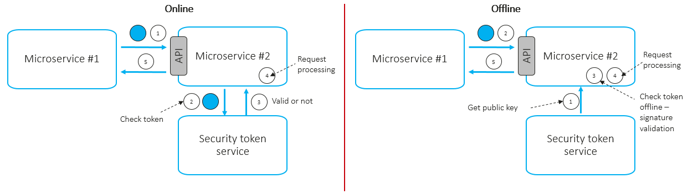
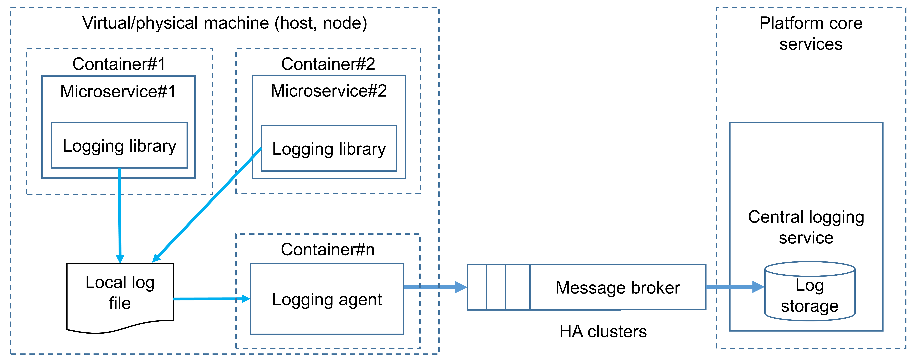

# Microservices Security Cheat Sheet

## Introduction

The microservice architecture is being increasingly used for designing and implementing application systems in both cloud-based and on-premise infrastructures, high-scale applications and services. There are many security challenges that need to be addressed in the application design and implementation phases. The fundamental security requirements that have to be addressed during design phase are authentication and authorization. Therefore, it is vital for applications security architects to understand and properly use existing architecture patterns to implement authentication and authorization in microservices-based systems. The goal of this cheat sheet is to identify such patterns and to do recommendations for applications security architects on possible ways to use them.

## Edge-level authorization

Use gateway checks to reject unauthorized ingress requests, and prevent direct access that bypasses those checks. Keep fine-grained authorization at the service when it needs resource or business context. See [Authorization Patterns](Authorization_Patterns_Cheat_Sheet.md#gateway-and-proxy-enforcement) for gateway and proxy enforcement, its limitations, and propagated authorization context.

## Service-level authorization

Each service must enforce access to its protected operations, including internal calls. Prefer shared, reviewed policies as the system grows, with service-level enforcement of object, tenant, and business-specific rules. See [Authorization Patterns](Authorization_Patterns_Cheat_Sheet.md#service-level-authorization) for policy placement and [Policy and Data Distribution](Authorization_Policy_And_Data_Distribution_Cheat_Sheet.md) for update and outage handling. Gateway checks complement these controls; they do not establish that a downstream operation is authorized.

## External Entity Identity Propagation

Propagate authenticated user context in a form each receiving service can validate, and authenticate the calling service separately. A signature protects an assertion's integrity; it does not itself grant access to a requested resource. See [Identity Propagation Patterns](Identity_Propagation_Patterns_Cheat_Sheet.md) for forwarding, token exchange, trusted internal assertions, and their limitations.

## Service-to-service authentication

### Existing patterns

#### Mutual transport layer security

With an mTLS approach, each microservice can legitimately identify who it talks to, in addition to achieving confidentiality and integrity of the transmitted data. Each microservice in the deployment has to carry a public/private key pair and use that key pair to authenticate to the recipient microservices via mTLS. mTLS is usually implemented with a self-hosted Public Key Infrastructure. The main challenges of using mTLS are key provisioning and trust bootstrap, certificate revocation, and key rotation.

#### Token-based

The token-based approach works at the application layer. A token is a container that may contain the caller ID (microservice ID) and its permissions (scopes). The caller microservice can obtain a signed token by invoking a special security token service using its own service ID and password and then attaches it to every outgoing request, e.g., via HTTP headers. The called microservice can extract the token and validate it online or offline.

Choose token validation based on the required revocation response time, token lifetime, and availability requirements:

1. Online validation:
    - The microservice queries the token service. For OAuth, [token introspection](https://www.rfc-editor.org/rfc/rfc7662.html#section-2.2) reports whether a token is active and can reflect revocation known to the authorization server.
    - Network calls add latency and a dependency on the token service's availability. [Caching introspection responses delays detection of revocation](https://www.rfc-editor.org/rfc/rfc7662.html#section-4); bound cache duration to the required freshness and never beyond token expiry.
2. Local validation:
    - The microservice validates a signed token using trusted issuer keys and the applicable token profile. For example, [RFC 9068 defines validation for JSON Web Token (JWT) access tokens](https://www.rfc-editor.org/rfc/rfc9068.html#section-4); signature verification alone is insufficient. See [validation at each boundary](Identity_Propagation_Patterns_Cheat_Sheet.md#validation-at-each-boundary).
    - This avoids a per-request introspection call, but local validation alone does not detect server-side revocation before token expiry. Use [token lifetimes or an additional revocation mechanism](https://www.rfc-editor.org/info/rfc7009/#section-3) that meets the required response time.

Neither approach replaces service-level authorization. Reject requests when the required token validation cannot be completed.

In most cases, token-based authentication works over TLS, which provides confidentiality and integrity of data in transit.

## Logging

Logging services in microservice-based systems aim to meet the principles of accountability and traceability and help detect security anomalies in operations via log analysis. Therefore, it is vital for application security architects to understand and adequately use existing architecture patterns to implement audit logging in microservices-based systems for security operations. A high-level architecture design is shown in the picture below and is based on the following principles:

- Each microservice writes a log message to a local file using standard output (via stdout, stderr).
- The logging agent periodically pulls log messages and sends (publishes) them to the message broker (e.g., NATS, Apache Kafka).
- The central logging service subscribes to messages in the message broker, receives them, and processes them.

High-level recommendations to logging subsystem architecture with its rationales are listed below.

1. In this pattern, buffer logs locally so a temporary downstream outage does not immediately interrupt log collection. Local files do not guarantee lossless delivery: storage limits, rotation, and node loss can remove records before they are shipped. For example, [Kubernetes documents container log rotation and eviction behavior](https://kubernetes.io/docs/concepts/cluster-administration/logging/#how-nodes-handle-container-logs).
2. Run a dedicated logging agent on the same host to collect and forward local logs. After an agent failure, it can resume shipping only records that are still retained locally.
3. Use the message broker to decouple log collection from central processing. Define buffer limits and behavior when storage fills, monitor delivery failures, and test recovery from outages; see [logging verification](Logging_Cheat_Sheet.md#verification). A broker alone does not prevent log loss or denial of service.
4. Logging agent and message broker shall use mutual authentication (e.g., based on TLS) to encrypt all transmitted data (log messages) and authenticate themselves:
    - this allows mitigating threats such as: microservice spoofing, logging/transport system spoofing, network traffic injection, sniffing network traffic
5. Message broker shall enforce access control policy to mitigate unauthorized access and implement the principle of least privileges:
    - this allows mitigating the threat of microservice elevation of privileges
6. Exclude secrets and unnecessary sensitive data before the microservice emits a log entry, including to local files or standard output. Agent-side filtering is an additional safeguard; it cannot remove sensitive data already written to local logs. Follow the [OWASP Logging Cheat Sheet guidance on data to exclude](Logging_Cheat_Sheet.md#data-to-exclude).
7. Microservices shall generate a correlation ID that uniquely identifies every call chain and helps group log messages to investigate them. The logging agent shall include a correlation ID in every log message.
8. The logging agent shall periodically provide health and status data to indicate its availability or non-availability.
9. The logging agent shall publish log messages in a structured logs format (e.g., JSON, CSV).
10. The logging agent shall append log messages with context data, e.g., platform context (hostname, container name), runtime context (class name, filename).

For a comprehensive overview of events that should be logged and possible data format, please see the [OWASP Logging Cheat Sheet](Logging_Cheat_Sheet.md#which-events-to-log) and [Application Logging Vocabulary Cheat Sheet](Logging_Vocabulary_Cheat_Sheet.md)

## References

- [NIST SP 800-204: Security Strategies for Microservices-Based Application Systems](https://nvlpubs.nist.gov/nistpubs/SpecialPublications/NIST.SP.800-204.pdf)
- [NIST SP 800-204A: Building Secure Microservices-Based Applications Using Service-Mesh Architecture](https://nvlpubs.nist.gov/nistpubs/SpecialPublications/NIST.SP.800-204A.pdf)
