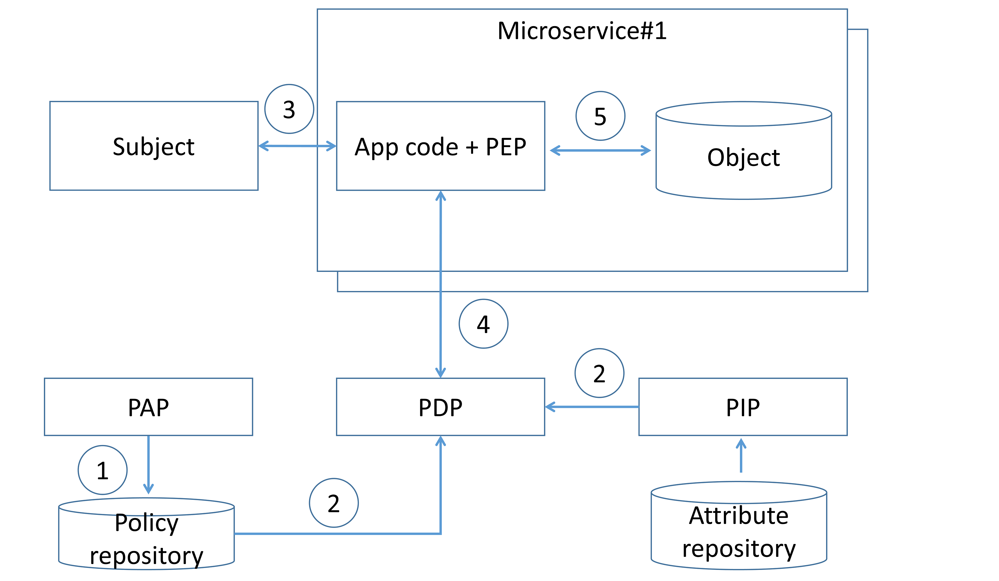
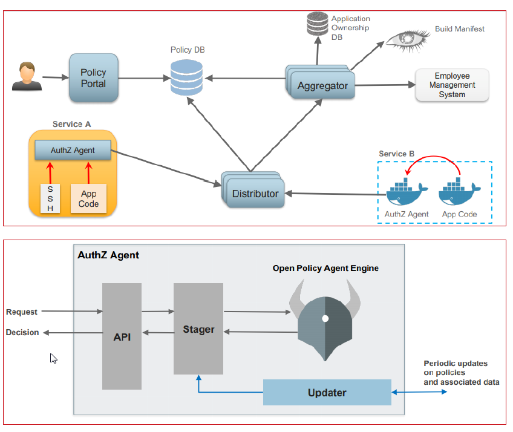

# Microservices Security Cheat Sheet

## Introduction

The microservice architecture is being increasingly used for designing and implementing application systems in both cloud-based and on-premise infrastructures, high-scale applications and services. There are many security challenges that need to be addressed in the application design and implementation phases. The fundamental security requirements that have to be addressed during design phase are authentication and authorization. Therefore, it is vital for applications security architects to understand and properly use existing architecture patterns to implement authentication and authorization in microservices-based systems. The goal of this cheat sheet is to identify such patterns and to do recommendations for applications security architects on possible ways to use them.

## Edge-level authorization

In simple scenarios, authorization can happen only at the edge level (API gateway). The API gateway can be leveraged to centralize enforcement of authorization for all downstream microservices, eliminating the need to provide authentication and access control for each of the individual services. In such cases, NIST recommends implementing mitigating controls such as mutual authentication to prevent direct, anonymous connections to the internal services (API gateway bypass). It should be noted that authorization at the edge layer has the [following limitations](https://www.youtube.com/watch?v=UnXjwCWgBKU):

- Pushing all authorization decisions to the API gateway can quickly become hard to manage in complex ecosystems with many roles and access control rules.
- The API gateway may become a single point of decision that may violate the “defense in depth” principle.
- Operation teams typically own the API gateway, so development teams cannot directly make authorization changes, slowing down velocity due to additional communication and process overhead.
  
In most cases, development teams implement authorization in both places – at the edge level at a coarse level of granularity, and at service level. To authenticate an external entity, the edge can use access tokens (referenced token or self-contained token) transmitted via HTTP headers (e.g., “Cookie” or “Authorization”) or use mTLS.

## Service-level authorization

Service-level authorization gives each microservice more control to enforce access control policies.
For further discussion, we will use terms and definitions according with [NIST SP 800-162](https://nvlpubs.nist.gov/nistpubs/SpecialPublications/NIST.SP.800-162.pdf). The functional components of an access control system can be classified as follows:

- Policy Administration Point (PAP): Provides a user interface for creating, managing, testing, and debugging access control rules.
- Policy Decision Point (PDP): Computes access decisions by evaluating the applicable access control policy.
- Policy Enforcement Point (PEP): Enforces policy decisions in response to a request from a subject requesting access to a protected object.
- Policy Information Point (PIP): Serves as the retrieval source of attributes or the data required for policy evaluation to provide the information needed by the PDP to make decisions.

### Service-level authorization: existing patterns

#### Decentralized pattern

The development team implements PDP and PEP directly at the microservice code level. All the access control rules and attributes that need to implement that rule are defined and stored on each microservice (step 1). When a microservice receives a request along with some authorization metadata (e.g., end user context or requested resource ID), the microservice analyzes it (step 3) to generate an access control policy decision and then enforces authorization (step 4).

Existing programming language frameworks allow development teams to implement authorization at the microservice layer. For example, [Spring Security allows](https://www.youtube.com/watch?v=v2J32nd0g24) developers to enable scopes checking (e.g., using scopes extracted from incoming JWT) in the resource server and use it to enforce authorization.

Implementing authorization at the source code level means that the code must be updated whenever the development team wants to modify authorization logic.

#### Centralized pattern with single policy decision point

In this pattern, access control rules are defined, stored, and evaluated centrally. Access control rules are defined using PAP (step 1) and delivered to a centralized PDP, along with attributes required to evaluate those rules (step 2). When a subject invokes a microservice endpoint (step 3), the microservice code invokes the centralized PDP via a network call, and the PDP generates an access control policy decision by evaluating the query input against access control rules and attributes (step 4). Based on the PDP decision, the microservice enforces authorization (step 5).

To define access control rules, development/operation teams have to use some language or notation. An example is Extensible Access Control Markup Language (XACML) and Next Generation Access Control (NGAC), which is a standard to describe policy rules.

This pattern can cause latency issues due to additional network calls to the remote PDP endpoint, but it can be mitigated by caching authorization policy decisions at the microservice level. It should be mentioned that the PDP must be operated in high-availability mode to prevent resilience and availability issues. Application security architects should combine it with other patterns (e.g., authorization on API gateway level) to enforce the "defense in depth" principle.

#### Centralized pattern with embedded policy decision point

In this pattern, access control rules are defined centrally but stored and evaluated at the microservice level. Access control rules are defined using PAP (step 1) and delivered to an embedded PDP, along with attributes required to evaluate those rules (step 2). When a subject invokes a microservice endpoint (step 3), the microservice code invokes the PDP, and the PDP generates an access control policy decision by evaluating the query input against access control rules and attributes (step 4). Based on the PDP decision, the microservice enforces authorization (step 5).

The PDP code in this case, can be implemented as a microservice built-in library or sidecar in a service mesh architecture. Due to possible network/host failures and network latency, it is advisable to implement embedded PDP as a microservice library or sidecar on the same host as the microservice. Embedded PDP usually stores authorization policy and policy-related data in-memory to minimize external dependencies during authorization enforcement and get low latency. The main difference from the “Centralized pattern with single policy decision point” approach, is that authorization *decisions* do not store on the microservice side, up-to-date authorization *policy* is stored on the microservice side instead. It should be mentioned that caching authorization decisions may lead to applying outdated authorization rules and access control violations.

Netflix presented ([link](https://www.youtube.com/watch?v=R6tUNpRpdnY), [link](https://conferences.oreilly.com/velocity/vl-ca-2018/public/schedule/detail/66606.html)) a real case of using “Centralized pattern with embedded PDP” pattern to implement authorization on the microservices level.

- The Policy portal and Policy repository are UI-based systems for creating, managing, and versioning access control rules.
- The Aggregator fetches data used in access control rules from all external sources and keeps it up to date.
- The Distributor pulls access control rules (from the Policy repository) and data used in access control rules (from Aggregators) to distribute them among PDPs.
- The PDP (library) asynchronously pulls access control rules and data and keeps them up to date to enforce authorization by the PEP component.

### Recommendations on how to implement authorization

1. To achieve scalability, it is not advisable to hardcode authorization policy in source code (decentralized pattern) but use a special language to express policy instead. The goal is to externalize/decouple authorization from code, and not just with a gateway/proxy acting as a checkpoint. The recommended pattern for service-level authorization is "Centralized pattern with embedded PDP" due to its resilience and wide adoption.
2. The authorization solution should be a platform-level solution; a dedicated team (e.g., Platform security team) must be accountable for the development and operation of the authorization solution as well as sharing microservice blueprint/library/components that implement authorization among development teams.
3. The authorization solution should be based on widely-used solutions because implementing a custom solution has the following cons:
    - Security or engineering teams have to build and maintain a custom solution.
    - It is necessary to build and maintain client library SDKs for every language used in the system architecture.
    - There is a necessity to train every developer on custom authorization service API and integration, and there’s no open-source community to source information from.
4. There is a probability that not all access control policies can be enforced by gateways/proxies and shared authorization library/components, so some specific access control rules still have to be implemented on microservice business code level. In order to do that, it is advisable to have microservice development teams use simple questionnaires/check-lists to uncover such security requirements and handle them properly during microservice development.
5. It is advisable to implement the “defense in depth” principle and enforce authorization on:
    - Gateway and proxy level, at a coarse level of granularity.
    - Microservice level, using shared authorization library/components to enforce fine-granted decisions.
    - Microservice business code level, to implement business-specific access control rules.
6. Formal procedures on access control policy must be implemented on development, approval and rolling-out.

## External Entity Identity Propagation

To make fine-grained authorization decisions at the microservice level, a microservice has to understand the caller’s context (e.g., user ID, user roles/groups). In order to allow the internal service layer to enforce authorization, the edge layer has to propagate an authenticated external entity identity (e.g., end user context) along with a request to downstream microservices. One of the simplest ways to propagate external entity identity is to reuse the access token received by the edge and pass it to internal microservices. However, it should be mentioned that this approach is highly insecure due to possible external access token leakage and may increase an attack surface because the communication relies on a proprietary token-based system implementation. If an internal service is unintentionally exposed to the external network, then it can be directly accessed using the leaked access token. This attack is not possible if the internal service only accepts a token format known only to internal services. This pattern is also not external access token agnostic, i.e., internal services have to understand external access tokens and support a wide range of authentication techniques to extract identity from different types of external tokens (e.g., JWT, cookie, OpenID Connect token).

### Identity propagation: existing patterns

#### Sending the external entity identity as clear or self-signed data structures

In this approach, the microservice extracts the external entity identity from the incoming request (e.g., by parsing the incoming access token), creates a data structure (e.g., JSON or self-signed JWT) with that context, and passes it on to an internal microservice.
In this scenario, the recipient microservice has to trust the calling microservice. If the calling microservice wants to violate access control rules, it can do so by setting any user/client ID or user roles it wants in the HTTP header. This approach is suitable only in highly trusted environments where every microservice is developed by a trusted development team that applies secure software development practices.

#### Using a data structure signed by a trusted issuer

In this pattern, after the external request is authenticated by the authentication service at the edge layer, a data structure representing the external entity identity (e.g., containing user ID, user roles/groups, or permissions) is generated, signed, or encrypted by the trusted issuer and propagated to internal microservices.

[Netflix presented](https://www.infoq.com/presentations/netflix-user-identity/) a real-world case of using that pattern: a structure called “Passport” that contains the user ID and its attributes and which is HMAC protected at the edge level for each incoming request. This structure is propagated to internal microservices and never exposed outside.

1. The Edge Authentication Service (EAS) obtains a secret key from the Key Management System.
2. EAS receives an access token (e.g., in a cookie, JWT, OAuth2 token) from the incoming request.
3. EAS decrypts the access token, resolves the external entity identity, and sends it to the internal services in the signed “Passport” structure.
4. Internal services can extract user identity to enforce authorization (e.g., to implement identity-based authorization) using wrappers.
5. If necessary, internal service can propagate the “Passport” structure to downstream services in the call chain.

It should be mentioned that the pattern is external access token agnostic and allows for decoupling of external entities from their internal representations.

### Recommendation on how to implement identity propagation

1. In order to implement an external access token agnostic and extendable system, decouple the access tokens issued for an external entity from its internal representation. Use a single data structure to represent and propagate the external entity identity among microservices. The edge-level service has to verify the incoming external access token, issue an internal entity representation structure, and propagate it to downstream services.
2. Using an internal entity representation structure signed (symmetric or asymmetric encryption) by a trusted issuer is a recommended pattern adopted by the community.
3. The internal entity representation structure should be extensible to enable adding more claims that may lead to low latency.
4. The internal entity representation structure must not be exposed outside (e.g., to a browser or external device)

## Service-to-service authentication

### Existing patterns

#### Mutual transport layer security

With an mTLS approach, each microservice can legitimately identify who it talks to, in addition to achieving confidentiality and integrity of the transmitted data. Each microservice in the deployment has to carry a public/private key pair and use that key pair to authenticate to the recipient microservices via mTLS. mTLS is usually implemented with a self-hosted Public Key Infrastructure. The main challenges of using mTLS are key provisioning and trust bootstrap, certificate revocation, and key rotation.

#### Token-based

The token-based approach works at the application layer. A token is a container that may contain the caller ID (microservice ID) and its permissions (scopes). The caller microservice can obtain a signed token by invoking a special security token service using its own service ID and password and then attaches it to every outgoing request, e.g., via HTTP headers. The called microservice can extract the token and validate it online or offline.

1. Online scenario:
    - To validate incoming tokens, the microservice invokes a centralized service token service via network call.
    - Revoked (compromised) tokens can be detected.
    - High latency.
    - Should be applied to critical requests.
2. Offline scenario:
    - To validate incoming tokens, the microservice uses the downloaded service token service public key.
    - Revoked (compromised) tokens may not be detected.
    - Low latency.
    - Should be applied to non-critical requests.
In most cases, token-based authentication works over TLS, which provides confidentiality and integrity of data in transit.

## Logging

Logging services in microservice-based systems aim to meet the principles of accountability and traceability and help detect security anomalies in operations via log analysis. Therefore, it is vital for application security architects to understand and adequately use existing architecture patterns to implement audit logging in microservices-based systems for security operations. A high-level architecture design is shown in the picture below and is based on the following principles:

- Each microservice writes a log message to a local file using standard output (via stdout, stderr).
- The logging agent periodically pulls log messages and sends (publishes) them to the message broker (e.g., NATS, Apache Kafka).
- The central logging service subscribes to messages in the message broker, receives them, and processes them.

High-level recommendations to logging subsystem architecture with its rationales are listed below.

1. Microservice shall not send log messages directly to the central logging subsystem using network communication. Microservice shall write its log message to a local log file:
    - this allows to mitigate the threat of data loss due to logging service failure due to attack or in case of its flooding by legitimate microservice
    - in case of logging service outage, microservice will still write log messages to the local file (without data loss), and after logging service recovery, logs will be available to shipping;
2. There shall be a dedicated component (logging agent) decoupled from the microservice. The logging agent shall collect log data on the microservice  (read local log file) and send it to the central logging subsystem. Due to possible network latency issues, the logging agent shall be deployed on the same host (virtual or physical machine) with the microservice:
    - this allows mitigating the threat of data loss due to logging service failure due to attack or in case of its flooding by legitimate microservice
    - in case of logging agent failure, microservice still writes information to the log file, logging agent after recovery will read the file and send information to message broker;
3. A possible DoS attack on the central logging subsystem logging agent shall not use an asynchronous request/response pattern to send log messages. There shall be a message broker to implement the asynchronous connection between the logging agent and central logging service:
    - this allows to mitigate the threat of data loss due to logging service failure in case of its flooding by legitimate microservice
    - in case of logging service outage, microservice will still write log messages to the local file (without data loss), and after logging service recovery, logs will be available to shipping;
4. Logging agent and message broker shall use mutual authentication (e.g., based on TLS) to encrypt all transmitted data (log messages) and authenticate themselves:
    - this allows mitigating threats such as: microservice spoofing, logging/transport system spoofing, network traffic injection, sniffing network traffic
5. Message broker shall enforce access control policy to mitigate unauthorized access and implement the principle of least privileges:
    - this allows mitigating the threat of microservice elevation of privileges
6. Logging agent shall filter/sanitize output log messages to make sure that sensitive data (e.g., PII, passwords, API keys) is never sent to the central logging subsystem (data minimization principle). For a comprehensive overview of items that should be excluded from logging, please see the [OWASP Logging Cheat Sheet](https://github.com/OWASP/CheatSheetSeries/blob/master/cheatsheets/Logging_Cheat_Sheet.md#data-to-exclude).
7. Microservices shall generate a correlation ID that uniquely identifies every call chain and helps group log messages to investigate them. The logging agent shall include a correlation ID in every log message.
8. The logging agent shall periodically provide health and status data to indicate its availability or non-availability.
9. The logging agent shall publish log messages in a structured logs format (e.g., JSON, CSV).
10. The logging agent shall append log messages with context data, e.g., platform context (hostname, container name), runtime context (class name, filename).

For a comprehensive overview of events that should be logged and possible data format, please see the [OWASP Logging Cheat Sheet](https://github.com/OWASP/CheatSheetSeries/blob/master/cheatsheets/Logging_Cheat_Sheet.md#which-events-to-log) and [Application Logging Vocabulary Cheat Sheet](https://github.com/OWASP/CheatSheetSeries/blob/master/cheatsheets/Logging_Vocabulary_Cheat_Sheet.md)

## References

- [NIST Special Publication 800-204](https://nvlpubs.nist.gov/nistpubs/SpecialPublications/NIST.SP.800-204.pdf) “Security Strategies for Microservices-based Application Systems”
- [NIST Special Publication 800-204A](https://nvlpubs.nist.gov/nistpubs/SpecialPublications/NIST.SP.800-204A.pdf) “Building Secure Microservices-based Applications Using Service-Mesh Architecture”
- [Microservices Security in Action](https://www.manning.com/books/microservices-security-in-action), Prabath Siriwardena and Nuwan Dias, 2020, Manning
