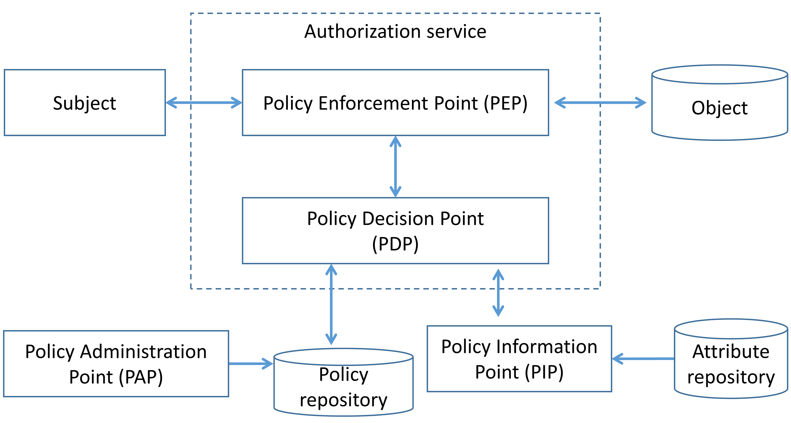
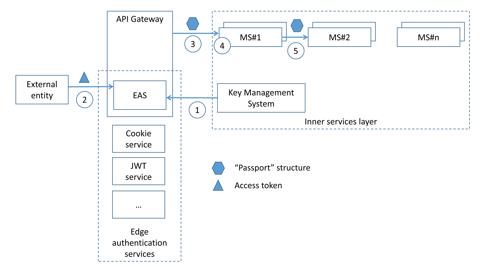

# Microservices Security Cheat Sheet

## Introduction

The microservice architecture is being increasingly used for designing and implementing application systems in both cloud-based and on-premise infrastructures, high-scale applications and services. There are many security challenges need to be addressed in the application design and implementation phases. The fundamental security requirements that have to be addressed during design phase are authentication and authorization. Therefore, it is vital for applications security architects to understand and properly use existing architecture patterns to implement authentication and authorization in microservices-based systems. The goal of this cheat sheet is to identify such patterns and to do recommendations for applications security architect on possible way to use it.

## Edge-level authorization

In simple scenario, authorization can happen only at the edge level (API gateway). The API gateway can be leveraged to centralize enforcement of authorization for all downstream microservices, eliminating the need to provide authentication and access control for each of the individual services. In such case, [NIST recommends](https://doi.org/10.6028/NIST.SP.800-204) to implement mitigating controls such as mutual authentication to prevent direct, anonymous connections to the internal services (API gateway bypass). It should be noted that authorization at the edge layer has a [following limitations](https://www.youtube.com/watch?v=UnXjwCWgBKU):

- pushing all authorization decisions to API gateway can quickly become hard to manage in complex ecosystems with many roles and access control rules;
- API gateway may become a single-point-of-decision that may violate “defense in depth” principle;
- operation teams typically own the API gateway, so development teams can not directly make authorization changes, slowing down velocity due to the additional communication and process overhead.

In most cases, development teams implement authorization in both places -- at the edge level at a coarse level of granularity and service level. To authenticate external entity edge can use access tokens (referenced token or self-contained token) transmitted via HTTP headers (e.g. “Cookie” or “Authorization”) or use mTLS.

## Service-level authorization

Service-level authorization gives each microservice more control to enforce access control policies.
For further discussion, we use terms and definitions according with [NIST SP 800-162](https://nvlpubs.nist.gov/nistpubs/SpecialPublications/NIST.SP.800-162.pdf). The functional components of access control system can be classified following way:

- Policy Administration Point (PAP) provides a user interface for creating, managing, testing, and debugging access control rules;
- Policy Decision Point (PDP) computes access decisions by evaluating the applicable access control policy;
- Policy Enforcement Point (PEP) enforces policy decisions in response to a request from a subject requesting access to a protected object;
- Policy Information Point (PIP) serves as the retrieval source of attributes, or the data required for policy evaluation to provide the information needed by the PDP to make the decisions.

### Service-level authorization: existing patterns

#### Decentralized pattern

Development team implements PDP and PEP directly at microservice code level. All the access control rules and as well as attributes that need to implement that rule are defined and stored on the each microservice (step 1). When microservice receives (step 2) request along with some authorization metadata (e.g., end user context or requested resource ID), microservice analyzes it (step 3) in order to generate access control policy decision and then enforces authorization (step 4).

Existing programming language frameworks allow development teams to implement authorization at the microservice layer. E.g., [Spring Security allows](https://www.youtube.com/watch?v=v2J32nd0g24) developers to enable scopes checking (e.g. using scopes extracted from incoming JWT) in the resource server and use it to enforce authorization.
Implementing authorization at the source code level means that the code must be updated whenever development team want to modify authorization logic.

#### Centralized pattern with single policy decision point

In that pattern access control rules are defined, stored, and evaluated centrally. Access control rules is defined using PAP (step 1) and delivered to centralized PDP as well as attributes that need to implement that rules (step 2). When a subject invokes microservice endpoint (step 3), microservice code invokes centralized PDP via network call and PDP generates access control policy decision by evaluating the query input against access control rules and attributes (step 4). Based on PDP decision microservice enforce authorization (step 5).

To define access control rules development/operation team has to use some language or notation. An example is Extensible Access Control Markup Language (XACML) and Next Generation Access Control (NGAC) that is a standard to implement policy rules description. This pattern badly affects latency due additional network calls of the remote PDP endpoint, but it can be mitigated by caching authorization policy decisions at microservice level. It should be mentioned that PDP must be operated in high-availability mode due to resilience and availability issues. Application security architects should combine it with other patterns (e.g., authorization on API gateway level) in order to enforce “defense in depth” principle.

#### Centralized pattern with embedded policy decision point

In that pattern access control rules are defined centrally but stored and evaluated at microservice level. Access control rules is defined using PAP (step 1) and delivered to embedded PDP as well as attributes that need to implement that rules (step 2). When a subject invokes microservice endpoint (step 3), microservice code invokes PDP and PDP generates access control policy decision by evaluating the query input against access control rules and attributes (step 4). Based on PDP decision microservice enforce authorization (step 5).

PDP code in that case can be implemented as microservice built-in library or sidecar in service mesh architecture. Due to possible network/host failures and network latency it is advisable to implement embedded PDP as microservice library or sidecar on the same host with microservice. Embedded PDP usually store authorization policy and policy-related data in-memory to minimize external dependencies during authorization enforcement and get low latency. Main difference from “Centralized pattern with single policy decision point” with caching approach is that authorization decisions do not store on the microservice side, up to date authorization policy are stored on microservice side instead. It should be mentioned that caching authorization decisions may lead to applying outdated authorization rules and access control violations.
Netfix presented ([link](https://www.youtube.com/watch?v=R6tUNpRpdnY), [link](https://conferences.oreilly.com/velocity/vl-ca-2018/public/schedule/detail/66606.html)) a real case of using “Centralized pattern with embedded PDP” pattern to implement authorization on the microservices level.

- Policy portal and Policy repository is UI-based system for creating, managing and versioning access control rules;
- Aggregator fetches data used in access control rules from all external sources and keeps it up to date;
- Distributor pulls access control rules (from Policy repository) and data used in access control rules (from Aggregators) to distribute it among PDPs;
- PDP (library) asynchronically pulls access control rules and data and keeps it up to date to enforce authorization by PEP component.

### Recommendation on how to implement authorization

1. To achieve scalability it is not advisable to hardcode authorization policy in source code (decentralized pattern), but use special language to express policy instead. The goal is to externalize/decouple authorization from code, and not just with a gateway/proxy that acts as a checkpoints. Recommended pattern for service-level authorization is “Centralized pattern with embedded PDP” due to its resilience and wide adoption.
2. Authorization solution should be platform-level solution; dedicated team (e.g., Platform security team) must be accountable for development and operation of authorization solution as well as sharing microservice blueprint/library/components that implement authorization among development teams.
3. Authorization solution should be based on widely used solution, because implementing custom solution has following cons:
    - security or engineering team have to build and maintain custom solution;
    - it is necessary to build and maintain client library SDKs for every language used in system architecture;
    - necessity to train every developer on custom authorization service API and integration, and there’s no open source community to source information from.
4. There is a probability that not all access control policy can be enforced by gateways/proxies and shared authorization library/components, so some specific access control rules still have to be implemented on microservice buisnes code level. In order to do that it is advisiable to have and use by microservice development teams simple questionary/check-list to uncover such security requriments and handle its properly during microservice development.
5. It is advisable to implement “defense in depth” principle   enforce authorization on:
    - gateways and proxies level at a coarse level of granularity;
    - microservice level using shared authorization library/components to enforce fine-granted decisions;
    - microservice business code level to implement business-specific access control rules.
6. Access control policy formal procedures like development, approvement, rolling-out must be implemented.

## External entity identity propagation

To make fine-granted authorization decision at the microservice level microservice has to understand caller context (e.g. user ID, user roles/groups). In order to allow internal service layer to enforce authorization edge layer has to propagate authenticated external entity identity (e.g., end user context) along with a request to downstream microservices. One of the simplest way to propagate external entity identity is to re-use the access token received by the edge and pass it to internal microservices. It should be mentioned that approach is highly insecure due to possible external access token leakage and may decrease an attack surface because the communication relies on proprietary token-based system implementation and internal microservices have to understand external access token. This pattern also is not external access token agnostic, i.e. internal services have to support a wide range of authentication techniques to extract identity from different types of external tokens (e.g. JWT, cookie, OpenID Connect token).

### Identity propagation: existing patterns

#### Send the external entity identity as a clear or self-signed data structures

In that approach calling microservice extracts external entity identity from incoming request (e.g. via parsing incoming access token), creates data structure (e.g. JSON or self-signed JWT) with context and passes that on to an internal microservices.
In this scenario recipient microservice has to trust the calling microservice -- if the calling microservice want to violate access control rules, it can do so by setting any user/client ID or user roles it wants as the HTTP header. That approach is applicable in a highly trusted environment in which every microservice is developed by trusted development team according with secure software development practices.

#### Using a data structures signed by a trusted issuer

In this pattern after the external request is authenticated by authentication service at the edge layer, a data structure representing external entity identity (e.g., contained user ID, user roles/groups or permissions) is generated, signed or encrypted by the trusted issuer and propagated  to internal microservices.

[Netflix presented](https://www.infoq.com/presentations/netflix-user-identity/) a real case of using that pattern: structure called “Passport” that contains user ID and its attributes and HMAC protected is created at the edge level for each incoming request, propagated to internal microservices and never exposes outside:

1. Edge authentication service (EAS) obtains secret key from the Key Management System.
2. EAS receives an access token (may be e.g. in a cookie, JWT, OAuth2 token) from incoming request.
3. EAS decrypts the access token, resolves the external entity identity and sends it to the internal services in the signed “Passport” structure.
4. Internal services can extract user identity in order to enforce authorization (e.g. to implement identity-based authorization) using wrappers.
5. If necessary, internal service can propagate “Passport” structure to downstream services in the call chain.

It should be mentioned that pattern is external access token agnostic and allows to decouple external entity and its internal representation.

### Recommendation on how to implement identity propogation

1. In order to implement external access token agnostic and extendable system decouple access tokens issued for external entity from its internal representation. Use single data structure to represent and propagate external entity identity among microservices. Edge-level service has to verify incoming external access token, issue internal entity representation structure and propagate it to downstream services.
2. Using an internal entity representation structure signed (symmetric or asymmetric encryption) by a trusted issuer is recommended pattern adopted by community.
3. Internal entity representation structure should be extensible to enable add more claims that may lead to low latency.
4. Internal entity representation structure must not be exposed outside (e.g., to browser or external device).

## Service-to-service authentication

### Existing patterns

#### Mutual transport layer security

In mTLS approach each microservice can legitimately identify who it talks to, in addition to achieving confidentiality and integrity of the transmitted data. Each microservice in the deployment has to carry a public/private key pair and uses that key pair to authenticate to the recipient microservices via mTLS. mTLS usually is implemented with a self-hosted Public Key Infrastructure. The main challenges using mTLS are: key provisioning and trust bootstrap, certificate revocation and key rotation.

#### Token based

Token based approach works at the application layer. Token is a container and may contain caller ID (microservice ID) and its permissions (scopes). Caller microservice can obtain signed token by invoking special security token service using its own service ID and password and then attaches it to every outgoing requests e.g., via HTTP headers. Called microservice can extract token and validate it online or offline.

1. Online scenario:
    - to validate incoming token microservice invokes centralized service token service via network call;
    - revoked (compromised) token can be detected
    - high latency
    - should be apply to critical requests
2. Offline scenario:
    - to validate incoming token microservice use downloaded service token service public key;
    - revoked (compromised) token may not be detected
    - low latency
    - should be apply to non-critical requests
In most cases, token-based authentication works over TLS that provides confidentiality and integrity of data in transit.

## References

- [NIST Special Publication 800-204](https://nvlpubs.nist.gov/nistpubs/SpecialPublications/NIST.SP.800-204.pdf) “Security Strategies for Microservices-based Application Systems”
- [NIST Special Publication 800-204A](https://nvlpubs.nist.gov/nistpubs/SpecialPublications/NIST.SP.800-204A.pdf) “Building Secure Microservices-based Applications Using Service-Mesh Architecture”
- [Microservices Security in Action](https://www.manning.com/books/microservices-security-in-action), Prabath Siriwardena and Nuwan Dias, 2020, Manning
