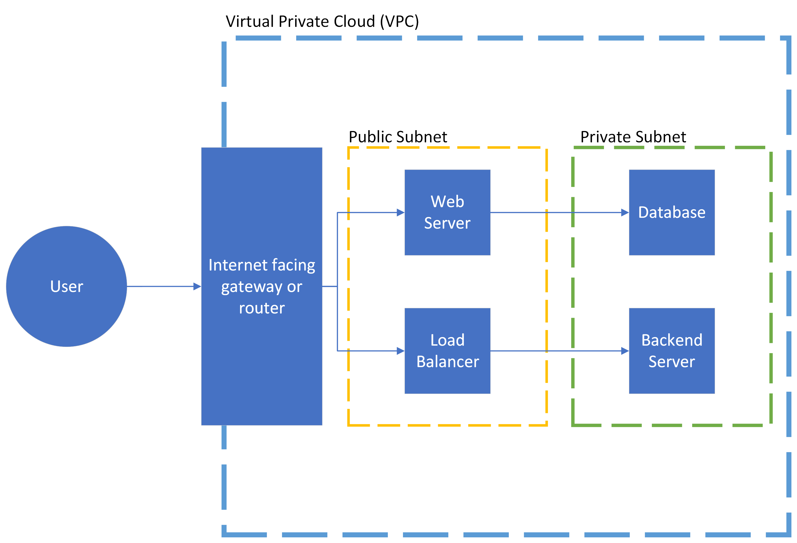
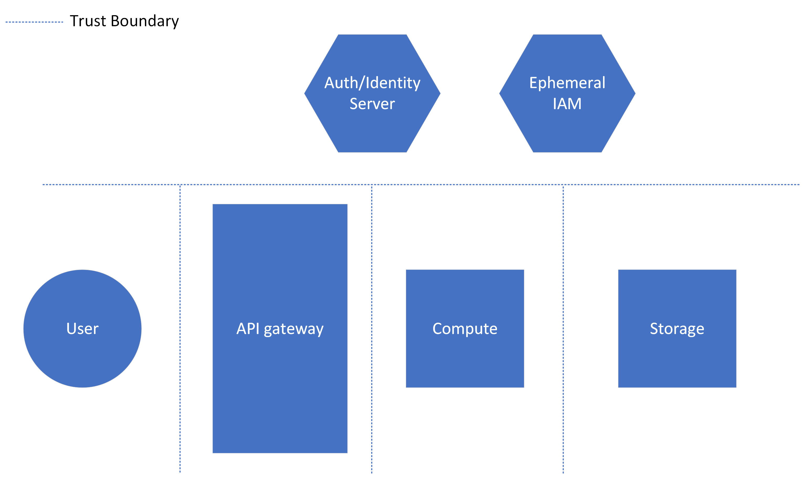
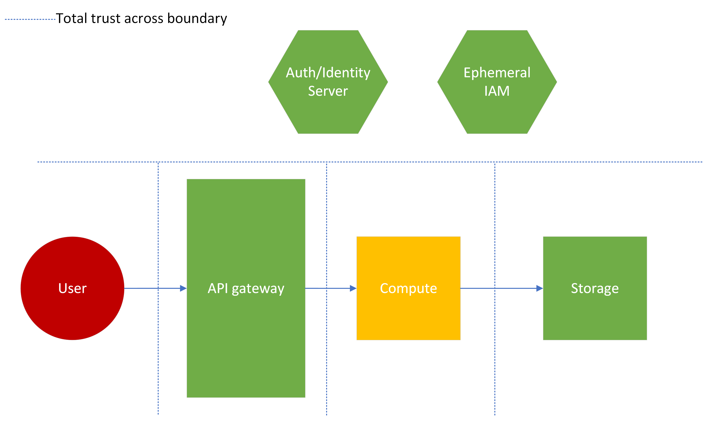

# Cloud Architecture Security Cheat Sheet

## Introduction

This cheat sheet will discuss common and necessary security patterns to follow when creating and reviewing cloud architectures. Each section will cover a specific security guideline or cloud design decision to consider. This sheet is written from a medium to large scale enterprise system, so additional overhead elements will be discussed, which may be unecessary for smaller organizations.

## Risk Analysis, Threat Modeling, and Attack Surface Assessments

With any application or architecture, understanding the risk and threats is extremely important for properly security. No one can spend their entire budget or bandwidth focus on security, and a product must be delivered at some point, so properly allocating security resources is necessary.
With this in mind, enterprises must perform risk assessments, threat modeling activites, and attack surface assessments to identify the following:

- What threats an application might face
- The likelihood of those threats actualizing as attacks
- The attack surface with which those attacks could be targeted
- The business impact of losing data or functionality due to said attack

This is all necessary to properly scope the security of an architecture. However, these are all separate subjects that can/should be discussed in greater detail. Use the resources link below to investigate further as part of a health secure architecture convesation.

- [Threat Modeling Cheat Sheet](https://cheatsheetseries.owasp.org/cheatsheets/Threat_Modeling_Cheat_Sheet.html)
- [Attack Surface Analysis Cheat Sheet](https://cheatsheetseries.owasp.org/cheatsheets/Attack_Surface_Analysis_Cheat_Sheet.html)
- [TODO RISK SHEET]()

## Public and Private Resources
Cloud resources often have public and private configuration settings, which while flexible, can lead to common pitfalls for developing secure cloud architectures. Generally speaking, resources should be configured for private use with dedicated public connections points for internet access. 

### Object Storage
Object storage usually has multiple options for access data:

- Accessing resources using built in Identity and Access Management policies
- Using cryptographically signed URLs and HTTP request
- Direct access with public storage

#### IAM Access
This method involves using other tooling, like a website hosted on the cloud service, to interact with the object storage on the user's behalf. This method is best used when the application has other user interfaces available, when it is important to hide as much of the storage system as possible, or when the information is not direct user assets (metadata). It can be used in combination with web authentication and logging to better track and control access to resources.

|                 Pros                 |                  Cons                  |
|:------------------------------------:|:--------------------------------------:|
|       No direct access to table      |    Potential use of broad IAM policy   |
| No user visibility to object storage | Possibility to inject into custom code |
|   Identifiable and loggable access   |                                        |

This approach is acceptable for sensitive user data, but must follow rigorous coding and cloud best practices, in order to properly secure data.

#### Signed URLs
URL Signing for object storage involves using some method or either statically or dynamically generating URLs, which cryptographically guarantee that an entity can access a resource in storage. This is best used when direct access to specific user files is necessary or preferred, as there is no file transfer overhead. It is advisable to only use this method for user data which is not very sensitive. This method can be secure, but falls into some interesting pitfalls. Code injection may still be possible if the method of URL generation is custom, dynamic and injectable, and anyone can access the resource anonymously, if given the URL. 

|                    Pros                   |                  Cons                  |
|:-----------------------------------------:|:--------------------------------------:|
|        Access to only one resource        |            Anonymous Access            |
| Minimal user visibility to object storage |       Anyone can access with URL       |
|           Efficient file transfer         | Possibility to inject into custom code |

#### Public Object Storage

**This is not an advisable method for resource storage and distribution**, and should only be used for public, non-sensitive, non-specific resources. This storage approach will provide threat actors additional reconnaissance into a cloud environment, and any data which is stored in this configuration for any period of time must be considered publicly available.

|                 Pros                |                     Cons                     |
|:-----------------------------------:|:--------------------------------------------:|
| Efficient access to many resources  |         Anyone can access/No privacy         |
|       Simple public file share      |            Direct Access to table            |
|                                     | Possibly leak info mistakenly put in storage |

### VPCs and Subnets
Virtual Private Clouds (VPC) and public/private network subnets allow an application and its network to be segmented into distinct chunks, adding layers of security within a cloud system. Unlike other private vs public trade-offs, an application will likely incorporate most or all of these components in a mature architecture. Each is explained below:

#### VPCs
VPC's are used to create network boundaries within an application, where-in components can talk to each other, much like a physical network in a data center. The VPC will be made up of some number of subnets, both public and private. VPCs can be used to:
  - Separate entire applications within the same cloud account.
  - Separate large components of application into distinct VPCs with isolated networks.
  - Create separations between duplicate applications used for different customers or data sets.

#### Public Subnets
Public subnets house components which will have an internet facing presence. The subnet will contain network routing elements to allow components within the subnet to connect directly to the internet. Some use cases include:
  - Public facing resources, like front-end web applications.
  - Initial touch points for applications, like load balancers and routers.
  - Developer access points, like [bastions](https://aws-quickstart.github.io/quickstart-linux-bastion/) (note, these can be very insecure if engineered/deployed incorrectly).

#### Private Subnets
Private subnets house components which should not have direct internet access. The subnet will likely contain network routing to connect it to public subnets, to receive internet traffic in a structured and protected way. Private subnets are great for:
  - Databases and data stores.
  - Backend servers and associated file systems.
  - Anything which is deemed too sensitive for direct internet access.

#### Simple Architecture Example
Consider the simple architecture diagram below. A VPC will house all of the components for the application, but elements will be in a specific subnet depending on its role within the system. The normal flow for an interaction with this application might look like:

1. Access to the application through some sort of internet gateway, API gateway or other internet facing component.
2. This gateway connects to a load balancer or a web server in a public subnet. Both components provide public facing functions and are secured accordingly.
3. These components then interact with their appropriate backend counterparts, a database or backend server, contained in a private VPC. This connections are more limited, preventing extraneous access to potentially more "soft" backend systems.

*Note: This diagram intentionally skips routing and IAM elements for subnet interfacing, for simplicity and to be service provider agnostic.*

This architecture prevents less hardened backend components or higher risk services like databases from being exposed to the internet directly. It also provides common, public functionality access to the internet to avoid additional routing overhead. This architecture can be secured more easily by focusing on security at the entry points and separating functionality, putting non-public or sensitive information inside a private subnet where it can't be accessed easily by external parties.

## Trust Boundaries

### Defining Trust Boundaries
Trust boundaries are connections between components within a system where a trust decision has to be made by the components. Another way to phrase it, this boundary is a point where two components with potentially different trust levels meet. These boundaries can range in scale, from the degrees of trust given to users interacting with an application, to trusting or verifying specific claims between code functions or components within a cloud architecture. Generally speaking however, trusting each component to perform its function correctly and securely suffices. Therefore, trust boundaries mainly occur in the connections between cloud components, and between the application and third party elements, like end users and other vendors.  

As an example of a trust boundary, consider the architecture below. An API gateway connects to multiple compute instances in a chain. Separately, there exists an authentication server, which can verify the integrity of a Json Web Token at any stage of the process. As shown by the dotted lines, trust boundaries exist between each compute component, the API gateway and the authentication server, even though many or all of the elements could be apart of the same organization's applications. 

### Exploring Different Levels of Trust
In the example from the last section, the trust boundaries existed between each element. This section will explore the differences between certain configurations of trust on said boundaries. For each example below, additional elements will be added to better explain the implications of trusting a certain resource. The "business criticality" as a number from 1 (lowest) to 5 (highest) will identify which resources are most important in the scenario. The threat level of a specific resource as a color from green (safe) to red (dangerous) will outline which resources should likely hold the least trust.

#### 1. No trust example:
As shown in the diagram below, this example outlines a model where no component trusts any other component, regardless of criticality or threat level. This type of trust configuration would likely be used for incredibly high risk applications, where either very personal data or important business data would be exposed, or where the application as a whole has an extremely high criticality for the company. Notice that each component calls out to the authentication server. This implies that no data passing between each component, even when "inside" the application, is considered trusted. Additionally, notice that there isn't trust between the authentication server and each component. While not displayed in the diagram, this would have additional impacts, like more rigorous checks before authentication, and more overhead dedicated to cryptographic operations.

This could be a necessary approach for certain applications with incredibly high risk of compromise or highly valuable data, such as those found in financial, military or energy systems. However, security must be careful when advocating for this model, as it will have significant performance and maintenance drawbacks. 

|            Pros               |         Cons          |
|:-----------------------------:|:---------------------:|
| High assurance data integrity | Slow and inefficient  |
|       Defense in depth        |      Complicated      |
|                               | Likely more expensive |

#### 2. High trust example:
Next, consider the an opposite approach, where everything is trusted. In this instance, the "dangerous" user input is trusted and essentially handed directly to a high criticality business component. The authentication resource is not used at all. In this instance, there would be a high likelihood that an attack of some kind would occur against the system, because there are no controls in place to prevent it. Additionally, this setup could be considred wasteful, as both the API gateway and the authentication server are not necessarily performing their intended function.

This is an unlikely architecture for all but the simplest and lowest risk applications. **Do not use this trust boundary configuration** unless there is no sensitive content to protect or efficiency is the only metric for success. Generally speaking, trusting user input is never recommended, even in low risk applications.

| Pros      | Cons                    |
|:---------:|:-----------------------:|
| Efficient |        Insecure         |
|  Simple   |        Wasteful         |
|           | High risk of compromise |

#### 3. Some trust example:
Most applications will need trust boundary configuration like this. Using knowledge from the risk and attack surface analysis in section 1, security can reasonably assign trust to low risk components or processes, and verify only when necessary to protect business critical resources. This will prevent wasting valuable security resources, but also limit the complexity and efficiency loss due to additional security overhead.

By nature, this approach limits the pros and cons of both previous examples. This model should be used for most applications, unless the benefits of the above examples are absolutely necessary to meet business requirements.

|                   Pros                   |          Cons          |
|:----------------------------------------:|:----------------------:|
|           Secured based on risk          | Known gaps in security |
| Cost/Efficiency derived from criticality |                        |

*Note: This trust methodology diverges from Zero Trust. For a more in depth look at that topic, check out [CISA's Zero Trust Maturity Model](https://www.cisa.gov/sites/default/files/2023-04/zero_trust_maturity_model_v2_508.pdf)*.

## Security Tooling

### Web Application Firewall
Web application firewalls (WAF) are used to monitor or block common attack payloads (like [XSS](https://owasp.org/www-community/attacks/xss/) and [SQLi](https://owasp.org/www-community/attacks/SQL_Injection)), or allow only specific request types and patterns. Applications should use them as a first line of defense, attaching them to entry points like load balancers or API gateways, to handle potentially malicious content before it reaches application code. Cloud providers curate base rule sets which will allow blocking or monitoring of common malicious payloads:

- [AWS Managed Rules](https://docs.aws.amazon.com/waf/latest/developerguide/aws-managed-rule-groups-list.html)
- [GCP WAF Rules](https://cloud.google.com/armor/docs/waf-rules)
- [Azure Core Rule Sets](https://learn.microsoft.com/en-us/azure/web-application-firewall/ag/application-gateway-crs-rulegroups-rules?tabs=owasp32)

By design these rule sets are generic and will not cover every attack type an application will face. Consider creating custom rules which will fit the application's specific security needs, like:

- Filtering routes to acceptable endpoints (block web scraping)
- Adding specific protections for application technologies around key endpoints
- Rate limit sensitive APIs

### Logging & Monitoring
Logging and monitoring is required for a truly secure application. Developers should know exactly what is going on in their environment, making use of alerting mechanisms to warn engineers when systems are not working as expected. Additionally, in the event of a security incident, logging should be verbose enough to track a threat actor through an entire application, and provide enough knowledge for respondents to understand what actions were taken against what resources. Note that proper logging and monitoring can be expensive, and risk/cost trade-offs should be discussed when putting incredibly verbose logging in place.

#### Logging
Proper logging will have the following:

- All [layer 7](https://en.wikipedia.org/wiki/OSI_model) calls logged with headers, caller metadata, and responses
  - Payloads may not be logged depending on where logging occurs (before TLS termination) and the sensitivity of data
- All internal actions logged with user and permission information
- Trace Ids sent through the entire request lifecycle to track errors or malicious actions
- Sensitive data masked or removed
  - SSNs, sensitive health information, and other PII should not be stored in logs

*Appropriate/relevant legal and compliance representatives should weigh in on log retention times for the specific application.*

#### Monitoring
Proper monitoring will have the following (percentages chosen based off risk and team response capacity):

- Anomaly alerts: 
  - HTTP 4xx and 5xx errors above a percent of normal
  - Memory, storage or CPU usage above/below percent of normal
  - Database writes/reads above/below percent of normal
  - Serverless compute invocations above percent of normal
- Alerting for failed health checks
- Alerting for deployment errors or container on/off cycling
- Alerts or cutoffs for cost limits

WAFs can also have monitoring or alerting attached to them for counting malicious payloads or (in some cases) anomalous activity detection.

### DDoS Protection

Cloud service companies offer a range of simple and advanced DDoS protection products, depending on application needs. Simple DDOS protection can often be employed using WAFs with rate limits and route blocking rules, while more advanced protection may require specific managed tooling offered by the cloud provider. Examples include:

- [AWS Shield](https://aws.amazon.com/shield/)
- [GCP Cloud Armor Managed Protection](https://cloud.google.com/armor/docs/managed-protection-overview)
- [Azure DDoS Protection](https://learn.microsoft.com/en-us/azure/ddos-protection/ddos-protection-overview)

The decision to enable advanced DDoS protections for a specific application should be based off risk and business criticality of application, taking into account mitigating factors and cost (these services can be very inexpensive compared to large company budgets).

## Cloud Offering Limitations

## Managed vs Un-Managed Tooling

### Updates

### 

## Additional Resources
- [Secure Product Design](https://cheatsheetseries.owasp.org/cheatsheets/Secure_Product_Design_Cheat_Sheet.html)
