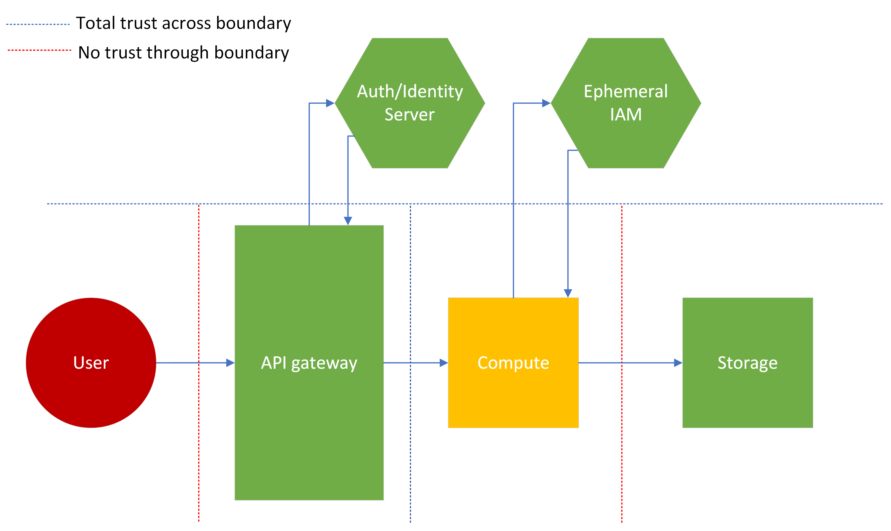

# Cloud Architecture Security Cheat Sheet

## Introduction

This cheat sheet will discuss common and necessary security patterns to follow when creating and reviewing cloud architectures. Each section will cover a specific security guideline or cloud design decision to consider. This sheet is written for a medium to large scale enterprise system, so additional overhead elements will be discussed, which may be unecessary for smaller organizations.

## Risk Analysis, Threat Modeling, and Attack Surface Assessments

With any application architecture, understanding the risks and threats is extremely important for proper security. No one can spend their entire budget or bandwidth focused on security, so properly allocating security resources is necessary.
Therefore, enterprises must perform risk assessments, threat modeling activites, and attack surface assessments to identify the following:

- What threats an application might face
- The likelihood of those threats actualizing as attacks
- The attack surface with which those attacks could be targeted
- The business impact of losing data or functionality due to said attack

This is all necessary to properly scope the security of an architecture. However, these are subjects that can/should be discussed in greater detail. Use the resources link below to investigate further as part of a healthy secure architecture conversation.

- [Threat Modeling Cheat Sheet](https://cheatsheetseries.owasp.org/cheatsheets/Threat_Modeling_Cheat_Sheet.html)
- [Attack Surface Analysis Cheat Sheet](https://cheatsheetseries.owasp.org/cheatsheets/Attack_Surface_Analysis_Cheat_Sheet.html)
- [CISA Cyber Risk Assessment](https://www.cisa.gov/sites/default/files/2023-02/22_1201_safecom_guide_to_cybersecurity_risk_assessment_508-r1.pdf)

## Public and Private Components

### Secure Object Storage

Object storage usually has the following options for accessing data:

- Accessing resources using built-in Identity and Access Management policies
- Using cryptographically signed URLs and HTTP requests
- Directly accessing with public storage

#### IAM Access

This method involves indirect access on tooling such as a managed or self-managed service running on ephemeral or persistent infrastructure. This infrastructure contains a persistent control plane IAM credential, which interacts with the object storage on the user's behalf. The method is best used when the application has other user interfaces or data systems available, when it is important to hide as much of the storage system as possible, or when the information shouldn't/won't be seen by an end user (metadata). It can be used in combination with web authentication and logging to better track and control access to resources. The key security concern for this approach is relying on developed code or policies which could contain weaknesses.

|                 Pros                 |                       Cons                         |
|:------------------------------------:|:--------------------------------------------------:|
|       No direct access to data       |          Potential use of broad IAM policy         |
| No user visibility to object storage | Credential loss gives access to control plane APIs |
|   Identifiable and loggable access   |           Credentials could be hardcoded           |

This approach is acceptable for sensitive user data, but must follow rigorous coding and cloud best practices, in order to properly secure data.

#### Signed URLs

URL Signing for object storage involves using some method or either statically or dynamically generating URLs, which cryptographically guarantee that an entity can access a resource in storage. This is best used when direct access to specific user files is necessary or preferred, as there is no file transfer overhead. It is advisable to only use this method for user data which is not very sensitive. This method can be secure, but has notable cons. Code injection may still be possible if the method of signed URL generation is custom, dynamic and injectable, and anyone can access the resource anonymously, if given the URL. Developers must also consider if and when the signed URL should expire, adding to the complexity of the approach.

|                    Pros                   |                    Cons                   |
|:-----------------------------------------:|:-----------------------------------------:|
|        Access to only one resource        |              Anonymous Access             |
| Minimal user visibility to object storage |         Anyone can access with URL        |
|           Efficient file transfer         | Possibility of injection with custom code |

#### Public Object Storage

**This is not an advisable method for resource storage and distribution**, and should only be used for public, non-sensitive, generic resources. This storage approach will provide threat actors additional reconnaissance into a cloud environment, and any data which is stored in this configuration for any period of time must be considered publicly accessed (leaked to the public).

|                 Pros                |                 Cons                 |
|:-----------------------------------:|:------------------------------------:|
| Efficient access to many resources  |     Anyone can access/No privacy     |
|       Simple public file share      |  Unauthenticated access to objects   |
|                                     |  Visibility into full file system    |
|                                     |     Accidently leak stored info      |

### VPCs and Subnets

Virtual Private Clouds (VPC) and public/private network subnets allow an application and its network to be segmented into distinct chunks, adding layers of security within a cloud system. Unlike other private vs public trade-offs, an application will likely incorporate most or all of these components in a mature architecture. Each is explained below.

#### VPCs

VPC's are used to create network boundaries within an application, where-in components can talk to each other, much like a physical network in a data center. The VPC will be made up of some number of subnets, both public and private. VPCs can be used to:

- Separate entire applications within the same cloud account.
- Separate large components of application into distinct VPCs with isolated networks.
- Create separations between duplicate applications used for different customers or data sets.

#### Public Subnets

Public subnets house components which will have an internet facing presence. The subnet will contain network routing elements to allow components within the subnet to connect directly to the internet. Some use cases include:

- Public facing resources, like front-end web applications.
- Initial touch points for applications, like load balancers and routers.
- Developer access points, like [bastions](https://aws-quickstart.github.io/quickstart-linux-bastion/) (note, these can be very insecure if engineered/deployed incorrectly).

#### Private Subnets

Private subnets house components which should not have direct internet access. The subnet will likely contain network routing to connect it to public subnets, to receive internet traffic in a structured and protected way. Private subnets are great for:

- Databases and data stores.
- Backend servers and associated file systems.
- Anything deemed too sensitive for direct internet access.

#### Simple Architecture Example

Consider the simple architecture diagram below. A VPC will house all of the components for the application, but elements will be in a specific subnet depending on its role within the system. The normal flow for interacting with this application might look like:

1. Accessing the application through some sort of internet gateway, API gateway or other internet facing component.
2. This gateway connects to a load balancer or a web server in a public subnet. Both components provide public facing functions and are secured accordingly.
3. These components then interact with their appropriate backend counterparts, a database or backend server, contained in a private VPC. This connections are more limited, preventing extraneous access to the possibly "soft" backend systems.

*Note: This diagram intentionally skips routing and IAM elements for subnet interfacing, for simplicity and to be service provider agnostic.*

This architecture prevents less hardened backend components or higher risk services like databases from being exposed to the internet directly. It also provides common, public functionality access to the internet to avoid additional routing overhead. This architecture can be secured more easily by focusing on security at the entry points and separating functionality, putting non-public or sensitive information inside a private subnet where it will be harder to access by external parties.

## Trust Boundaries

Trust boundaries are connections between components within a system where a trust decision has to be made by the components. Another way to phrase it, this boundary is a point where two components with potentially different trust levels meet. These boundaries can range in scale, from the degrees of trust given to users interacting with an application, to trusting or verifying specific claims between code functions or components within a cloud architecture. Generally speaking however, trusting each component to perform its function correctly and securely, suffices. Therefore, trust boundaries likely will occur in the connections between cloud components, and between the application and third party elements, like end users and other vendors.

As an example, consider the architecture below. An API gateway connects to a compute instance (ephemeral or persistent), which then accesses a persistent storage resource. Separately, there exists a server which can verify the authentication, authorization and/or identity of the caller. This is a generic representation of an OAuth, IAM or directory system, which controls access to these resources. Additionally, there exists an Ephemeral IAM server which controls access for the stored resources (using an approach like the [IAM Access](#iam-access) section above). As shown by the dotted lines, trust boundaries exist between each compute component, the API gateway and the auth/identity server, even though many or all of the elements could be in the same application.

### Exploring Different Levels of Trust

Architects have to select a trust configuration between components, using quantative factors like risk score/tolerance, velocity of project, as well as subjective security goals. Each example below details trust boundary relationships to better explain the implications of trusting a certain resource. The threat level of a specific resource as a color from green (safe) to red (dangerous) will outline which resources shouldn't be trusted.

#### 1. No trust example

As shown in the diagram below, this example outlines a model where no component trusts any other component, regardless of criticality or threat level. This type of trust configuration would likely be used for incredibly high risk applications, where either very personal data or important business data is contained, or where the application as a whole has an extremely high business criticality.

Notice that both the API gateway and compute components call out to the auth/identity server. This implies that no data passing between these components, even when right next to each other "inside" the application, is considered trusted. The compute instance must then assume an ephemeral identity to access the storage, as the compute instance isn't trusted to a specific resource even if the user is trusted to the instance.

Also note the lack of trust between the auth/identity server and ephemeral IAM server and each component. While not displayed in the diagram, this would have additional impacts, like more rigorous checks before authentication, and possibly more overhead dedicated to cryptographic operations.

This could be a necessary approach for applications found in financial, military or critical infrastructure systems. However, security must be careful when advocating for this model, as it will have significant performance and maintenance drawbacks.

|              Pros                |         Cons          |
|:--------------------------------:|:---------------------:|
| High assurance of data integrity | Slow and inefficient  |
|         Defense in depth         |      Complicated      |
|                                  | Likely more expensive |

#### 2. High trust example

Next, consider the an opposite approach, where everything is trusted. In this instance, the "dangerous" user input is trusted and essentially handed directly to a high criticality business component. The auth/identity resource is not used at all. In this instance, there is higher likelihood of a successful attack against the system, because there are no controls in place to prevent it. Additionally, this setup could be considered wasteful, as both the auth/identity and ephemeral IAM servers are not necessarily performing their intended function. *(These could be shared corporate resources that aren't being used to their full potential).*

This is an unlikely architecture for all but the simplest and lowest risk applications. **Do not use this trust boundary configuration** unless there is no sensitive content to protect or efficiency is the only metric for success. Trusting user input is never recommended, even in low risk applications.

| Pros      | Cons                    |
|:---------:|:-----------------------:|
| Efficient |        Insecure         |
|  Simple   |   Potentially Wasteful  |
|           | High risk of compromise |

#### 3. Some trust example

Most applications will use a trust boundary configuration like this. Using knowledge from a risk and attack surface analysis, security can reasonably assign trust to low risk components or processes, and verify only when necessary. This prevents wasting valuable security resources, but also limits the complexity and efficiency loss due to additional security overhead.

Notice in this example, that the API gateway checks the auth/identity of a user, then immediately passes the request on to the compute instance. The instance doesn't need to re-verify, and performs it's operation. However, as the compute instance is working with untrusted user inputs (designated yellow for some trust), it is still necessary to assume an ephemeral identity to access the storage system.

By nature, this approach limits the pros and cons of both previous examples. This model will likely be used for most applications, unless the benefits of the above examples are necessary to meet business requirements.

|                   Pros                   |          Cons          |
|:----------------------------------------:|:----------------------:|
|           Secured based on risk          | Known gaps in security |
| Cost/Efficiency derived from criticality |                        |

*Note: This trust methodology diverges from Zero Trust. For a more in depth look at that topic, check out [CISA's Zero Trust Maturity Model](https://www.cisa.gov/sites/default/files/2023-04/zero_trust_maturity_model_v2_508.pdf)*.

## Security Tooling

### Web Application Firewall

Web Application Firewalls (WAF) are used to monitor or block common attack payloads (like [XSS](https://owasp.org/www-community/attacks/xss/) and [SQLi](https://owasp.org/www-community/attacks/SQL_Injection)), or allow only specific request types and patterns. Applications should use them as a first line of defense, attaching them to entry points like load balancers or API gateways, to handle potentially malicious content before it reaches application code. Cloud service providers curate base rule sets which will block or monitor common malicious payloads:

- [AWS Managed Rules](https://docs.aws.amazon.com/waf/latest/developerguide/aws-managed-rule-groups-list.html)
- [GCP WAF Rules](https://cloud.google.com/armor/docs/waf-rules)
- [Azure Core Rule Sets](https://learn.microsoft.com/en-us/azure/web-application-firewall/ag/application-gateway-crs-rulegroups-rules?tabs=owasp32)

By design these rule sets are generic and will not cover every attack type an application will face. Consider creating custom rules which will fit the application's specific security needs, like:

- Filtering routes to acceptable endpoints (block web scraping)
- Adding specific protections for chosen technologies and key application endpoints
- Rate limiting sensitive APIs

### Logging & Monitoring

Logging and monitoring is required for a truly secure application. Developers should know exactly what is going on in their environment, making use of alerting mechanisms to warn engineers when systems are not working as expected. Additionally, in the event of a security incident, logging should be verbose enough to track a threat actor through an entire application, and provide enough knowledge for respondents to understand what actions were taken against what resources. Note that proper logging and monitoring can be expensive, and risk/cost trade-offs should be discussed when putting logging in place.

#### Logging

For proper logging, consider:

- Logging all [layer 7](https://en.wikipedia.org/wiki/OSI_model) HTTP calls with headers, caller metadata, and responses
    - Payloads may not be logged depending on where logging occurs (before TLS termination) and the sensitivity of data
- Logging internal actions with actor and permission information
- Sending trace IDs through the entire request lifecycle to track errors or malicious actions
- Masking or removing sensitive data
    - SSNs, sensitive health information, and other PII should not be stored in logs

*Legal and compliance representatives should weigh in on log retention times for the specific application.*

#### Monitoring

For proper monitoring consider adding:

- Anomaly alerts:
    - HTTP 4xx and 5xx errors above a percent of normal
    - Memory, storage or CPU usage above/below percent of normal
    - Database writes/reads above/below percent of normal
    - Serverless compute invocations above percent of normal
- Alerting for failed health checks
- Alerting for deployment errors or container on/off cycling
- Alerts or cutoffs for cost limits

Anomalies by count and type can vary wildly from app to app. A proper understanding of what qualifies as an anomaly requires an environment specific baseline. Therefore, the percentages mentioned above should be chosen based off that baseline, in addition to considerations like risk and team response capacity.

WAFs can also have monitoring or alerting attached to them for counting malicious payloads or (in some cases) anomalous activity detection.

### DDoS Protection

Cloud service providers offer a range of DDoS protection products, from simple to advanced, depending on application needs. Simple DDoS protection can often be implemented using WAFs with rate limits and route blocking rules. More advanced protection may require specific managed tools offered by the cloud service provider. Examples include:

- [AWS Shield](https://aws.amazon.com/shield/)
- [GCP Cloud Armor Managed Protection](https://cloud.google.com/armor/docs/managed-protection-overview)
- [Azure DDoS Protection](https://learn.microsoft.com/en-us/azure/ddos-protection/ddos-protection-overview)

The decision to enable advanced DDoS protections for a specific application should be based off risk and business criticality of application, taking into account mitigating factors and cost (these services can be very inexpensive compared to large company budgets).

## Shared Responsibility Model

The Shared Responsibility Model is a framework for cloud service providers (CSPs) and those selling cloud based services to properly identify and segment the responsibilities of the developer and the provider. This is broken down into different levels of control, corresponding to different elements/layers of the technology stack. Generally, components like physical computing devices and data center space are the responsibility of the CSP. Depending on the level of [management](#self-managed-tooling), the developer could be responsible for the entire stack from operating system on up, or only for some ancillary functionality, code or administration.

This responsiblitity model is often categorized into three levels of service called:

- Infrastructure as a Service ([IaaS](#iaas))
- Platform as a Service ([PaaS](#paas))
- Software as a Service ([SaaS](#saas))

*Many other service classifications exist, but aren't listed for simplicity and brevity.*

As each name indicates, the level of responsibility the CSP assumes is the level of "service" they provide. Each level provides its own set of pros and cons, discussed below.

### IaaS

In the case of IaaS, the infrastructure is maintained by the CSP, while everything else is maintained by the developer. This includes:

- Authentication and authorization
- Data storage, access and management
- Certain networking tasks (ports, NACLs, etc)
- Application software

This model favors developer configurability and flexibility, while being more complex and generally higher cost than other service models. It also most closely resembles on premise models which are waning in favor with large companies. Because of this, it may be easier to migrate certain applications to cloud IaaS, than to re-architect with a more cloud native architecture.

|             Pros             |            Cons           |
|:----------------------------:|:-------------------------:|
| Control over most components |        Highest cost       |
|   High level of flexilibity  | More required maintenance |
| Easy transition from on-prem |  High level of complexity |

**Responsibility is held almost exclusively by the developer, and must be secured as such**. Everything, from network access control, operating system vulnerabilities, application vulnerabilities, data access, and authentication/authorization must be considered when developing an IaaS security strategy. Like described above, this offers a high level of control across almost everything in the technology stack, but can be very difficult to maintain without adequate resources going to tasks like version upgrades or end of life migrations. *([Self-managed security updates](#update-strategy-for-self-managed-services) are discussed in greater detail below.)*

### PaaS

Platform as a Service is in the middle between IaaS and SaaS. The developer controls:

- Application authentication and authorization
- Application software
- External data storage

It provides neatly packaged code hosting and containerized options, which allow smaller development teams or less experienced developers a way to get started with their applications while ignoring more complex or superfluous computing tasks. It is generally less expensive than IaaS, while still retaining some control over elements that a SaaS system does not provide. However, developers could have problems with the specific limitations of the offering used, or issues with compatability, as the code must work with the correct container, framework or language version.

Also, while scalability is very dependent on provider and setup, PaaS usually provides higher scalability due to containerization options and common, repeatable base OS systems. Compared to IaaS, where scalability must be built by the developer, and SaaS, where the performance is very platform specific.

|              Pros              |              Cons              |
|:------------------------------:|:------------------------------:|
| Easier to onboard and maintain | Potential compatability issues |
|       Better scalability       |  Offering specific limitations |

Manual security in PaaS solutions is similary less extensive (compared to IaaS). Application specific authentication and authorization must still be handled by the developer, along with any access to external data systems. However, the CSP is responsible for securing containerized instances, operating systems, ephemeral files systems, and certain networking controls.

### SaaS

The Software as a Service model is identified by a nearly complete product, where the end user only has to configure or customize small details in order to meet their needs. The user generally controls:

- Configuration, administration and/or code within the product's boundaries
- Some user access, such as designating administrators
- High level connections to other products, through permissions or integrations

The entire technology stack is controlled by the provider (cloud service or other software company), and the developer will only make relatively small tweaks to meet custom needs. This limits cost and maintenance, and problems can typically be solved with a provider's customer support, as opposed to needing technical knowledge to troubleshoot the whole tech stack.

|               Pros               |                Cons                |
|:--------------------------------:|:----------------------------------:|
|          Low maintenance         | Restricted by provider constraints |
|            Inexpensive           |           Minimal control          |
| Customer support/troubleshooting |      Minimal insight/oversight     |

Security with SaaS is simultaneously the easiest and most difficult, due to the lack of control expressed above. A developer will only have to manage a small set of security functions, like some access controls, the data trust/sharing relationship with integrations, and any security implications of customizations. All other layers of security are controlled by the provider. This means that any security fixes will be out of the developer's hands, and therefore could be handled in a untimely manner, or not to a satisfactory level of security for an end user (depending on security needs). However, such fixes won't require end user involvement and resources, making them easier from the perspective of cost and maintenance burden.

*Note: When looking for SaaS solutions, consider asking for a company's attestation records and proof of compliance to standards like [ISO 27001](https://www.iso.org/standard/27001). Listed below are links to each of the major CSPs' attestation sites for additional understanding.*

- [GCP](https://cloud.google.com/security/compliance/offerings)
- [AWS](https://aws.amazon.com/compliance/programs/)
- [Azure](https://servicetrust.microsoft.com/ViewPage/HomePageVNext)

### Self-managed tooling

Another way to describe this shared responsibility model more generically is by categorizing cloud tooling on a spectrum of "management". Fully managed services leave very little for the end developer to handle besides some coding or administrative functionality (SaaS), while self-managed systems require much more overhead to maintain (IaaS).

AWS provides an excellent example of this difference in management, identifying where some of their different products fall onto different points in the spectrum.

*Note: It is hard to indicate exactly which offerings are considered what type of service (Ex: IaaS vs PaaS). Developers should look to understand the model which applies to the specific tool they are using.*

#### Update Strategy for Self-managed Services

Self-managed tooling will require additional overhead by developers and support engineers. Depending on the tool, basic version updates, upgrades to images like [AMIs](https://docs.aws.amazon.com/AWSEC2/latest/UserGuide/AMIs.html) or [Compute Images](https://cloud.google.com/compute/docs/images), or other operating system level maintence will be required. Use automation to regularly update minor versions or [images](https://docs.aws.amazon.com/systems-manager/latest/userguide/automation-tutorial-update-patch-golden-ami.html), and schedule time in development cycles for refreshing stale resources.

#### Avoid Gaps in Managed Service Security

Managed services will offer some level of security, like updating and securing the underlying hardware which runs application code. However, the development team are still responsible for many aspects of security in the system. Ensure developers understand what security will be their responsibility based on tool selection. Likely the following will be partially or wholly the responsibility of the developer:

- Authentication and authorization
- Logging and monitoring
- Code security ([OWASP Top 10](https://owasp.org/www-project-top-ten/))
- Third-party library patching

Refer to the documentation provided by the cloud service provider to understand which aspects of security are the responsibility of each party, based on the selected service. For example, in the case of serverless functions:

- [AWS Lambda](https://docs.aws.amazon.com/lambda/latest/dg/lambda-security.html)
- [GCP Cloud Functions](https://cloud.google.com/functions/docs/securing)
- [Azure Functions](https://learn.microsoft.com/en-us/azure/architecture/serverless-quest/functions-app-security)

## References

- [Secure Product Design](https://cheatsheetseries.owasp.org/cheatsheets/Secure_Product_Design_Cheat_Sheet.html)
- [CISA Security Technical Reference Architecture](https://www.cisa.gov/sites/default/files/publications/Cloud%20Security%20Technical%20Reference%20Architecture.pdf)
