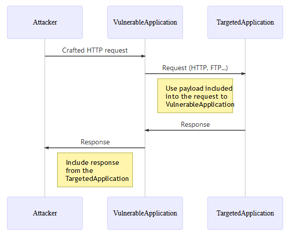

# Introduction

The objective of the cheat sheet is to provide advices regarding the protection against [Server Side Request Forgery](https://www.acunetix.com/blog/articles/server-side-request-forgery-vulnerability/) attack.

**S**erver **S**ide **R**equest **F**orgery will be named **SSRF** in the rest of the cheat sheet.

This cheat sheet will focus on the defense point of view and will not explains how to perform this attack. This [talk](../assets/Server_Side_Request_Forgery_Prevention_Cheat_Sheet_Orange_Tsai_Talk.pdf) from the security researcher [Orange Tsai](https://twitter.com/orange_8361) provides deep advices about how to perform this kind of attack.

# Context

Server-Side Request Forgery is a way to force application to make a malicious network request. It can happen when user can control the URL to an external resource like: 
- Image on external server (e.g. user enter URL of the avatar, then the application will download this file and display some feedback like image itself or error).
- Custom [WebHook](https://en.wikipedia.org/wiki/Webhook) (user have to specify WebHook handlers, Callback URLs).
- Request to another application, often located on other network, to perform a specific task. Depending of the business case, it can happen that information from the user are needed to perform the action.

Overview of an SSRF common flow:



*Note:* SSRF is not limited to HTTP protocol, even if often the first request performed by the attacker leverage the HTTP protocol, the second request (performed by the vulnerable application, the SSRF in fact) can use different protocol like HTTP, FTP, SMTP, SMB and so on...It depends on the technical need of the vulnerable application to perform the normal expected job on the other application on which the request is sent.

# Cases

Depending on application functionality and requirements there are two basic cases when SSRF can happen:
* Application should send request only to **identified and trusted applications**: *Case when [whitelist](https://en.wikipedia.org/wiki/Whitelisting) approach is available*.
* Application can send requests to **ANY other IP address or domain name**: *Case when [whitelist](https://en.wikipedia.org/wiki/Whitelisting) approach is not available*.

Because these two cases are very different this document will describe defences against them separately.

# Case 1 - Application should send request only to identified and trusted applications

Sometime, an application need to perform request to another application, often located on other network, to perform a specific task. Depending of the business case, it can happen that information from the user are needed to perform the action.

*Example:* 

We can imagine an web application that receive and use the information coming a user like the firstname/lastname/birthdate/email/SSN to create a profile into an HR system via a request to this HR system. 

Basically, the user cannot reach the HR system directly but if the web application in charge of receiving the user information is vulnerable to SSRF then the user can leverage it to access the HR system. 

The user use the web application as a proxy to the HR system, jumping accross the different networks in which the web application and the HR system are located.

## Available protections

 > In the rest of this section, we assume that we application absolutely need that the application to use a information from the user to perform a valid request to another application to do the expected job.

Several protections measures are possible at Application and Network layers, both layers will be addressed in this cheat sheet in order to apply the *defense in deph* principle.

### Application layer

The first level of protection that come to mind is [Input validation](Input_Validation_Cheat_Sheet.md). 

It's a good point but then this question appear: *How to perform this input validation?*

As [Orange Tsai](https://twitter.com/orange_8361) show in his [talk](../assets/Server_Side_Request_Forgery_Prevention_Cheat_Sheet_Orange_Tsai_Talk.pdf), depending on the programming language used, parser can be abused. One possible countermeasure is to apply the [whitelisting approach](Input_Validation_Cheat_Sheet.md#whitelisting-vs-blacklisting) when input validation is used because, most of the time, the format of the information expected from the user is globally know.

We can identify the following kind of information that we can receive from a user and that will use to create the request that will be sent to the final application:
* String containing business data.
* IP address (V4 or V6).
* Domain name.
* URL

#### String

In the context of an SSRF, we can simply ensure that the provided string respect the business/technical format expected. A [regex](https://www.regular-expressions.info/) can be used to ensure that data receive is valid from a security point of view. We assume here that the expected data is a non-network related data like firstname/lastname/birthdate/...

Example:

```java
if(Pattern.matches("[a-zA-Z0-9\\s\\-]{1,50}", userInput)){
    //Continue the processing because the input data is valid
}else{
    //Stop the processing and reject the request
}
```

#### IP address

In the context of an SSRF, there is 2 validation to perform:

1. Ensure that the data provided is a valid IP V4 or V6 address.
2. Ensure that the IP address provided belong to the one of the IP addresses of the identified and trusted applications (the whitelisting come to action here).

The first validation can be performed using one of this libraries depending on your technologies (libray option is proposed here in order to delegate the managing of the IP address format and leverage battle tested validation function):

* **JAVA:** Method [InetAddressValidator.isValid](http://commons.apache.org/proper/commons-validator/apidocs/org/apache/commons/validator/routines/InetAddressValidator.html#isValid(java.lang.String)) from the [Apache Commons Validator](http://commons.apache.org/proper/commons-validator/) library.
* **.NET**: Method [IPAddress.TryParse](https://docs.microsoft.com/en-us/dotnet/api/system.net.ipaddress.tryparse?view=netframework-4.8) from the SDK. 
* **JavaScript**: Library [ip-address](https://www.npmjs.com/package/ip-address).
* **Python**: Module [ipaddress](https://docs.python.org/3/library/ipaddress.html) from the SDK.
* **Ruby**: Class [IPAddr](https://ruby-doc.org/stdlib-2.0.0/libdoc/ipaddr/rdoc/IPAddr.html) from the SDK.

Once you are sure that the value is a valid IP address then you can perform the second validation. Here, as a whitelist has been built with all the IP addresses (**V4 + V6** in order to avoid bypass using one of the 2 IP type) of every identified and trusted applications, then a verification can be made to ensure that the IP address provided is part of this whitelist (string strict comparison with case sensitive).

#### Domain name

When validation of a domain name come to mind, the first idea is to do a DNS resolution in order to see if the domain exists, it's not a bad idea but it bring 2 problems depending on the configuration of the application regarding the DNS servers to use for the resolution:
* It can disclose information to external DNS resolvers.
* It can be used, by an attacker, to deliver a malicious payload to the internal DNS resolvers as well as to the API (SDK or third-party) used by the application to handle the DNS communication and then, potentially, trigger a vulnerability in one of these both components.

In the context of an SSRF, there is 2 validation to perform:

1. Ensure that the data provided is a valid domain name.
2. Ensure that the domain name provided belong to the one of the domain name of the identified and trusted applications (the whitelisting come to action here).

Like for IP address, the first validation can be performed using one of this libraries depending on your technologies (libray option is proposed here in order to delegate the managing of the domain name format and leverage battle tested validation function), proposed functions do not perform any DNS resolution query:

* **JAVA:** Method [DomainValidator.isValid](https://commons.apache.org/proper/commons-validator/apidocs/org/apache/commons/validator/routines/DomainValidator.html#isValid(java.lang.String)) from the [Apache Commons Validator](http://commons.apache.org/proper/commons-validator/) library.
* **.NET**: Method [Uri.CheckHostName](https://docs.microsoft.com/en-us/dotnet/api/system.uri.checkhostname?view=netframework-4.8) from the SDK. 
* **JavaScript**: Library [is-valid-domain](https://www.npmjs.com/package/is-valid-domain).
* **Python**: Module [validators.domain](https://validators.readthedocs.io/en/latest/#module-validators.domain).
* **Ruby**: TODO:

Once you are sure that the value is a valid domain name then you can perform the second validation. As we are, here, in a context where whitelist is possible then we can apply this approach:

1. Build a whitelist with all the domain names of every identified and trusted applications.
2. Verify that the domain name received is part of this whitelist (string strict comparison with case sensitive).

#### URL

Do not accept complete URL from the user because URL are difficult to validate and parser can be abused depending on the technology used like demonstrated by the [talk](../assets/Server_Side_Request_Forgery_Prevention_Cheat_Sheet_Orange_Tsai_Talk.pdf) of [Orange Tsai](https://twitter.com/orange_8361). 

If network related information is really nedded then only accept an valid IP address or domain name.

### Network layer

The objective here is to prevent that the *VulnerableApplication* performs call to arbitrary applications, so, only the expected *routes* will be opened at network level.

The Firewall component, as a specific device or using the one provided within the operating system, will be used here define the legitimate flows. 

In the schema below we show the goal that we want the achieve by leveraging the Firewall component, using this way, even if an application is vulnerable to SSRF, the attacker can only call applications that are part of legitimate flows:


Network segregation can also be leveraged and **is highly recommanded in order to block not legit call directly at network level itself**.

# Case 2 - Application can send requests to ANY external IP address or domain name

This case happen when user can control an URL to an external resource and application makes a request to this URL (e.g. in case of webhooks). Whitelist cannot be used here because the list of IPs/domains is often unknown upfront and is dynamically changing. **In that case system should blok all IPs/domains that are in private network including localhost and IPv4 Link-Local addresses 169.254.0.0-169.254.255.255 (that is all not-routable ip addresses).** In practice it is a hard task.

*Random notes: When whitelist approach is not available, attacker can try to forge requests to two types of internal applications: 1. applications that normally are not requested by this application - and here attacker should be stopped by authentication 2. applications that normally are exchanging data thus vulnerable application is allowed to make requests. Here are couple of options like adding custom header to all requests that maybe controlled by attacker and rejecting them in internal applications. In this attack attacker typically can control URL but not headers etc*

## Challenges in blocking URLs at application layer

It is know in security industry that blacklisting is very hard and prone to errors. Below is described why filtering URLs is very hard at application layer.

## Available protections

### Application layer

*Random notes: it cannot be done only on app layer but on that layer we can do scheme:// white-listing + logging*

### Network layer

# Authors and Primary Editors

Firstname Lastname - email@email.com

# Tools and code used for schemas

* [Mermaid Online Editor](https://mermaidjs.github.io/mermaid-live-editor).
* [Mermaid documentation](https://mermaidjs.github.io/).
* [Draw.io Online Editor](https://www.draw.io/).

Mermaid code for SSRF common flow (printscreen are used to capture PNG image inserted into this cheat sheet):

```text
sequenceDiagram
    participant Attacker
    participant VulnerableApplication
    participant TargetedApplication
    Attacker->>VulnerableApplication: Crafted HTTP request
    VulnerableApplication->>TargetedApplication: Request (HTTP, FTP...)
    Note left of TargetedApplication: Use paylaod included<br>into the request to<br>VulnerableApplication
    TargetedApplication->>VulnerableApplication: Response 
    VulnerableApplication->>Attacker: Response
    Note left of VulnerableApplication: Include response<br>from the<br>TargetedApplication
```

Draw.io schema XML code for the "[case 1 for network layer protection about flows that we want to prevent](../assets/Server_Side_Request_Forgery_Prevention_Cheat_Sheet_Case1_NetworkLayer_PreventFlow.xml)" schema (printscreen are used to capture PNG image inserted into this cheat sheet).