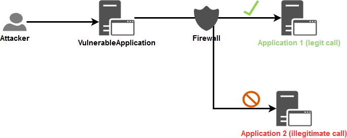

# Server-Side Request Forgery Prevention Cheat Sheet

## Introduction

The objective of the cheat sheet is to provide advices regarding the protection against [Server Side Request Forgery](https://www.acunetix.com/blog/articles/server-side-request-forgery-vulnerability/) (SSRF) attack.

This cheat sheet will focus on the defensive point of view and will not explain how to perform this attack. This [talk](../assets/Server_Side_Request_Forgery_Prevention_Cheat_Sheet_Orange_Tsai_Talk.pdf) from the security researcher [Orange Tsai](https://twitter.com/orange_8361) as well as this [document](../assets/Server_Side_Request_Forgery_Prevention_Cheat_Sheet_SSRF_Bible.pdf) provide techniques on how to perform this kind of attack.

## Context

SSRF is an attack vector that abuses an application to interact with the internal/external network or the machine itself. One of the enablers for this vector is the mishandling of URLs, as showcased in the following examples:

- Image on an external server (*e.g.* user enters image URL of their avatar for the application to download and use).
- Custom [WebHook](https://en.wikipedia.org/wiki/Webhook) (users have to specify Webhook handlers or Callback URLs).
- Internal requests to interact with another service to serve a specific functionality. Most of the times, user data is sent along to be processed, and if poorly handled, can perform specific injection attacks.

## Overview of a SSRF common flow


*Notes:*

- SSRF is not limited to the HTTP protocol. Generally, the first request is HTTP, but in cases where the application itself performs the second request, it could use different protocols (*e.g.* FTP, SMB, SMTP, etc.) and schemes (*e.g.* `file://`, `phar://`, `gopher://`, `data://`, `dict://`, etc.).
- If the application is vulnerable to [XML eXternal Entity (XXE) injection](https://portswigger.net/web-security/xxe) then it can be exploited to perform a [SSRF attack](https://portswigger.net/web-security/xxe#exploiting-xxe-to-perform-ssrf-attacks), take a look at the [XXE cheat sheet](XML_External_Entity_Prevention_Cheat_Sheet.md) to learn how to prevent the exposure to XXE.

## Cases

Depending on the application's functionality and requirements, there are two basic cases in which SSRF can happen:

- Application can send request only to **identified and trusted applications**: Case when [allowlist](https://en.wikipedia.org/wiki/Whitelisting) approach is available.
- Application can send requests to **ANY external IP address or domain name**: Case when [allowlist](https://en.wikipedia.org/wiki/Whitelisting) approach is unavailable.

Because these two cases are very different, this cheat sheet will describe defences against them separately.

### Case 1 - Application can send request only to identified and trusted applications

Sometimes, an application needs to perform a request to another application, often located on another network, to perform a specific task. Depending on the business case, user input is required for the functionality to work.

#### Example

 > Take the example of a web application that receives and uses personal information from a user, such as their first name, last name, birth date etc. to create a profile in an internal HR system. By design, that web application will have to communicate using a protocol that the HR system understands to process that data.
 > Basically, the user cannot reach the HR system directly, but, if the web application in charge of receiving user information is vulnerable to SSRF, the user can leverage it to access the HR system.
 > The user leverages the web application as a proxy to the HR system.

The allowlist approach is a viable option since the internal application called by the *VulnerableApplication* is clearly identified in the technical/business flow. It can be stated that the required calls will only be targeted between those identified and trusted applications.

#### Available protections

Several protective measures are possible at the **Application** and **Network** layers. To apply the **defense in depth** principle, both layers will be hardened against such attacks.

##### Application layer

The first level of protection that comes to mind is [Input validation](Input_Validation_Cheat_Sheet.md).

Based on that point, the following question comes to mind: *How to perform this input validation?*

As [Orange Tsai](https://twitter.com/orange_8361) shows in his [talk](../assets/Server_Side_Request_Forgery_Prevention_Cheat_Sheet_Orange_Tsai_Talk.pdf), depending on the programming language used, parsers can be abused. One possible countermeasure is to apply the [allowlist approach](Input_Validation_Cheat_Sheet.md#allow-list-vs-block-list) when input validation is used because, most of the time, the format of the information expected from the user is globally known.

The request sent to the internal application will be based on the following information:

- String containing business data.
- IP address (V4 or V6).
- Domain name.
- URL.

**Note:** Disable the support for the following of the [redirection](https://developer.mozilla.org/en-US/docs/Web/HTTP/Redirections) in your web client in order to prevent the bypass of the input validation described in the section `Exploitation tricks > Bypassing restrictions > Input validation > Unsafe redirect` of this [document](../assets/Server_Side_Request_Forgery_Prevention_Cheat_Sheet_SSRF_Bible.pdf).

###### String

In the context of SSRF, validations can be added to ensure that the input string respects the business/technical format expected.

A [regex](https://www.regular-expressions.info/) can be used to ensure that data received is valid from a security point of view if the input data have a simple format (*e.g.* token, zip code, etc.). Otherwise, validation should be conducted using the libraries available from the `string` object because regex for complex formats are difficult to maintain and are highly error-prone.

User input is assumed to be non-network related and consists of the user's personal information.

Example:

```java
//Regex validation for a data having a simple format
if(Pattern.matches("[a-zA-Z0-9\\s\\-]{1,50}", userInput)){
    //Continue the processing because the input data is valid
}else{
    //Stop the processing and reject the request
}
```

###### IP address

In the context of SSRF, there are 2 possible validations to perform:

1. Ensure that the data provided is a valid IP V4 or V6 address.
2. Ensure that the IP address provided belongs to one of the IP addresses of the identified and trusted applications.

The first layer of validation can be applied using libraries that ensure the security of the IP address format, based on the technology used (library option is proposed here to delegate the managing of the IP address format and leverage battle-tested validation function):

> Verification of the proposed libraries has been performed regarding the exposure to bypasses (Hex, Octal, Dword, URL and Mixed encoding) described in this [article](https://medium.com/@vickieli/bypassing-ssrf-protection-e111ae70727b).

- **JAVA:** Method [InetAddressValidator.isValid](http://commons.apache.org/proper/commons-validator/apidocs/org/apache/commons/validator/routines/InetAddressValidator.html#isValid(java.lang.String)) from the [Apache Commons Validator](http://commons.apache.org/proper/commons-validator/) library.
    - **It is NOT exposed** to bypass using Hex, Octal, Dword, URL and Mixed encoding.
- **.NET**: Method [IPAddress.TryParse](https://docs.microsoft.com/en-us/dotnet/api/system.net.ipaddress.tryparse?view=netframework-4.8) from the SDK.
    - **It is exposed** to bypass using Hex, Octal, Dword and Mixed encoding but **NOT** the URL encoding.
    - As allowlisting is used here, any bypass tentative will be blocked during the comparison against the allowed list of IP addresses.
- **JavaScript**: Library [ip-address](https://www.npmjs.com/package/ip-address).
    - **It is NOT exposed** to bypass using Hex, Octal, Dword, URL and Mixed encoding.
- **Ruby**: Class [IPAddr](https://ruby-doc.org/stdlib-2.0.0/libdoc/ipaddr/rdoc/IPAddr.html) from the SDK.
    - **It is NOT exposed** to bypass using Hex, Octal, Dword, URL and Mixed encoding.

> **Use the output value of the method/library as the IP address to compare against the allowlist.**

After ensuring the validity of the incoming IP address, the second layer of validation is applied. An allowlist is created after determining all the IP addresses (v4 and v6 to avoid bypasses) of the identified and trusted applications. The valid IP is cross-checked with that list to ensure its communication with the internal application (string strict comparison with case sensitive).

###### Domain name

In the attempt of validate domain names, it is apparent to do a DNS resolution to verify the existence of the domain. In general, it is not a bad idea, yet it opens up the application to attacks depending on the configuration used regarding the DNS servers used for the domain name resolution:

- It can disclose information to external DNS resolvers.
- It can be used by an attacker to bind a legit domain name to an internal IP address. See the section `Exploitation tricks > Bypassing restrictions > Input validation > DNS pinning` of this [document](../assets/Server_Side_Request_Forgery_Prevention_Cheat_Sheet_SSRF_Bible.pdf).
- An attacker can use it to deliver a malicious payload to the internal DNS resolvers and the API (SDK or third-party) used by the application to handle the DNS communication and then, potentially, trigger a vulnerability in one of these components.

In the context of SSRF, there are two validations to perform:

1. Ensure that the data provided is a valid domain name.
2. Ensure that the domain name provided belongs to one of the domain names of the identified and trusted applications (the allowlisting comes to action here).

Similar to the IP address validation, the first layer of validation can be applied using libraries that ensure the security of the domain name format, based on the technology used (library option is proposed here in order to delegate the managing of the domain name format and leverage battle tested validation function):

> Verification of the proposed libraries has been performed to ensure that the proposed functions do not perform any DNS resolution query.

- **JAVA:** Method [DomainValidator.isValid](https://commons.apache.org/proper/commons-validator/apidocs/org/apache/commons/validator/routines/DomainValidator.html#isValid(java.lang.String)) from the [Apache Commons Validator](http://commons.apache.org/proper/commons-validator/) library.
- **.NET**: Method [Uri.CheckHostName](https://docs.microsoft.com/en-us/dotnet/api/system.uri.checkhostname?view=netframework-4.8) from the SDK.
- **JavaScript**: Library [is-valid-domain](https://www.npmjs.com/package/is-valid-domain).
- **Python**: Module [validators.domain](https://validators.readthedocs.io/en/latest/#module-validators.domain).
- **Ruby**: No valid dedicated gem has been found.
    - [domainator](https://github.com/mhuggins/domainator), [public_suffix](https://github.com/weppos/publicsuffix-ruby) and [addressable](https://github.com/sporkmonger/addressable) has been tested but unfortunately they all consider `<script>alert(1)</script>.owasp.org` as a valid domain name.
    - This regex, taken from [here](https://stackoverflow.com/a/26987741), can be used: `^(((?!-))(xn--|_{1,1})?[a-z0-9-]{0,61}[a-z0-9]{1,1}\.)*(xn--)?([a-z0-9][a-z0-9\-]{0,60}|[a-z0-9-]{1,30}\.[a-z]{2,})$`

Example of execution of the proposed regex for Ruby:

```ruby
domain_names = ["owasp.org","owasp-test.org","doc-test.owasp.org","doc.owasp.org",
                "<script>alert(1)</script>","<script>alert(1)</script>.owasp.org"]
domain_names.each { |domain_name|
    if ( domain_name =~ /^(((?!-))(xn--|_{1,1})?[a-z0-9-]{0,61}[a-z0-9]{1,1}\.)*(xn--)?([a-z0-9][a-z0-9\-]{0,60}|[a-z0-9-]{1,30}\.[a-z]{2,})$/ )
        puts "[i] #{domain_name} is VALID"
    else
        puts "[!] #{domain_name} is INVALID"
    end
}
```

```bash
$ ruby test.rb
[i] owasp.org is VALID
[i] owasp-test.org is VALID
[i] doc-test.owasp.org is VALID
[i] doc.owasp.org is VALID
[!] <script>alert(1)</script> is INVALID
[!] <script>alert(1)</script>.owasp.org is INVALID
```

After ensuring the validity of the incoming domain name, the second layer of validation is applied:

1. Build an allowlist with all the domain names of every identified and trusted applications.
2. Verify that the domain name received is part of this allowlist (string strict comparison with case sensitive).

Unfortunately here, the application is still vulnerable to the `DNS pinning` bypass mentioned in this [document](../assets/Server_Side_Request_Forgery_Prevention_Cheat_Sheet_SSRF_Bible.pdf). Indeed, a DNS resolution will be made when the business code will be executed. To address that issue, the following action must be taken in addition of the validation on the domain name:

1. Ensure that the domains that are part of your organization are resolved by your internal DNS server first in the chains of DNS resolvers.
2. Monitor the domains allowlist in order to detect when any of them resolves to a/an:
   - Local IP address (V4 + V6).
   - Internal IP of your organization (expected to be in private IP ranges) for the domain that are not part of your organization.

The following Python3 script can be used, as a starting point, for the monitoring mentioned above:

```python
# Dependencies: pip install ipaddress dnspython
import ipaddress
import dns.resolver

# Configure the allowlist to check
DOMAINS_ALLOWLIST = ["owasp.org", "labslinux"]

# Configure the DNS resolver to use for all DNS queries
DNS_RESOLVER = dns.resolver.Resolver()
DNS_RESOLVER.nameservers = ["1.1.1.1"]

def verify_dns_records(domain, records, type):
    """
    Verify if one of the DNS records resolve to a non public IP address.
    Return a boolean indicating if any error has been detected.
    """
    error_detected = False
    if records is not None:
        for record in records:
            value = record.to_text().strip()
            try:
                ip = ipaddress.ip_address(value)
                # See https://docs.python.org/3/library/ipaddress.html#ipaddress.IPv4Address.is_global
                if not ip.is_global:
                    print("[!] DNS record type '%s' for domain name '%s' resolve to
                    a non public IP address '%s'!" % (type, domain, value))
                    error_detected = True
            except ValueError:
                error_detected = True
                print("[!] '%s' is not valid IP address!" % value)
    return error_detected

def check():
    """
    Perform the check of the allowlist of domains.
    Return a boolean indicating if any error has been detected.
    """
    error_detected = False
    for domain in DOMAINS_ALLOWLIST:
        # Get the IPs of the current domain
        # See https://en.wikipedia.org/wiki/List_of_DNS_record_types
        try:
            # A = IPv4 address record
            ip_v4_records = DNS_RESOLVER.query(domain, "A")
        except Exception as e:
            ip_v4_records = None
            print("[i] Cannot get A record for domain '%s': %s\n" % (domain,e))
        try:
            # AAAA = IPv6 address record
            ip_v6_records = DNS_RESOLVER.query(domain, "AAAA")
        except Exception as e:
            ip_v6_records = None
            print("[i] Cannot get AAAA record for domain '%s': %s\n" % (domain,e))
        # Verify the IPs obtained
        if verify_dns_records(domain, ip_v4_records, "A")
        or verify_dns_records(domain, ip_v6_records, "AAAA"):
            error_detected = True
    return error_detected

if __name__== "__main__":
    if check():
        exit(1)
    else:
        exit(0)
```

###### URL

Do not accept complete URLs from the user because URL are difficult to validate and the parser can be abused depending on the technology used as showcased by the following [talk](../assets/Server_Side_Request_Forgery_Prevention_Cheat_Sheet_Orange_Tsai_Talk.pdf) of [Orange Tsai](https://twitter.com/orange_8361).

If network related information is really needed then only accept a valid IP address or domain name.

##### Network layer

The objective of the Network layer security is to prevent the *VulnerableApplication* from performing calls to arbitrary applications. Only allowed *routes* will be available for this application in order to limit its network access to only those that it should communicate with.

The Firewall component, as a specific device or using the one provided within the operating system, will be used here to define the legitimate flows.

In the schema below, a Firewall component is leveraged to limit the application's access, and in turn, limit the impact of an application vulnerable to SSRF:



[Network segregation](https://www.mwrinfosecurity.com/our-thinking/making-the-case-for-network-segregation) (see this set of [implementation advice](https://www.cyber.gov.au/acsc/view-all-content/publications/implementing-network-segmentation-and-segregation) can also be leveraged and **is highly recommended in order to block illegitimate calls directly at network level itself**.

### Case 2 - Application can send requests to ANY external IP address or domain name

This case happens when a user can control a URL to an **External** resource and the application makes a request to this URL (e.g. in case of [WebHooks](https://en.wikipedia.org/wiki/Webhook)). Allow lists cannot be used here because the list of IPs/domains is often unknown upfront and is dynamically changing.

In this scenario, *External* refers to any IP that doesn't belong to the internal network, and should be reached by going over the public internet.

Thus, the call from the *Vulnerable Application*:

- **Is NOT** targeting one of the IP/domain *located inside* the company's global network.
- Uses a convention defined between the *VulnerableApplication* and the expected IP/domain in order to *prove* that the call has been legitimately initiated.

#### Challenges in blocking URLs at application layer

Based on the business requirements of the above mentioned applications, the allowlist approach is not a valid solution. Despite knowing that the block-list approach is not an impenetrable wall, it is the best solution in this scenario. It is informing the application what it should **not** do.

Here is why filtering URLs is hard at the Application layer:

- It implies that the application must be able to detect, at the code level, that the provided IP (V4 + V6) is not part of the official [private networks ranges](https://en.wikipedia.org/wiki/Private_network) including also *localhost* and *IPv4/v6 Link-Local* addresses. Not every SDK provides a built-in feature for this kind of verification, and leaves the handling up to the developer to understand all of its pitfalls and possible values, which makes it a demanding task.
- Same remark for domain name: The company must maintain a list of all internal domain names and provide a centralized service to allow an application to verify if a provided domain name is an internal one. For this verification, an internal DNS resolver can be queried by the application but this internal DNS resolver must not resolve external domain names.

#### Available protections

Taking into consideration the same assumption in the following [example](Server_Side_Request_Forgery_Prevention_Cheat_Sheet.md#example) for the following sections.

##### Application layer

Like for the case [n°1](Server_Side_Request_Forgery_Prevention_Cheat_Sheet.md#case-1-application-can-send-request-only-to-identified-and-trusted-applications), it is assumed that the `IP Address` or `domain name` is required to create the request that will be sent to the *TargetApplication*.

The first validation on the input data presented in the case [n°1](Server_Side_Request_Forgery_Prevention_Cheat_Sheet.md#application-layer) on the 3 types of data will be the same for this case **BUT the second validation will differ**. Indeed, here we must use the block-list approach.

> **Regarding the proof of legitimacy of the request**: The *TargetedApplication* that will receive the request must generate a random token (ex: alphanumeric of 20 characters) that is expected to be passed by the caller (in body via a parameter for which the name is also defined by the application itself and only allow characters set `[a-z]{1,10}`) to perform a valid request. The receiving endpoint must only accept HTTP POST requests.

**Validation flow (if one the validation steps fail then the request is rejected):**

1. The application will receive the IP address or domain name of the *TargetedApplication* and it will apply the first validation on the input data using the libraries/regex mentioned in this [section](Server_Side_Request_Forgery_Prevention_Cheat_Sheet.md#application-layer).
2. The second validation will be applied against the IP address or domain name of the *TargetedApplication* using the following block-list approach:
   - For IP address:
     - The application will verify that it is a public one (see the hint provided in the next paragraph with the python code sample).
   - For domain name:
        1. The application will verify that it is a public one by trying to resolve the domain name against the DNS resolver that will only resolve internal domain name. Here, it must return a response indicating that it do not know the provided domain because the expected value received must be a public domain.
        2. To prevent the `DNS pinning` attack described in this [document](../assets/Server_Side_Request_Forgery_Prevention_Cheat_Sheet_SSRF_Bible.pdf), the application will retrieve all the IP addresses behind the domain name provided (taking records *A* + *AAAA* for IPv4 + IPv6) and it will apply the same verification described in the previous point about IP addresses.
3. The application will receive the protocol to use for the request via a dedicated input parameter for which it will verify the value against an allowed list of protocols (`HTTP` or `HTTPS`).
4. The application will receive the parameter name for the token to pass to the *TargetedApplication* via a dedicated input parameter for which it will only allow the characters set `[a-z]{1,10}`.
5. The application will receive the token itself via a dedicated input parameter for which it will only allow the characters set `[a-zA-Z0-9]{20}`.
6. The application will receive and validate (from a security point of view) any business data needed to perform a valid call.
7. The application will build the HTTP POST request **using only validated information** and will send it (*don't forget to disable the support for [redirection](https://developer.mozilla.org/en-US/docs/Web/HTTP/Redirections) in the web client used*).

##### Network layer

Similar to the following [section](Server_Side_Request_Forgery_Prevention_Cheat_Sheet.md#network-layer).

## IMDSv2 in AWS

In cloud environments SSRF is often used to access and steal credentials and access tokens from metadata services (e.g. AWS Instance Metadata Service, Azure Instance Metadata Service, GCP metadata server).

[IMDSv2](https://aws.amazon.com/blogs/security/defense-in-depth-open-firewalls-reverse-proxies-ssrf-vulnerabilities-ec2-instance-metadata-service/) is an additional defence-in-depth mechanism for AWS that mitigates some of the instances of SSRF.

To leverage this protection migrate to IMDSv2 and disable old IMDSv1. Check out [AWS documentation](https://docs.aws.amazon.com/AWSEC2/latest/UserGuide/instancedata-data-retrieval.html) for more details.

## Semgrep Rules

[Semgrep](https://semgrep.dev/) is a command-line tool for offline static analysis. Use pre-built or custom rules to enforce code and security standards in your codebase.
Checkout the Semgrep rule for SSRF to identify/investigate for SSRF vulnerabilities in Java
[https://semgrep.dev/salecharohit:owasp_java_ssrf](https://semgrep.dev/salecharohit:owasp_java_ssrf)

## References

Online version of the [SSRF bible](https://docs.google.com/document/d/1v1TkWZtrhzRLy0bYXBcdLUedXGb9njTNIJXa3u9akHM) (PDF version is used in this cheat sheet).

Article about [Bypassing SSRF Protection](https://medium.com/@vickieli/bypassing-ssrf-protection-e111ae70727b).

Articles about SSRF attacks: [Part 1](https://medium.com/poka-techblog/server-side-request-forgery-ssrf-attacks-part-1-the-basics-a42ba5cc244a), [part 2](https://medium.com/poka-techblog/server-side-request-forgery-ssrf-attacks-part-2-fun-with-ipv4-addresses-eb51971e476d) and  [part 3](https://medium.com/poka-techblog/server-side-request-forgery-ssrf-part-3-other-advanced-techniques-3f48cbcad27e).

Article about [IMDSv2](https://aws.amazon.com/blogs/security/defense-in-depth-open-firewalls-reverse-proxies-ssrf-vulnerabilities-ec2-instance-metadata-service/)

## Tools and code used for schemas

- [Mermaid Online Editor](https://mermaidjs.github.io/mermaid-live-editor) and [Mermaid documentation](https://mermaidjs.github.io/).
- [Draw.io Online Editor](https://www.draw.io/).

Mermaid code for SSRF common flow (printscreen are used to capture PNG image inserted into this cheat sheet):

```text
sequenceDiagram
    participant Attacker
    participant VulnerableApplication
    participant TargetedApplication
    Attacker->>VulnerableApplication: Crafted HTTP request
    VulnerableApplication->>TargetedApplication: Request (HTTP, FTP...)
    Note left of TargetedApplication: Use payload included<br>into the request to<br>VulnerableApplication
    TargetedApplication->>VulnerableApplication: Response
    VulnerableApplication->>Attacker: Response
    Note left of VulnerableApplication: Include response<br>from the<br>TargetedApplication
```

Draw.io schema XML code for the "[case 1 for network layer protection about flows that we want to prevent](../assets/Server_Side_Request_Forgery_Prevention_Cheat_Sheet_Case1_NetworkLayer_PreventFlow.xml)" schema (printscreen are used to capture PNG image inserted into this cheat sheet).
