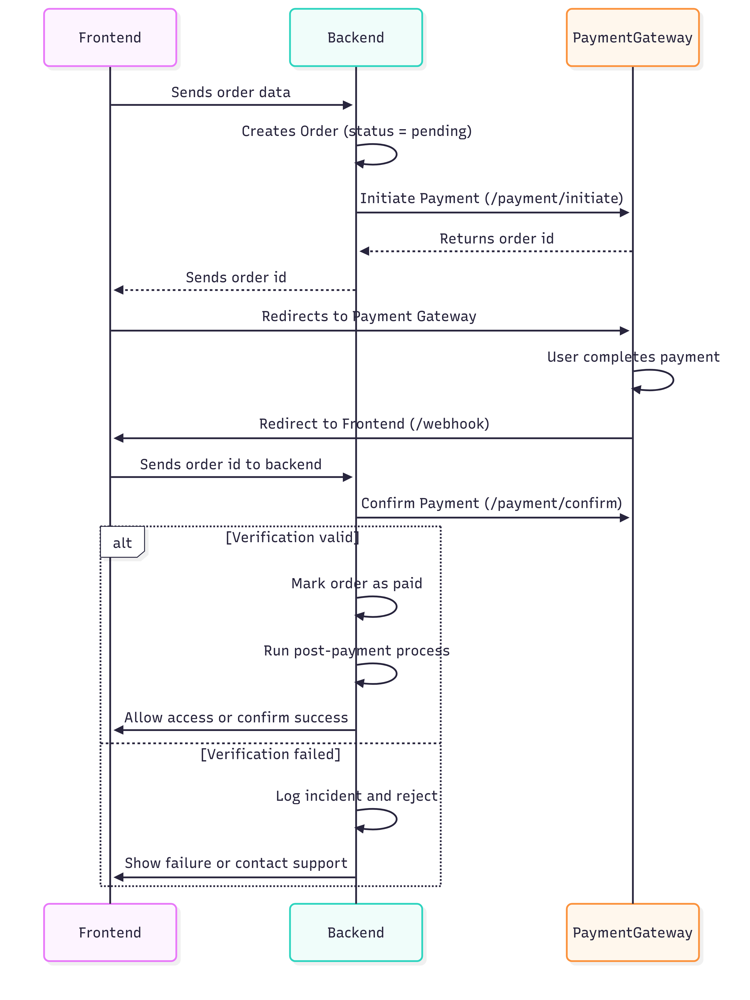

# Secure Integration of Third-Party Payment Gateways Cheat Sheet

## Introduction

Integrating third-party payment gateways allows businesses to securely outsource payment processing. These gateways handle sensitive data like cardholder information and offer PCI compliance out-of-the-box.

However, insecure integration can lead to severe vulnerabilities—ranging from payment spoofing and order manipulation to fraud and business logic flaws. This cheat sheet outlines secure practices for integrating any third-party payment gateway, focusing on a general flow. It identifies potential failure points at each step and provides practical recommendations to prevent common mistakes.

## Understanding the Payment Flow

A typical third-party payment flow consists of five core steps:

1. **Cart Preparation**  
   The user selects items and initiates checkout.

2. **Order Initialization (Merchant Backend → Payment Gateway)**  
   The merchant backend creates a transaction or order via API and receives an `order_id` or `payment_url`.

3. **User Redirection to Payment Gateway**  
   The user is redirected to the gateway-hosted payment page.

4. **Payment Execution (User → Gateway)**  
   The user completes or fails the payment.

5. **Return and Verification (Payment Gateway → Merchant)**  
   The user is redirected to the merchant site (callback/return URL), and optionally, the gateway sends a server-to-server notification. The merchant verifies the result and proceeds with order fulfillment.

The following sequence diagram explain the steps above.

---

## What Can Go Wrong at Each Step and How to Prevent It

### 1. Sending Order data

**Risks:**

- Price tampering or product substitution via client-side manipulation.
- Missing server-side cart validation.
- Trusting unauthenticated or spoofed callbacks.
- Processing orders before verifying payment status.
- Race conditions from multiple callbacks.
- Replaying callbacks to trigger repeated fulfillment (e.g., multiple shipments, account credits).

**Mitigations:**

- Validate all cart details (product IDs, prices, discounts) on the backend.
- Recalculate totals server-side using trusted data before order creation.
- Always verify the payment status server-side with the gateway’s API before fulfilling the order.
- Match the expected amount, currency, and order ID.
- Validate the authenticity of callbacks (e.g., HMAC signatures, secret tokens).
- Implement idempotency: only process an order once regardless of how many times the callback is received.
- Log all callback attempts for forensic analysis.

---

## Logging and Monitoring

**Why it matters:**
Even with proper validation and logic, monitoring is crucial for detecting abuse, fraud attempts, or system misbehavior.

**Recommendations:**

- Log all payment attempts (initiation, redirects, callbacks) with timestamps and IPs.
- Alert on:
    - Unexpected order statuses (e.g., "Paid" without any gateway confirmation).
    - Excessive callback attempts for the same order.
    - Payment failures followed by repeated attempts with identical data.
- Store raw request data for callbacks to aid investigation.

---

## References

- [OWASP Web Security Testing Guide – Business Logic Testing](https://owasp.org/www-project-web-security-testing-guide/stable/4-Web_Application_Security_Testing/10-Business_Logic_Testing/10-Test-Payment-Functionality)
- [Idempotency in Payment APIs – Stripe Docs](https://stripe.com/docs/api/idempotent_requests)
- [3rd Pary Payment Gateway API integration](https://docs.konnect.network/docs/en/api-integration/intro)
