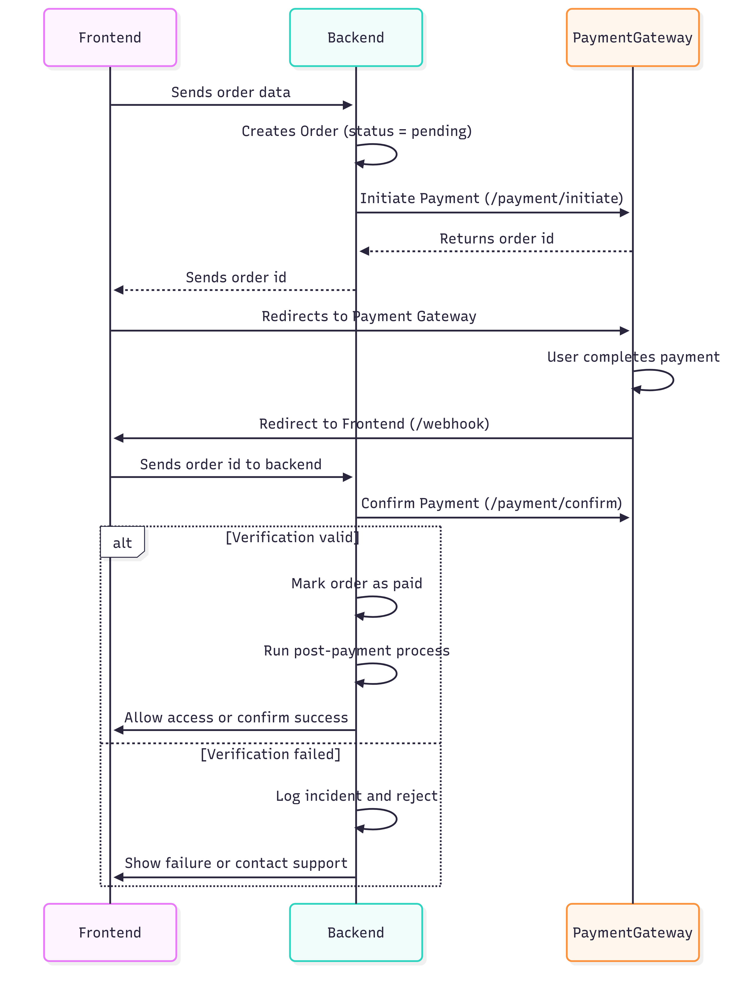

# Secure Integration of Third-Party Payment Gateways Cheat Sheet

## Introduction

Integrating third-party payment gateways allows businesses to securely outsource payment processing. These gateways handle sensitive data like cardholder information and offer reduced PCI DSS scope if integrated correctly.

However, insecure integration can lead to severe vulnerabilities—ranging from payment spoofing and order manipulation to fraud and business logic flaws. This cheat sheet outlines secure practices for integrating any third-party payment gateway, focusing on a general flow. It identifies potential failure points at each step and provides practical recommendations to prevent common mistakes.

## Understanding the Payment Flow

A typical third-party payment flow consists of five core steps:

1. **Cart Preparation**  
   The user selects items and initiates checkout.

2. **Order Initialization (Merchant Backend → Payment Gateway)**  
   The merchant backend creates a transaction or order via API and receives an `order_id` or `payment_url`.

3. **User Redirection to Payment Gateway**  
   The user is redirected to the gateway-hosted payment page.

4. **Payment Execution (User → Gateway)**  
   The user completes or fails the payment.

5. **Return and Verification (Payment Gateway → Merchant)**  
   The user is redirected to the merchant site (callback/return URL), and optionally, the gateway sends a server-to-server notification. The merchant verifies the result and proceeds with order fulfillment.

The following sequence diagram explains the steps above.

---

## What Can Go Wrong at Each Step and How to Prevent It

### 1. Sending Order data

**Risks:**

- Price tampering or product substitution via client-side manipulation.
- Missing server-side cart validation.

**Mitigations:**

- Validate all cart details (product IDs, prices, discounts) on the backend.
- Recalculate totals server-side using trusted data before order creation.

---

### 2. Redirect to webhook

**Risks:**

- Trusting unauthenticated or spoofed callbacks.
- Processing orders before verifying payment status.
- Race conditions from multiple callbacks.
- Replaying callbacks to trigger repeated fulfillment (e.g., multiple shipments, account credits).
- Assuming user redirection parameters are trustworthy (these are untrusted and can be manipulated).

**Mitigations:**

- Validate all cart details (product IDs, prices, discounts) on the backend.
- Always verify the payment status server-side with the gateway’s API before fulfilling the order.
- Match the expected amount, currency, and order ID.
- Validate the authenticity of callbacks (e.g., HMAC signatures, secret tokens).
- Implement idempotency: only process an order once regardless of how many times the callback is received.
- Treat checkout expiry separately from webhook signature freshness. Gateways can [retry delivery](https://docs.stripe.com/webhooks#automatic-retries) or [send events out of order](https://docs.stripe.com/webhooks#event-ordering); verify late notifications and reconcile the current payment state instead of discarding them solely because the checkout expired. Use persistent duplicate-event records and idempotent fulfillment as described in the [Webhook Security Cheat Sheet](Webhook_Security_Cheat_Sheet.md#idempotency-and-duplicate-events).
- Only server-to-server callbacks should be trusted for payment verification and order fulfillment.
- Log all callback attempts for forensic analysis.

## Logging and Monitoring

**Why it matters:**
Even with proper validation and logic, monitoring is crucial for detecting abuse, fraud attempts, or system misbehavior.

**Recommendations:**

- Log all payment attempts (initiation, redirects, callbacks) with timestamps and IPs.
- Alert on:
    - Unexpected order statuses (e.g., "Paid" without any gateway confirmation).
    - Excessive callback attempts for the same order.
    - Payment failures followed by repeated attempts with identical data.
- Log callback identifiers, validation outcomes, and order correlation data instead of raw headers and bodies. Exclude credentials and unnecessary personal or payment data; apply the [Logging Cheat Sheet's data-exclusion guidance](Logging_Cheat_Sheet.md#data-to-exclude).
- Do not retain sensitive authentication data, such as card verification codes or PIN data, after authorization, [even if encrypted](https://www.pcisecuritystandards.org/faqs/1154/). Restrict access to permitted investigation records and define their retention period.
- Incorporate fraud and risk scoring mechanisms to detect carding attacks and other suspicious activities during payment execution.

---

## References

- [OWASP WSTG: Payment Functionality](https://wstg.owasp.org/latest/4-Web_Application_Security_Testing/10-Business_Logic/10-Payment_Functionality/)
- [Adyen: API idempotency](https://docs.adyen.com/development-resources/api-idempotency)
- [Adyen: Verify HMAC signatures](https://docs.adyen.com/development-resources/webhooks/secure-webhooks/verify-hmac-signatures)
