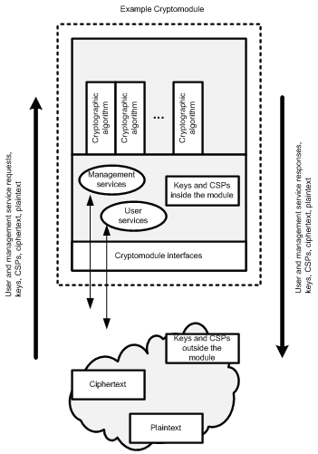

# Introduction

This cheat sheet provides a simple model to follow when implementing transport layer protection for an application. Although the concept of SSL is known to many, the actual details and security specific decisions of implementation are often poorly understood and frequently result in insecure deployments. This article establishes clear rules which provide guidance on securely designing and configuring transport layer security for an application. This article is focused on the use of SSL/TLS between a web application and a web browser, but we also encourage the use of SSL/TLS or other network encryption technologies, such as VPN, on back end and other non-browser based connections.

# Architectural Decision

An architectural decision must be made to determine the appropriate method to protect data when it is being transmitted. The most common options available to corporations are Virtual Private Networks (VPN) or a SSL/TLS model commonly used by web applications. The selected model is determined by the business needs of the particular organization. For example, a VPN connection may be the best design for a partnership between two companies that includes mutual access to a shared server over a variety of protocols. Conversely, an Internet facing enterprise web application would likely be best served by a SSL/TLS model.

TLS is mainly a defence against man-in-the-middle attacks. An TLS Threat Model is one that starts with the question *"What is the business impact of an attacker's ability to observe, intercept and manipulate the traffic between the client and the server"*.

This cheat sheet will focus on security considerations when the SSL/TLS model is selected. This is a frequently used model for publicly accessible web applications.

# Providing Transport Layer Protection with SSL/TLS

## Benefits

The primary benefit of transport layer security is the protection of web application data from unauthorized disclosure and modification when it is transmitted between clients (web browsers) and the web application server, and between the web application server and back end and other non-browser based enterprise components.

The server validation component of TLS provides authentication of the server to the client. If configured to require client side certificates, TLS can also play a role in client authentication to the server. However, in practice client side certificates are not often used in lieu of username and password based authentication models for clients.

TLS also provides two additional benefits that are commonly overlooked; integrity guarantees and replay prevention. A TLS stream of communication contains built-in controls to prevent tampering with any portion of the encrypted data. In addition, controls are also built-in to prevent a captured stream of TLS data from being replayed at a later time.

It should be noted that TLS provides the above guarantees to data during transmission. TLS does not offer any of these security benefits to data that is at rest. Therefore appropriate security controls must be added to protect data while at rest within the application or within data stores.

- Use TLS, as SSL is no longer considered usable for security
- All pages must be served over HTTPS. This includes css, scripts, images, AJAX requests, POST data and third party includes. Failure to do so creates a vector for man-in-the-middle attacks.
- Just protecting authenticated pages with HTTPS, is not enough. Once there is one request in HTTP, man-in-the-middle attacks are possible, with the attackers being able to prevent users from reaching the secured pages.
- The [HTTP Strict Transport Security](https://www.owasp.org/index.php/HTTP_Strict_Transport_Security) Header must be used and [pre loaded into browsers](https://hstspreload.appspot.com/). This will instruct compatible browsers to only use HTTPS, even if requested to use HTTP.
- Cookies must be marked as [Secure](https://developer.mozilla.org/en-US/docs/Web/HTTP/Cookies#Secure_and_HttpOnly_cookies).

## Basic Requirements

The basic requirements for using TLS are: access to a Public Key Infrastructure (PKI) in order to obtain certificates, access to a directory or an Online Certificate Status Protocol (OCSP) responder in order to check certificate revocation status, and agreement/ability to support a minimum configuration of protocol versions and protocol options for each version.

## SSL vs. TLS

The terms, Secure Socket Layer (SSL) and Transport Layer Security (TLS) are often used interchangeably. In fact, SSL v3.1 is equivalent to TLS v1.0. However, different versions of SSL and TLS are supported by modern web browsers and by most modern web frameworks and platforms. 

For the purposes of this cheat sheet we will refer to the technology generically as TLS. Recommendations regarding the use of SSL and TLS protocols, as well as browser support for TLS, can be found in the rule below titled **Only Support Strong Protocols**.



## When to Use a FIPS 140-2 Validated Cryptomodule

If the web application may be the target of determined attackers (a common threat model for Internet accessible applications handling sensitive data), it is strongly advised to use TLS services that are provided by [FIPS 140-2 validated cryptomodules](http://csrc.nist.gov/groups/STM/cmvp/validation.html).

A cryptomodule, whether it is a software library or a hardware device, basically consists of three parts:

- Components that implement cryptographic algorithms (symmetric and asymmetric algorithms, hash algorithms, random number generator algorithms, and message authentication code algorithms)
- Components that call and manage cryptographic functions (inputs and outputs include cryptographic keys and so-called critical security parameters)
- A physical container around the components that implement cryptographic algorithms and the components that call and manage cryptographic functions

The security of a cryptomodule and its services (and the web applications that call the cryptomodule) depend on the correct implementation and integration of each of these three parts. In addition, the cryptomodule must be used and accessed securely. The includes consideration for:

- Calling and managing cryptographic functions
- Securely Handling inputs and output
- Ensuring the secure construction of the physical container around the components

In order to leverage the benefits of TLS it is important to use a TLS service (e.g. library, web framework, web application server) which has been FIPS 140-2 validated. In addition, the cryptomodule must be installed, configured and operated in either an approved or an allowed mode to provide a high degree of certainty that the FIPS 140-2 validated cryptomodule is providing the expected security services in the expected manner.

If the system is legally required to use FIPS 140-2 encryption (e.g., owned or operated by or on behalf of the U.S. Government) then TLS must be used and SSL disabled. Details on why SSL is unacceptable are described in Section 7.1 of [Implementation Guidance for FIPS PUB 140-2 and the Cryptographic Module Validation Program](http://csrc.nist.gov/groups/STM/cmvp/documents/fips140-2/FIPS1402IG.pdf).

Further reading on the use of TLS to protect highly sensitive data against determined attackers can be viewed in [SP800-52 Guidelines for the Selection and Use of Transport Layer Security (TLS) Implementations](http://csrc.nist.gov/publications/nistpubs/800-52/SP800-52.pdf)

## Secure Server Design

### Rule - Use TLS or Other Strong Transport Everywhere

All networks, both external and internal, must utilize TLS or an equivalent transport layer security mechanism for all communication. It is not sufficient to claim that access to the internal network is "restricted to employees". Numerous recent data compromises have shown that the internal network can be breached by attackers. In these attacks, sniffers have been installed to access unencrypted sensitive data sent on the internal network.

The login page and all subsequent authenticated pages must be exclusively accessed over TLS. The initial login page, referred to as the "login landing page", must be served over TLS. Failure to utilize TLS for the login landing page allows an attacker to modify the login form action, causing the user's credentials to be posted to an arbitrary location. Failure to utilize TLS for authenticated pages after the login enables an attacker to view the unencrypted session ID and compromise the user's authenticated session.

Even marketing or other low-security websites still require TLS. Lack of TLS leads to a lack of integrity which allows attackers to modify content in transit. Also, sites that do not provide TLS are marked lower in pagerank for SEO.

### Rule - Do Not Provide Non-TLS Pages for Secure Content

All pages which are available over TLS must not be available over a non-TLS connection. A user may inadvertently bookmark or manually type a URL to a HTTP page (e.g. `http://example.com/myaccount`) within the authenticated portion of the application. If this request is processed by the application then the response, and any sensitive data, would be returned to the user over the clear text HTTP.

### Rule - Do Not Mix TLS and Non-TLS Content

A page that is available over TLS must be comprised completely of content which is transmitted over TLS. The page must not contain any content that is transmitted over unencrypted HTTP. This includes content from unrelated third party sites.

An attacker could intercept any of the data transmitted over the non-encrypted HTTP and inject malicious content into the user's page. This malicious content would be included in the page even if the overall page is served over TLS. In addition, an attacker could steal the user's session cookie that is transmitted with any non-TLS requests. This is possible if the cookie's 'secure' flag is not set. See the rule 'Use "Secure" Cookie Flag'.

### Rule - Use "Secure" Cookie Flag

The "Secure" flag must be set for all user cookies. Failure to use the "secure" flag enables an attacker to access the session cookie by tricking the user's browser into submitting a request to an unencrypted page on the site. This attack is possible even if the server is not configured to offer HTTP content since the attacker is monitoring the requests and does not care if the server responds with a 404 or doesn't respond at all.

### Rule - Keep Sensitive Data Out of the URL

Sensitive data must not be transmitted via URL arguments. A more appropriate place is to store sensitive data in a server side repository or within the user's session. When using TLS the URL arguments and values are encrypted during transit. However, there are two methods that the URL arguments and values could be exposed.

1. The entire URL is cached within the local user's browser history. This may expose sensitive data to any other user of the workstation.

2. The entire URL is exposed if the user clicks on a link to another HTTPS site. This may expose sensitive data within the referral field to the third party site. This exposure occurs in most browsers and will only occur on transitions between two TLS sites.

For example, a user following a link on `https://example.com` which leads to `https://someOtherexample.com` would expose the full URL of `https://example.com` (including URL arguments) in the referral header (within most browsers). This would not be the case if the user followed a link on `https://example.com` to `http://someHTTPexample.com`.

### Rule - Prevent Caching of Sensitive Data

The TLS protocol provides confidentiality only for data in transit but it does not help with potential data leakage issues at the client or intermediary proxies. As a result, it is frequently prudent to instruct these nodes not to cache or persist sensitive data. One option is to add anticaching headers to relevant HTTP responses, (for example, "Cache-Control: no-cache, no-store" and "Expires: 0" for coverage of many modern browsers as of 2013). For compatibility with HTTP/1.0 (i.e., when user agents are really old or the webserver works around quirks by forcing HTTP/1.0) the response should also include the header "Pragma: no-cache". More information is available in [HTTP 1.1 RFC 2616](https://tools.ietf.org/html/rfc2616), section 14.9.

### Rule - Use HTTP Strict Transport Security

See: [HTTP Strict Transport Security](https://www.owasp.org/index.php/HTTP_Strict_Transport_Security)

### Rule - Use Public Key Pinning

See: [Certificate and Public Key Pinning](https://www.owasp.org/index.php/Certificate_and_Public_Key_Pinning)

## Server Certificate

Note: If using a FIPS 140-2 cryptomodule disregard the following rules and defer to the recommended configuration for the particular cryptomodule. Nevertheless we recommend to use this rules to audit your configuration.

### Rule - Use Strong Keys & Protect Them

The private key used to generate the cipher key must be sufficiently strong for the anticipated lifetime of the private key and corresponding certificate. The current best practice is to select a key size of at least 2048 bits. Additional information on key lifetimes and comparable key strengths can be found [here](http://www.keylength.com/en/compare/) and here [NIST SP 800-57](http://csrc.nist.gov/publications/nistpubs/800-57/sp800-57_part1_rev3_general.pdf). In addition, the private key must be stored in a location that is protected from unauthorized access.

### Rule - Use a Certificate That Supports Required Domain Names

A user should never be presented with a certificate error, including prompts to reconcile domain or hostname mismatches, or expired certificates. If the application is available at both `https://www.example.com` and `https://example.com` then an appropriate certificate, or certificates, must be presented to accommodate the situation. The presence of certificate errors desensitizes users to TLS error messages and increases the possibility an attacker could launch a convincing phishing or man-in-the-middle attack.

For example, consider a web application accessible at `https://abc.example.com` and `https://xyz.example.com`. One certificate should be acquired for the host or server *`abc.example.com`*; and a second certificate for host or server *`xyz.example.com`*. In both cases, the hostname would be present in the Subject's Common Name (CN).

Alternatively, the Subject Alternate Names (SANs) can be used to provide a specific listing of multiple names where the certificate is valid. In the example above, the certificate could list the Subject's CN as *`example.com`*, and list two SANs: *`abc.example.com`* and *`xyz.example.com`*. These certificates are sometimes referred to as "multiple domain certificates".

### Rule - Use Fully Qualified Names in Certificates

Use fully qualified names in the DNS name field, and do not use unqualifed names (e.g., 'www'), local names (e.g., 'localhost'), or private IP addresses (e.g., 192.168.1.1) in the DNS name field. Unqualifed names, local names, or private IP addresses violate the certificate specification.

### Rule - Do Not Use Wildcard Certificates

You should refrain from using wildcard certificates. Though they are expedient at circumventing annoying user prompts, they also [violate the principal of least privilege](https://www.owasp.org/index.php/Least_privilege) and asks the user to trust all machines, including developer's machines, the secretary's machine in the lobby and the sign-in kiosk. Obtaining access to the private key is left as an exercise for the attacker, but its made much easier when stored on the file system unprotected.

Statistics gathered by Qualys for [Internet SSL Survey 2010](http://media.blackhat.com/bh-us-10/presentations/Ristic/BlackHat-USA-2010-Ristic-Qualys-SSL-Survey-HTTP-Rating-Guide-slides.pdf) indicate wildcard certificates have a 4.4% share, so the practice is not standard for public facing hosts. Finally, wildcard certificates violate [EV Certificate Guidelines](https://cabforum.org/extended-validation/).

### Rule - Do Not Use RFC 1918 Addresses in Certificates

Certificates should not use private addresses. RFC 1918 is [Address Allocation for Private Internets](https://tools.ietf.org/html/rfc1918). Private addresses are Internet Assigned Numbers Authority (IANA) reserved and include `192.168/16`, `172.16/12`, and `10/8`.

Certificates issued with private addresses violate [EV Certificate Guidelines](https://cabforum.org/extended-validation/). In addition, Peter Gutmann writes in in [Engineering Security](http://www.cs.auckland.ac.nz/~pgut001/pubs/book.pdf): "*This one is particularly troublesome because, in combination with the router-compromise attacks... and ...OSCP-defeating measures, it allows an attacker to spoof any EV-certificate site.*"

### Rule - Use an Appropriate Certification Authority for the Application's User Base

An application user must never be presented with a warning that the certificate was signed by an unknown or untrusted authority. The application's user population must have access to the public certificate of the certification authority which issued the server's certificate. For Internet accessible websites, the most effective method of achieving this goal is to purchase the TLS certificate from a recognize certification authority. Popular Internet browsers already contain the public certificates of these recognized certification authorities.

Internal applications with a limited user population can use an internal certification authority provided its public certificate is securely distributed to all users. However, remember that all certificates issued by this certification authority will be trusted by the users. Therefore, utilize controls to protect the private key and ensure that only authorized individuals have the ability to sign certificates.

The use of self signed certificates is never acceptable. Self signed certificates negate the benefit of end-point authentication and also significantly decrease the ability for an individual to detect a man-in-the-middle attack.

### Rule - Always Provide All Needed Certificates

Clients attempt to solve the problem of identifying a server or host using PKI and X509 certificate. When a user receives a server or host's certificate, the certificate must be validated back to a trusted root certification authority. This is known as path validation.

There can be one or more intermediate certificates in between the end-entity (server or host) certificate and root certificate. In addition to validating both endpoints, the user will also have to validate all intermediate certificates. Validating all intermediate certificates can be tricky because the user may not have them locally. This is a well-known PKI issue called the “Which Directory?" problem.

To avoid the “Which Directory?" problem, a server should provide the user with all required certificates used in a path validation.

### Rule - Be aware of and have a plan for the SHA-1 deprecation plan

In order to avoid presenting end users with progressive certificate warnings, organizations must proactively address the browser vendor's upcoming SHA-1 deprecation plans. The Google Chrome plan is probably the most specific and aggressive at this point: [Gradually sunsetting SHA-1](http://googleonlinesecurity.blogspot.com/2014/09/gradually-sunsetting-sha-1.html)

If your organization has no [SHA256 compatibility issues](https://support.globalsign.com/customer/portal/articles/1499561-sha-256-compatibility) then it may be appropriate to move your site to a SHA256 signed certificate/chain. If there are, or may be, issues - you should ensure that your SHA-1 certificates expire before 1/1/2017.

## Server Protocol and Cipher Configuration

For more information on configuring TLS Cipher Strings please visit the [TLS Cipher String Cheat Sheet](TLS_Cipher_String_Cheat_Sheet.md).

**Note:** If using a FIPS 140-2 cryptomodule disregard the following rules and defer to the recommended configuration for the particular cryptomodule. Nevertheless we recommend to use this rules to audit your configuration.

### Rule - Only Support Strong Protocols

SSL/TLS is a collection of protocols. Weaknesses have been identified with earlier SSL protocols, including [SSLv2](http://www.schneier.com/paper-ssl-revised.pdf) and [SSLv3](https://disablessl3.com/), hence SSL versions 1, 2, and 3 should not longer be used. The best practice for transport layer protection is to only provide support for the TLS protocols - TLS 1.0, TLS 1.1 and TLS 1.2. This configuration will provide maximum protection against skilled and determined attackers and is appropriate for applications handling sensitive data or performing critical operations.

[Nearly all modern browsers support at least TLS 1.0](http://en.wikipedia.org/wiki/Transport_Layer_Security#Web_browsers). As of February 2014, contemporary browsers (Chrome v20+, Firefox v27+, IE v8+, Opera v10+, and Safari v5+) [support TLS 1.1 and TLS 1.2](http://en.wikipedia.org/wiki/Transport_Layer_Security#Web_browsers). You should provide support for TLS 1.1 and TLS 1.2 to accommodate clients that support these protocols. The client and server (usually) negotiate the best protocol that is supported on both sides.

TLS 1.0 is still widely used as the 'best' protocol by a lot of browsers that are not patched to the very latest version. It suffers from [CBC Chaining attacks and Padding Oracle attacks](http://www.yassl.com/yaSSL/Blog/Entries/2010/10/7_Differences_between_SSL_and_TLS_Protocol_Versions.html). TLSv1.0 should only be used after risk analysis and acceptance. [PCI DSS 3.2](https://www.pcisecuritystandards.org/document_library?category=pcidss&document=pci_dss) prohibits the use of TLS 1.0 after June 30, 2018 (earlier requirements to do so by June 30, 2016 were [postponed](https://blog.pcisecuritystandards.org/migrating-from-ssl-and-early-tls)).

Support the extension 'TLS_FALLBACK_SCSV' to prevent all unnecessary fallbacks from a higher to a lower protocol version, see [RFC7507](https://tools.ietf.org/html/rfc7507).

Under no circumstances either SSLv2 or SSLv3 should be enabled as a protocol selection:

- The [SSLv2 protocol is broken](http://www.schneier.com/paper-ssl-revised.pdf) and does not provide adequate transport layer protection.
- [SSLv3 had been known for weaknesses](https://disablessl3.com/) which severely compromise the channel's security long before the ['POODLE'-Bug](https://www.openssl.org/~bodo/ssl-poodle.pdf) finally stopped to tolerate this protocol by October 2014. Switching off SSLv3 terminates the support of legacy browsers like [IE6/XP](https://www.ssllabs.com/ssltest/viewClient.html?name=IE&version=6&platform=XP) and elder (in their default configuration).

### Rule - Prefer Ephemeral Key Exchanges

Ephemeral key exchanges are based on Diffie-Hellman and use per-session, temporary keys during the initial SSL/TLS handshake. They provide perfect forward secrecy (PFS), which means a compromise of the server's long term signing key does not compromise the confidentiality of past session (see this [Rule - Only Support Strong Cryptographic Ciphers](Transport_Layer_Protection_Cheat_Sheet.md#rule---only-support-strong-cryptographic-ciphers)). When the server uses an ephemeral key, the server will sign the temporary key with its long term key (the long term key is the customary key available in its certificate).

Use cryptographic parameters (like [DH-parameter](https://wiki.openssl.org/index.php/Diffie-Hellman_parameters)) that use a secure length that match to the supported keylength of your certificate (superior or equals to 2048 bits or equivalent Elliptic Curves). As some middleware had some issues with this, upgrade to the latest version. Note: There are some legacy browsers or old Java versions that are not capable to cope with DH-Params superior ro 1024 bits, please read this [Rule - Only Support Strong Cryptographic Ciphers](Transport_Layer_Protection_Cheat_Sheet.md#rule---only-support-strong-cryptographic-ciphers) to know how this can be solved.

Do NOT use standardized [DH-parameter](https://wiki.openssl.org/index.php/Diffie-Hellman_parameters) like they are defined by RFCs [2409](https://tools.ietf.org/html/rfc2409), [3526](https://tools.ietf.org/html/rfc3526), or [5114](https://tools.ietf.org/html/rfc5114). 

Generate your individual [DH-parameter](https://wiki.openssl.org/index.php/Diffie-Hellman_parameters) to get unique prime numbers (this may take a long time): 

```bash
$ openssl dhparam 2048 -out dhparam2048.pem 
```

Set the path to use this parameter file, e.g. when using Apache: 

```bash
SSLOpenSSLConfCmd DHParameters <path to dhparam2048.pem> 
```

If you have a server farm and are providing [forward secrecy](https://scotthelme.co.uk/perfect-forward-secrecy/), then you might have to disable session resumption. For example, Apache writes the session id's and master secrets to disk so all servers in the farm can participate in resuming a session (there is currently no in-memory mechanism to achieve the sharing). 

Writing the session id and master secret to disk undermines [forward secrecy](https://scotthelme.co.uk/perfect-forward-secrecy/).

### Rule - Only Support Strong Cryptographic Ciphers

Each protocol (TLSv1.0, TLSv1.1, TLSv1.2, etc) provides cipher suites. As of TLS 1.2, [there is support for over 300 suites (320+ and counting)](http://www.iana.org/assignments/tls-parameters/tls-parameters.xml#tls-parameters-3), including [national vanity cipher suites](http://www.mail-archive.com/cryptography@randombit.net/msg03785.html). The strength of the encryption used within a TLS session is determined by the encryption cipher negotiated between the server and the browser. In order to ensure that only strong cryptographic ciphers are selected the server must be modified to disable the use of weak ciphers and to configure the ciphers in an adequate order. It is recommended to configure the server to only support strong ciphers and to use sufficiently large key sizes. In general, the following should be observed when selecting cipher suites:

- Use the very latest recommendations, they may be volatile these days
- Setup your policy to get a whitelist for recommended ciphers, e.g.:
    - Activate to set the cipher order by the server, e.g. `SSLHonorCipherOrder On`
    - Highest priority for ciphers that support 'Forward Secrecy' (Support ephemeral Diffie-Hellman key exchange, see rule above) [2](http://vincent.bernat.im/en/blog/2011-ssl-perfect-forward-secrecy.html)
    - Favor DHE over ECDHE (and monitor the CPU usage, see Notes below), ECDHE lacks now of really reliable Elliptic Curves, see discussion about `secp{224,256,384,521}r1` and `secp256k1`, cf. [3](http://safecurves.cr.yp.to), [4](https://www.schneier.com/blog/archives/2013/09/the_nsa_is_brea.html#c1675929). The solution might be to use [Brainpool Curves \[German\]](http://www.researchgate.net/profile/Johannes_Merkle/publication/260050106_Standardisierung_der_Brainpool-Kurven_fr_TLS_und_IPSec/file/60b7d52f36a0cc2fdd.pdf), defined for TLS in [RFC 7027](https://tools.ietf.org/html/rfc7027), or [Edwards Curves](http://eprint.iacr.org/2007/286). The most promising candidates for the latter are ['Curve25519'](https://tools.ietf.org/html/draft-josefsson-tls-curve25519-06) and [Ed448-Goldilocks](http://sourceforge.net/p/ed448goldilocks/wiki/Home/) (see [RFC 7748 - Elliptic Curves for Security](https://tools.ietf.org/html/rfc7748)), that are about to be defined by RFC for TLS, cf. [DRAFT-ietf-tls-rfc4492bis](https://tools.ietf.org/html/draft-ietf-tls-rfc4492bis-17) and [IANA (temporary registrations for ecdh_x25519, ecdh_x448)](http://www.iana.org/assignments/tls-parameters/tls-parameters.xhtml#tls-parameters-8), furthermore some crypto libraries support [already Curve 25519](https://en.wikipedia.org/wiki/Comparison_of_TLS_implementations#Supported_elliptic_curves).
    - Use RSA-Keys (no DSA/DSS: they get very weak, if a bad entropy source is used during signing, cf. [5](https://projectbullrun.org/dual-ec/tls.html), [6](https://factorable.net/weakkeys12.conference.pdf))
    - Favor GCM over CBC regardless of the cipher size. In other words, use Authenticated Encryption with Associated Data (AEAD), e.g. AES-GCM, AES-CCM.
    - Watch also for stream ciphers which XOR the key stream with plaintext (such as AES/CTR mode)
    - Priorize the ciphers by the sizes of the cipher and the MAC
    - Use SHA1 or above for digests, prefer SHA2 (or equivalent)
    - Disable weak ciphers (which is implicitly done by this whitelist) without disabling legacy browsers and bots that have to be supported (find the best compromise), actually the cipher `TLS_RSA_WITH_AES_128_CBC_SHA` (`AES128-SHA`, 0x2F) does this job.
        - If you are forced to support legacy operating systems, libraries or special business applications you may need to add `3DES` (`TLS_RSA_WITH_3DES_EDE_CBC_SHA`, `DES-CBC3-SHA`, 0x0A) with very low priority for a transition time. Be ready to phase it out (status as of Feb 2017). It is **NOT** recommended to use `3DES` together with perfect forward secrecy ciphers (`DHE`, `ECDHE`). Disable 3DES completely, if possible.
        - Disable cipher suites that do not offer encryption (`eNULL`, `NULL`)
        - Disable cipher suites that do not offer authentication (`aNULL`). `aNULL` includes anonymous cipher suites `ADH` (Anonymous Diffie-Hellman) and `AECDH` (Anonymous Elliptic Curve Diffie Hellman).
        - Disable export level ciphers (`EXP`, eg. ciphers containing DES)
        - Disable key sizes smaller than 128 bits for encrypting payload traffic (see [BSI: TR-02102 Part 2 (German)](https://www.bsi.bund.de/SharedDocs/Downloads/DE/BSI/Publikationen/TechnischeRichtlinien/TR02102/BSI-TR-02102-2.pdf))
        - Disable the use of `MD5` as a hashing mechanism for payload traffic
        - Disable the use of `IDEA` cipher suites (see [7](https://tools.ietf.org/html/rfc5469))
        - Disable `RC4` cipher suites (see [8](https://tools.ietf.org/html/rfc7465), [9](http://www.isg.rhul.ac.uk/tls/))
    - DHE-ciphers should be usable for DH-Pamameters superior or equals to 2048 bits, without blocking legacy browsers (The ciphers `DHE-RSA-AES128-SHA` and `DHE-RSA-AES256-SHA` moved to the end as some browsers like to use them but are not capable to cope with DH-Params superior to 1024 bits; alternative option suppress these ciphers).
    - ECDHE-ciphers must not support weak curves, e.g. less than 256 bits.
- Define a cipher string that works with different versions of your encryption tool, like openssl
- Verify your cipher string
    - with an audit-tool, like [OWASP 'O-Saft' (OWASP SSL audit for testers / OWASP SSL advanced forensic tool)](https://www.owasp.org/index.php/O-Saft)
    - listing it manually with your encryption software, e.g. `openssl ciphers -v <cipher-string>` (the result may differ by version), e.g.:

```text
openssl ciphers -v "EDH+aRSA+AESGCM:EDH+aRSA+AES:EECDH+aRSA+AESGCM:EECDH+aRSA+AES:-SHA:ECDHE-RSA-AES256-SHA
:ECDHE-RSA-AES128-SHA:RSA+AESGCM:RSA+AES+SHA256
:RSA+AES+SHA:DES-CBC3-SHA:DHE-RSA-AES256-SHA:DHE-RSA-AES128-SHA"
#add optionally ':!aNULL:!eNULL:!LOW:!MD5:!EXP:!PSK:!DSS:!RC4:!SEED:!ECDSA:!ADH:!IDEA' 
#to protect older Versions of OpenSSL
#3DES (=DES-CBC3-SHA): please read the text above
#you may use openssl ciphers -V "..." for openssl >= 1.0.1:

0x00,0x9F - DHE-RSA-AES256-GCM-SHA384   TLSv1.2 Kx=DH     Au=RSA  Enc=AESGCM(256) Mac=AEAD
0x00,0x9E - DHE-RSA-AES128-GCM-SHA256   TLSv1.2 Kx=DH     Au=RSA  Enc=AESGCM(128) Mac=AEAD
0x00,0x6B - DHE-RSA-AES256-SHA256       TLSv1.2 Kx=DH     Au=RSA  Enc=AES(256)    Mac=SHA256
0x00,0x67 - DHE-RSA-AES128-SHA256       TLSv1.2 Kx=DH     Au=RSA  Enc=AES(128)    Mac=SHA256
0xC0,0x30 - ECDHE-RSA-AES256-GCM-SHA384 TLSv1.2 Kx=ECDH   Au=RSA  Enc=AESGCM(256) Mac=AEAD
0xC0,0x2F - ECDHE-RSA-AES128-GCM-SHA256 TLSv1.2 Kx=ECDH   Au=RSA  Enc=AESGCM(128) Mac=AEAD
0xC0,0x28 - ECDHE-RSA-AES256-SHA384     TLSv1.2 Kx=ECDH   Au=RSA  Enc=AES(256)    Mac=SHA384
0xC0,0x27 - ECDHE-RSA-AES128-SHA256     TLSv1.2 Kx=ECDH   Au=RSA  Enc=AES(128)    Mac=SHA256
0xC0,0x14 - ECDHE-RSA-AES256-SHA        SSLv3   Kx=ECDH   Au=RSA  Enc=AES(256)    Mac=SHA1
0xC0,0x13 - ECDHE-RSA-AES128-SHA        SSLv3   Kx=ECDH   Au=RSA  Enc=AES(128)    Mac=SHA1
0x00,0x9D - AES256-GCM-SHA384           TLSv1.2 Kx=RSA    Au=RSA  Enc=AESGCM(256) Mac=AEAD
0x00,0x9C - AES128-GCM-SHA256           TLSv1.2 Kx=RSA    Au=RSA  Enc=AESGCM(128) Mac=AEAD
0x00,0x3D - AES256-SHA256               TLSv1.2 Kx=RSA    Au=RSA  Enc=AES(256)    Mac=SHA256
0x00,0x3C - AES128-SHA256               TLSv1.2 Kx=RSA    Au=RSA  Enc=AES(128)    Mac=SHA256
0x00,0x35 - AES256-SHA                  SSLv3   Kx=RSA    Au=RSA  Enc=AES(256)    Mac=SHA1
0x00,0x2F - AES128-SHA                  SSLv3   Kx=RSA    Au=RSA  Enc=AES(128)    Mac=SHA1
0x00,0x0A - DES-CBC3-SHA                SSLv3   Kx=RSA    Au=RSA  Enc=3DES(168)   Mac=SHA1
0x00,0x39 - DHE-RSA-AES256-SHA          SSLv3   Kx=DH     Au=RSA  Enc=AES(256)    Mac=SHA1
0x00,0x33 - DHE-RSA-AES128-SHA          SSLv3   Kx=DH     Au=RSA  Enc=AES(128)    Mac=SHA1
```

- Inform yourself how to securely configure the settings for your used services or hardware, e.g. [BetterCrypto.org: Applied Crypto Hardening (DRAFT)](https://bettercrypto.org)
- Check new software and hardware versions for new security settings.

**Notes:**

- According to my researches the most common browsers should be supported with this setting, too (see also [SSL Labs: SSL Server Test &rarr; SSL Report &rarr; Handshake Simulation](https://www.ssllabs.com/ssltest/index.html)).
- Monitor the performance of your server, e.g. the TLS handshake with DHE hinders the CPU abt 2.4 times more than ECDHE, cf. [Vincent Bernat, 2011](http://vincent.bernat.im/en/blog/2011-ssl-perfect-forward-secrecy.html#some-benchmarks), [nmav's Blog, 2011](http://nmav.gnutls.org/2011/12/price-to-pay-for-perfect-forward.html).
- Use of Ephemeral Diffie-Hellman key exchange will protect confidentiality of the transmitted plaintext data even if the corresponding RSA or DSS server private key got compromised. An attacker would have to perform active man-in-the-middle attack at the time of the key exchange to be able to extract the transmitted plaintext. All modern browsers support this key exchange with the notable exception of Internet Explorer prior to Windows Vista.
- Some ciphers like `ECDHE-RSA-AES256-SHA` are explicitly inluded in the cipher string that it also works with elder versions of openssl.

Additional information can be obtained within the:
- [TLS 1.2 RFC 5246](https://tools.ietf.org/html/rfc5246).
- [SSL Labs: 'SSL/TLS Deployment Best Practices'](https://www.ssllabs.com/projects/best-practices/index.html),.
- [BSI: 'TR-02102 Part 2 (German)'](https://www.bsi.bund.de/SharedDocs/Downloads/DE/BSI/Publikationen/TechnischeRichtlinien/TR02102/BSI-TR-02102-2.pdf).
- [ENISA: 'Algorithms, Key Sizes and Parameters Report'](http://www.enisa.europa.eu/activities/identity-and-trust/library/deliverables/algorithms-key-sizes-and-parameters-report).
- [RFC 7525: Recommendations for Secure Use of Transport Layer Security (TLS) and Datagram Transport Layer Security (DTLS)](https://tools.ietf.org/html/rfc7525).
- [FIPS 140-2 IG](http://csrc.nist.gov/groups/STM/cmvp/documents/fips140-2/FIPS1402IG.pdf).

### Rule - Support TLS-PSK and TLS-SRP for Mutual Authentication

When using a shared secret or password offer TLS-PSK (Pre-Shared Key) or TLS-SRP (Secure Remote Password), which are known as Password Authenticated Key Exchange (PAKEs). TLS-PSK and TLS-SRP properly bind the channel, which refers to the cryptographic binding between the outer tunnel and the inner authentication protocol. IANA currently reserves [79 PSK cipher suites](http://www.iana.org/assignments/tls-parameters/tls-parameters.xml#tls-parameters-3) and [9 SRP cipher suites](http://www.iana.org/assignments/tls-parameters/tls-parameters.xml#tls-parameters-3).

Basic authentication places the user's password on the wire in the plain text after a server authenticates itself. Basic authentication only provides unilateral authentication. In contrast, both TLS-PSK and TLS-SRP provide mutual authentication, meaning each party proves it knows the password without placing the password on the wire in the plain text.

Finally, using a PAKE removes the need to trust an outside party, such as a Certification Authority (CA).

### Rule - Only Support Secure Renegotiations

A design weakness in TLS, identified as [CVE-2009-3555](http://web.nvd.nist.gov/view/vuln/detail?vulnId=CVE-2009-3555), allows an attacker to inject a plaintext of his choice into a TLS session of a victim. In the HTTPS context the attacker might be able to inject his own HTTP requests on behalf of the victim. The issue can be mitigated either by disabling support for TLS renegotiations or by supporting only renegotiations compliant with [RFC 5746](https://tools.ietf.org/html/rfc5746). All modern browsers have been updated to comply with this RFC.

### Rule - Disable Compression

Compression Ratio Info-leak Made Easy (CRIME) is an exploit against the data compression scheme used by the TLS and SPDY protocols. The exploit allows an adversary to recover user authentication cookies from HTTPS. The recovered cookie can be subsequently used for session hijacking attacks.

### Rule - Update your Crypto Libraries

- Use solely versions of crypto libraies that are sill supported (eg. [openssl](https://www.openssl.org/policies/releasestrat.html)).
- Watch out for vulnerabilities (e.g. [cvedetails.com](https://www.cvedetails.com/product-search.php)) and update your crypto libraries on a regular base.

## Test your overall TLS/SSL setup and your Certificate

This section shows the most common references only. For more tools and such, please refer to [Tools](Transport_Layer_Protection_Cheat_Sheet.md#tools).

- [OWASP Testing Guide: Chapter on SSL/TLS Testing](https://www.owasp.org/index.php/Testing_for_SSL-TLS_%28OWASP-CM-001%29_)
- [OWASP 'O-Saft' (OWASP SSL audit for testers / OWASP SSL advanced forensic tool)](https://www.owasp.org/index.php/O-Saft)
- [SSL LABS Server Test](https://www.ssllabs.com/ssltest).
- [SSLyze - SSL configuration scanner](https://github.com/nabla-c0d3/sslyze).
- [sslstrip - a demonstration of the HTTPS stripping attacks](https://www.thoughtcrime.org/software/sslstrip/).
- [sslstrip2 - SSLStrip version to defeat HSTS](https://github.com/LeonardoNve/sslstrip2).
- [tls_prober - fingerprint a server's SSL/TLS implementation](https://github.com/WestpointLtd/tls_prober).
- other Tools: [Testing for Weak SSL/TSL Ciphers, Insufficient Transport Layer Protection (OWASP-EN-002) (DRAFT)](https://www.owasp.org/index.php/Testing_for_Weak_SSL/TLS_Ciphers,_Insufficient_Transport_Layer_Protection_%28OTG-CRYPST-001%29) - References - Tools

## Client (Browser) Configuration

The validation procedures to ensure that a certificate is valid are complex and difficult to correctly perform. In a typical web application model, these checks will be performed by the client's web browser in accordance with local browser settings and are out of the control of the application. However, these items do need to be addressed in the following scenarios:

- The application server establishes connections to other applications over TLS for purposes such as web services or any exchange of data
- A thick client application is connecting to a server via TLS

In these situations extensive certificate validation checks must occur in order to establish the validity of the certificate. Consult the following resources to assist in the design and testing of this functionality. The NIST PKI testing site includes a full test suite of certificates and expected outcomes of the test cases.

- [NIST PKI Testing](http://csrc.nist.gov/groups/ST/crypto_apps_infra/pki/pkitesting.html)
- [IETF RFC 5280](https://tools.ietf.org/html/rfc5280)

As specified in the above guidance, if the certificate can not be validated for any reason then the connection between the client and server must be dropped. Any data exchanged over a connection where the certificate has not properly been validated could be exposed to unauthorized access or modification.

## Additional Controls

### Extended Validation Certificates

Extended validation certificates (EV Certificates) proffer an enhanced investigation by the issuer into the requesting party due to the industry's race to the bottom. The purpose of EV certificates is to provide the user with greater assurance that the owner of the certificate is a verified legal entity for the site. Browsers with support for EV certificates distinguish an EV certificate in a variety of ways. Internet Explorer will color a portion of the URL in green, while Mozilla will add a green portion to the left of the URL indicating the company name.

High value websites should consider the use of EV certificates to enhance customer confidence in the certificate. It should also be noted that EV certificates do not provide any greater technical security for the TLS. The purpose of the EV certificate is to increase user confidence that the target site is indeed who it claims to be.

### Client-Side Certificates

Client side certificates can be used with TLS to prove the identity of the client to the server. Referred to as "two-way TLS", this configuration requires the client to provide their certificate to the server, in addition to the server providing their's to the client. If client certificates are used, ensure that the same validation of the client certificate is performed by the server, as indicated for the validation of server certificates above. In addition, the server should be configured to drop the TLS connection if the client certificate cannot be verified or is not provided.

The use of client side certificates is relatively rare currently due to the complexities of certificate generation, safe distribution, client side configuration, certificate revocation and reissuance, and the fact that clients can only authenticate on machines where their client side certificate is installed. Such certificates are typically used for very high value connections that have small user populations.

### Certificate and Public Key Pinning

Hybrid and native applications can take advantage of [certificate and public key pinning](https://www.owasp.org/index.php/Certificate_and_Public_Key_Pinning). Pinning associates a host (for example, server) with an identity (for example, certificate or public key), and allows an application to leverage knowledge of the pre-existing relationship. At runtime, the application would inspect the certificate or public key received after connecting to the server. If the certificate or public key is expected, then the application would proceed as normal. If unexpected, the application would stop using the channel and close the connection since an adversary could control the channel or server.

Pinning still requires customary X509 checks, such as revocation, since CRLs and OCSP provides real time status information. Otherwise, an application could possibly (1) accept a known bad certificate; or (2) require an out-of-band update, which could result in a lengthy App Store approval.

Browser based applications are at a disadvantage since most browsers do not allow the user to leverage pre-existing relationships and *a priori* knowledge. In addition, Javascript and Websockets do not expose methods to for a web app to query the underlying secure connection information (such as the certificate or public key). It is noteworthy that Chromium based browsers perform pinning on selected sites, but the list is currently maintained by the vendor.

For more information, please see the [Pinning Cheat Sheet](Pinning_Cheat_Sheet.md).

# Providing Transport Layer Protection for Back End and Other Connections

Although not the focus of this cheat sheet, it should be stressed that transport layer protection is necessary for back-end connections and any other connection where sensitive data is exchanged or where user identity is established. Failure to implement an effective and robust transport layer security will expose sensitive data and undermine the effectiveness of any authentication or access control mechanism.

## Secure Internal Network Fallacy

The internal network of a corporation is not immune to attacks. Many recent high profile intrusions, where thousands of sensitive customer records were compromised, have been perpetrated by attackers that have gained internal network access and then used sniffers to capture unencrypted data as it traversed the internal network.

## Protocol and Cipher Configuration for Back End and Other Connections

It is important to provide TLS for server-to-server communication in addition to client-to-server communication. Secure the 'client side' configuration of your server that is used for backend and other connections according to the section **Server Protocol and Cipher Configuration** of this document. Be sure to deactivate insecure protocols and ciphers. (e.g. Only support a minimum strong configuration when your server acts as 'client').

# Tools

## Local/Offline

- [O-Saft - OWASP SSL advanced forensic tool](https://www.owasp.org/index.php/O-Saft)
- [testssl.sh - Testing any TLS/SSL encryption](https://testssl.sh)
- [SSLScan - Fast SSL Scanner](http://sourceforge.net/projects/sslscan/)
- [SSLyze](https://github.com/iSECPartners/sslyze)
- [SSL Audit](http://www.g-sec.lu/sslaudit/sslaudit.zip)

## Online

- [SSL LABS Server Test](https://www.ssllabs.com/ssltest)
- [Observatory by Mozilla](https://observatory.mozilla.org)
- [High-Tech Bridge online tool to verify SSL/TLS compliance with NIST SP 800-52 guidelines and PCI DSS requirements on any TCP port](https://www.htbridge.com/ssl/)

# Related Articles

- OWASP – [TLS Cipher String Cheat Sheet](TLS_Cipher_String_Cheat_Sheet.md)
- OWASP – [Testing for SSL-TLS](https://www.owasp.org/index.php/Testing_for_SSL-TLS_%28OWASP-CM-001%29), and OWASP [Guide to Cryptography](https://www.owasp.org/index.php/Guide_to_Cryptography)
- OWASP – [Application Security Verification Standard (ASVS) – Communication Security Verification Requirements (V10)](http://www.owasp.org/index.php/ASVS)
- OWASP – ASVS Article on [Why you need to use a FIPS 140-2 validated cryptomodule](https://www.owasp.org/index.php/Why_you_need_to_use_a_FIPS_140-2_validated_cryptomodule)
- Mozilla – [Mozilla Recommended Configurations](https://wiki.mozilla.org/Security/Server_Side_TLS#Recommended_configurations)
- SSL Labs – [SSL/TLS Deployment Best Practices](https://www.ssllabs.com/projects/best-practices/index.html)
- SSL Labs – [SSL Server Rating Guide](http://www.ssllabs.com/projects/rating-guide/index.html)
- ENISA – [Algorithms, Key Sizes and Parameters Report](http://www.enisa.europa.eu/activities/identity-and-trust/library/deliverables/algorithms-key-sizes-and-parameters-report)
- BSI – [BSI TR-02102 Part 2 (German)](https://www.bsi.bund.de/SharedDocs/Downloads/DE/BSI/Publikationen/TechnischeRichtlinien/TR02102/BSI-TR-02102-2.pdf)
- yaSSL – [Differences between SSL and TLS Protocol Versions](http://www.yassl.com/yaSSL/Blog/Entries/2010/10/7_Differences_between_SSL_and_TLS_Protocol_Versions.html)
- NIST – [SP 800-52 Rev. 1 Guidelines for the Selection, Configuration, and Use of Transport Layer Security (TLS) Implementations](http://csrc.nist.gov/publications/PubsSPs.html#800-52)
- NIST – [FIPS 140-2 Security Requirements for Cryptographic Modules](http://csrc.nist.gov/publications/fips/fips140-2/fips1402.pdf)
- NIST – [Implementation Guidance for FIPS PUB 140-2 and the Cryptographic Module Validation Program](http://csrc.nist.gov/groups/STM/cmvp/documents/fips140-2/FIPS1402IG.pdf)
- NIST – [NIST SP 800-57 Recommendation for Key Management, Revision 3](http://csrc.nist.gov/publications/nistpubs/800-57/sp800-57_part1_rev3_general.pdf), [Public DRAFT](http://csrc.nist.gov/publications/PubsDrafts.html#SP-800-57-Part%203-Rev.1)
- NIST – [SP 800-95 Guide to Secure Web Services](http://csrc.nist.gov/publications/drafts.html#sp800-95)
- IETF – [RFC 5280 Internet X.509 Public Key Infrastructure Certificate and Certificate Revocation List (CRL) Profile](https://tools.ietf.org/html/rfc5280)
- IETF – [RFC 2246 The Transport Layer Security (TLS) Protocol Version 1.0 (JAN 1999)](https://tools.ietf.org/html/rfc2246)
- IETF – [RFC 4346 The Transport Layer Security (TLS) Protocol Version 1.1 (APR 2006)](https://tools.ietf.org/html/rfc4346)
- IETF – [RFC 5246 The Transport Layer Security (TLS) Protocol Version 1.2 (AUG 2008)](https://tools.ietf.org/html/rfc5246)
- IETF – [RFC 7525 Recommendations for Secure Use of Transport Layer Security (TLS) and Datagram Transport Layer Security (DTLS)](https://tools.ietf.org/html/rfc7525)
- Bettercrypto – [Applied Crypto Hardening: HOWTO for secure crypto settings of the most common services (DRAFT)](https://bettercrypto.org)
- PCI – [Migrating from SSL and Early TLS](https://www.pcisecuritystandards.org/documents/Migrating-from-SSL-Early-TLS-Info-Supp-v1_1.pdf)