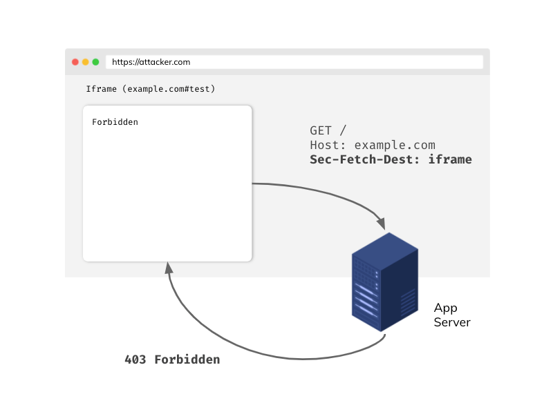
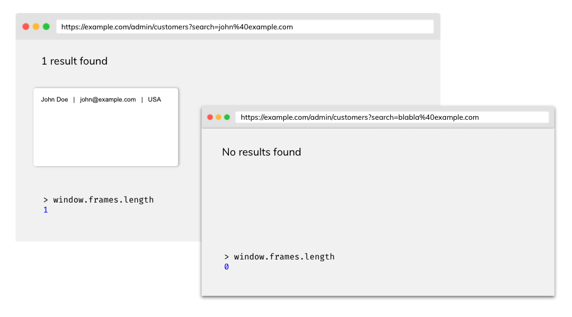

# Cross-site leaks Cheat Sheet

## Introduction

This article describes examples of attacks and defenses against cross-site leaks vulnerability (XS Leaks). Since this vulnerability is based on the core mechanism of modern web browsers, it's also called a browser side-channel attack. XS-Leaks attacks seek to exploit the fact of seemingly insignificant information that is exchanged in cross-site communications between sites. This information infers answers to the previously asked questions about the victim's user account. Please take a look at the examples provided below:

- Is the user currently logged in?
- Is the user ID 1337?
- Is the user an administrator?
- Does the user have a person with a particular email address in their contact list?

On the basis of such questions, the attacker might try to deduce the answers, depending on the application's context. In most cases, the answers will be in binary form (yes or no). The impact of this vulnerability depends strongly on the application's risk profile. Despite this, XS Leaks may pose a real threat to user privacy and anonymity.

## Attack vector


- The entire attack takes place on the victim's browser side - just like an XSS attack
- In some cases, the victim must remain on the attacker's site longer for the attack to succeed.

## Same Origin Policy (SOP)

Before describing attacks, it's good to understand one of the most critical security mechanisms in browsers - The Same-origin Policy. A few key aspects:

- Two URLs are considered as **same-origin** if their **protocol**, **port**, and **host** are the same
- Any origin can send a request to another source, but due to the Same-origin Policy, they will not be able to read the response directly
- Same Origin Policy may be relaxed by [Cross Origin Resource Sharing (CORS)](https://developer.mozilla.org/en-US/docs/Web/HTTP/CORS).

| Origin A              | Origin B                  | Same origin?                   |
| -------------         | -------------             | -------------                  |
| `https://example.com` | `http://sub.example.com`  | No, different hosts             |
| `https://example.com` | `https://example.com:443` | Yes! Implicit port in Origin A |

Although the SOP principle protects us from accessing information in cross-origin communication, XS-Leaks attacks based on residual data can infer some information.

## SameSite Cookies

The SameSite attribute of a cookie tells the browser whether it should include the cookie in the request from the other site. The SameSite attribute takes the following values:

- `None` -  the cookie will be attached to a request from another site, but it must be sent over a secure HTTPS channel
- `Lax` - the cookie will be appended to the request from another page if the request method is GET and the request is made to top-level navigation (i.e. the navigation changes the address in the browser top bar)
- `Strict` - the cookie will never be sent from another site

It is worth mentioning here the attitude of Chromium based browsers in which cookies without SameSite attribute set by default are treated as Lax.

SameSite cookies are a strong **defense-in-depth** mechanism against **some** classes of XS Leaks and [CSRF attacks](https://cheatsheetseries.owasp.org/cheatsheets/Cross-Site_Request_Forgery_Prevention_Cheat_Sheet.html), which can significantly reduce the attack surface, but may not completely cut them (see, e.g., [window-based XS Leak](https://soheilkhodayari.github.io/same-site-wiki/docs/attacks/xs-leaks.html) attacks like [frame counting](https://xsleaks.dev/docs/attacks/frame-counting/) and [navigation](https://xsleaks.dev/docs/attacks/navigations/)).

### How do we know that two sites are SameSite?


In the context of the SameSite attribute, we consider the site to be the combination of the TLD (top-level domain) and the domain name before it. For example:

| Full URL                                      | Site (eTLD+1)             |
| --------------------------------------------  | ------------------------  |
| `https://example.com:443/data?query=test`     | `example.com`             |

Why are we talking about eTLD+1 and not just TLD+1? It's because of domains like `.github.io` or `.eu.org`. Such parts are not atomic enough to be compared well. For this reason, a list of "effective" TLDs (eTLDs) was created and can be found [here](https://publicsuffix.org/list/public_suffix_list.dat).

Sites that have the same eTLD+1 are considered SameSite, examples:

| Origin A                  | Origin B                   | SameSite?                    |
| ------------------------- | -------------------------- | ---------------------        |
| `https://example.com`     | `http://example.com`       | Yes, schemes don't matter    |
| `https://evil.net`        | `https://example.com`      | No, different eTLD+1          |
| `https://sub.example.com` | `https://data.example.com` | Yes, subdomains don't matter |

For more information about SameSite, see the excellent article [Understanding "same-site"](https://web.dev/same-site-same-origin/).

## Attacks using the element ID attribute

Elements in the DOM can have an ID attribute that is unique within the document. For example:

```html
<button id="pro">Pro account</button>
```

The browser will automatically focus on an element with a given ID if we append a hash to the URL, e.g. `https://example.com#pro`. What's more, the JavaScript [focus event](https://developer.mozilla.org/en-US/docs/Web/API/Element/focus_event) gets fired. The attacker may try to embed the application in the iframe with specific source on its own controlled page:


then add listener in main document for [blur event](https://developer.mozilla.org/en-US/docs/Web/API/Element/blur_event) (the opposite of focus). When the victim visits the attackers site, the blur event gets fired. The attacker will be able to conclude that the victim has a pro account.

### Defense

#### Framing protection

If you don't need other origins to embed your application in a frame, you can consider using one of two mechanisms:

- **Content Security Policy frame ancestors** directive. [Read more about syntax](https://developer.mozilla.org/en-US/docs/Web/HTTP/Headers/Content-Security-Policy/frame-src).
- **X-Frame-Options**  - mainly if you want to support old browsers.

Setting up framing protection efficiently blocks the ability to embed your application in a frame on the attacker-controlled origin and protects from other attacks like [Clickjacking](https://cheatsheetseries.owasp.org/cheatsheets/Clickjacking_Defense_Cheat_Sheet.html).

#### Fetch metadata (Sec-Fetch-Dest)

Sec-Fetch-Dest header provides us with a piece of information about what is the end goal of the request. This header is included automatically by the browser and is one of the headers within the Fetch Metadata standard.

With Sec-Fetch-Dest you can build effective own resource isolation policies, for example:

```javascript
app.get('/', (req, res) => {
    if (req.get('Sec-Fetch-Dest') === 'iframe') {
        return res.sendStatus(403);
    }
    res.send({
        message: 'Hello!'
    });
});
```



If you want to use headers from the Fetch Metadata standard, make sure that your users' browsers support this standard (you can check it [here](https://caniuse.com/?search=sec-fetch)). Also, think about using the appropriate fallback in code if the Sec-Fetch-* header is not included in the request.

## Attacks based on error events

Embedding from resources from other origins is generally allowed. For example, you can embed an image from another origin or even script on your page. What is not permitted is reading cross-origin resource due the SOP policy.

When the browser sends a request for a resource, the server processes the request and decides on the response e.g. (200 OK or 404 NOT FOUND). The browser receives the HTTP response and based on that, the appropriate JavaScript event is fired (onload or onerror).

In this way, we can try to load resources and, based on the response status, infer whether they exist or not in the context of the logged-in victim. Let's look at the following situation:

- `GET /api/user/1234` - 200 OK - currently logged-in user is 1234 because we successfully loaded resource ([onload](https://developer.mozilla.org/en-US/docs/Web/API/GlobalEventHandlers/onload) event fired)
- `GET /api/user/1235` - 401 Unauthorized  - 1235 is not the ID of the currently logged in user ([onerror](https://developer.mozilla.org/en-US/docs/Web/API/GlobalEventHandlers/onerror) event will be triggered)

Given the above example, an attacker can use JavaScript on his controlled origin to guess the victim's ID by enumerating over all the values in a simple loop.

```javascript
function checkId(id) {
    const script = document.createElement('script');
    script.src = `https://example.com/api/users/${id}`;
    script.onload = () => {
        console.log(`Logged user id: ${id}`);
    };
    document.body.appendChild(script);
}

// Generate array [0, 1, ..., 40]
const ids = Array(41)
    .fill()
    .map((_, i) => i + 0);

for (const id of ids) {
    checkId(id);
}
```

Note that the attacker here does not care about reading the response body even though it would not be able to due to solid isolation mechanisms in browsers such as [Cross-Origin Resource Blocking](https://www.chromium.org/Home/chromium-security/corb-for-developers). All it needs is the success information it receives when the `onload` event fires.

### Defense

#### SubResource protection

In some cases, mechanism of special unique tokens may be implemented to protect our sensitive endpoints.

```
/api/users/1234?token=be930b8cfb5011eb9a030242ac130003
```

- Token should be long and unique
- The back-end must correctly validate the token passed in the request

Although it is pretty effective, the solution generates a significant overhead in proper implementation.

#### Fetch metadata (Sec-Fetch-Site)

This header specifies where the request was sent from, and it takes the following values:

- `cross-site`
- `same-origin`
- `same-site`
- `none` - user directly reached the page

Like Sec-Fetch-Dest, this header is automatically appended by the browser to each request and is part of the Fetch Metadata standard. Example usage:

```javascript
app.get('/api/users/:id', authorization, (req, res) => {
    if (req.get('Sec-Fetch-Site') === 'cross-site') {
        return res.sendStatus(403);
    }

    // ... more code

    return res.send({ id: 1234, name: 'John', role: 'admin' });
});
```

#### Cross-Origin-Resource-Policy (CORP)

If the server returns this header with the appropriate value, the browser will not load resources from our site or origin (even static images) in another application. Possible values:

- `same-site`
- `same-origin`
- `cross-origin`

Read more about CORP [here](https://resourcepolicy.fyi/).

## Attacks on postMessage communication

Sometimes in controlled situations we would like, despite SOP, to exchange information between different origins. We can use the postMessage mechanism. See below example:

```javascript
// Origin: http://example.com
const site = new URLSearchParams(window.location.search).get('site'); // https://evil.com
const popup = window.open(site);
popup.postMessage('secret message!', '*');

// Origin: https://evil.com
window.addEventListener('message', e => {
    alert(e.data) // secret message! - leak
});
```

### Defense

#### Specify strict targetOrigin

To avoid situations like the one above, where an attacker manages to get the reference for a window to receive a message, always specify the exact `targetOrigin` in postMessage. Passing to the `targetOrigin` wildcard `*` causes any origin to receive the message.

```javascript
// Origin: http://example.com
const site = new URLSearchParams(window.location.search).get('site'); // https://evil.com
const popup = window.open(site);
popup.postMessage('secret message!', 'https://sub.example.com');

// Origin: https://evil.com
window.addEventListener('message', e => {
    alert(e.data) // no data!
});
```

## Frame counting attacks

Information about the number of loaded frames in a window can be a source of leakage. Take for example an application that loads search results into a frame, if the results are empty then the frame does not appear.



An attacker can get information about the number of loaded frames in a window by counting the number of frames in a `window.frames` object.

So finally, an attacker can obtain the email list and, in a simple loop, open subsequent windows and count the number of frames. If the number of frames in the opened window is equal to 1, the email is in the client's database of the application used by the victim.

### Defense

#### Cross-Origin-Opener-Policy (COOP)

Setting this header will prevent cross-origin documents from opening in the same browsing context group. This solution ensures that document A opening another document will not have access to the `window` object. Possible values:

- `unsafe-none`
- `same-origin-allow-popups`
- `same-origin`

In case the server returns for example `same-origin` COOP header, the attack fails:

```javascript
const win = window.open('https://example.com/admin/customers?search=john%40example.com');
console.log(win.frames.length) // Cannot read property 'length' of null
```

## Attacks using browser cache

Browser cache helps to significantly reduce the time it takes for a page to load when revisited. However, it can also pose a risk of information leakage. If an attacker is able to detect whether a resource was loaded from the cache after the load time, he will be able to draw some conclusions based on it.

The principle is simple, a resource loaded from cache memory will load incomparably faster than from the server.


An attacker can embed a resource on their site that is only accessible to a user with the admin role. Then, using JavaScript, read the load time of a particular resource and, based on this information, deduce whether the resource is in cache or not.

```javascript
    // Threshold above which we consider a resource to have loaded from the server
    // const THRESHOLD = ...

    const adminImagePerfEntry = window.performance
        .getEntries()
        .filter((entry) => entry.name.endsWith('admin.svg'));

    if (adminImagePerfEntry.duration < THRESHOLD) {
        console.log('Image loaded from cache!')
    }
```

### Defense

#### Unpredictable tokens for images

This technique is accurate when the user wants the resources to still be cached, while an attacker will not be able to find out about it.

```
/avatars/admin.svg?token=be930b8cfb5011eb9a030242ac130003
```

- Tokens should be unique in context of each user
- If an attacker cannot guess this token, it will not be able to detect whether the resource was loaded from cache

#### Using the Cache-Control header

You can disable the cache mechanism if you accept the degraded performance related to the necessity of reloading resources from the server every time a user visits the site. To disable caching for resources you want to protect, set the response header `Cache-Control: no-store`.

## Quick recommendations

- If your application uses cookies, make sure to set the appropriate [SameSite attribute](#samesite-cookies).
- Think about whether you really want to allow your application to be embedded in frames. If not, consider using the mechanisms described in the [framing protection](#framing-protection) section.
- To strengthen the isolation of your application between other origins, use [Cross Origin Resource Policy](#cross-origin-resource-policy-corp) and [Cross Origin Opener Policy](#cross-origin-opener-policy-coop) headers with appropriate values.
- Use the headers available within Fetch Metadata to build your own resource isolation policy.

## References

### XS Leaks

- [XS Leaks Wiki](https://xsleaks.dev/)
- [XS Leaks Attacks & Prevention](https://www.appsecmonkey.com/blog/xs-leaks)

### Fetch Metadata

- [Fetch Metadata and Isolation Policies](https://www.appsecmonkey.com/blog/fetch-metadata)
- [Protect your resources from attacks with Fetch Metadata](https://web.dev/fetch-metadata/)

### Framing protection

- [Preventing framing with policies](https://pragmaticwebsecurity.com/articles/securitypolicies/preventing-framing-with-policies.html)
- [CSP 'frame-ancestors' policy](https://content-security-policy.com/frame-ancestors/)

### SameSite

- [SameSite cookies explained](https://web.dev/samesite-cookies-explained/)
- [SameSite cookies recipes](https://web.dev/samesite-cookie-recipes/)

### COOP and CORP header

- [Making your site "cross-origin isolated"](https://web.dev/coop-coep/)
- [MDN Web Docs about CORP](https://developer.mozilla.org/en-US/docs/Web/HTTP/Cross-Origin_Resource_Policy_%28CORP%29)
