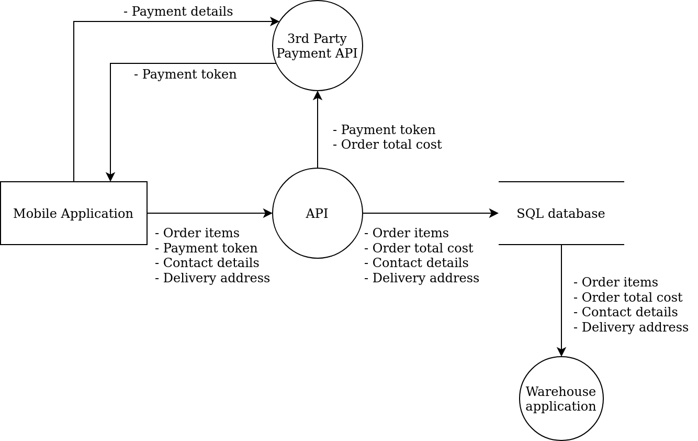

# Threat Modeling Cheat Sheet

## Introduction

Threat Modeling is a team activity, facilitated by one or two people, whereby sections of a system or process are laid out in front of the team and are reviewed for potential security vulnerabilities.

TODO, why should I care, what is the output etc.

## Getting started

Threat modeling can be done at any time, however, the most fitting time to threat model a system or process is just after the design phase. Threat modeling after the design phase will both help to highlight potential vulnerabilities and inform the necessary countermeasures, all before a line of code is written.

Threat modeling can also be performed retrospectively on existing systems or processes to help identify current vulnerabilities.

It can be useful at this point to split your entire system or entire process into key domain areas, for example: authorization flow, user management, account management, and order management. These domain areas should be vertical slices through the system. Threat modeling each of these domain areas individually will help you and the team focus your attention on the data flowing through a given area and at which key points in the system data is validated, updated, stored, returned, and deleted.

TODO image showing different parts of an example domain split up?
TODO who is needed

### Agree on the scope

Before anything else, you must agree with the team on what should be threat modeled and what shouldn't be threat modeled. Although potentially interesting it may not be beneficial to spend time threat modeling parts of a system you have little control over. The scope of a threat model impacts how long the threat modeling session runs for: the larger the scope, the longer the session.

### Visualize the system

Once you have a good idea about which part of the wider system or wider process you're going to threat model, and what is in scope and out of scope, you're ready to diagram it.

Spending the time to diagram what you're going to threat model will provide you with a piece of documentation that can be used as a tangible discussion point by the team. Diagraming as a team will help team members understand which types of data are present in the system, and how data flows through the system. Having a clear diagram to guide and inform discussions can help keep the conversations and questions relevant.

System diagrams (for threat modeling) don't have to be elegant. Diagrams that are created using a whiteboard and dry marker, or pen and paper, are more than enough to facilitate a threat modeling session. Making a digital copy of these diagrams after the session is beneficial as digital copies are easier to keep up to date. If team members are separated and are working from different locations, online whiteboarding or diagramming tools may be used.

System diagrams drawn as part of a threat model should be kept fairly high level, concerned more with components and context, and less concerned with exact implementations. It is very easy to become bogged down in the smaller details. You may also have less experienced members of the team present, so drawing high-level diagrams will make it easier for them to contribute.

[C4](https://c4model.com/) is a model that defines a set of patterns for documenting system architectures clearly and consistently. The different levels of C4 diagrams [can be seen here](https://c4model.com/#CoreDiagrams). Generally, Level 2 diagrams provide enough detail for threat modeling.

TODO example C4

[Data-flow diagrams](https://en.wikipedia.org/wiki/Data-flow_diagram) are less prescriptive than C4 diagrams but are effective at communicating how data flows through a given system or process. The connections between components in data-flow diagrams can serve to be excellent discussion points.

### Identify threats

After diagraming the system or process, and agreeing on the scope of the threat model, you may begin identifying potential threats. This part of the threat modeling process is mostly informal, where the team openly discusses what might go wrong, focusing less on potential mitigations and more on threats, at this stage.

To keep the session flowing and relevant it is beneficial to use a well known (and well used) framework. [STRIDE](https://www.microsoft.com/security/blog/2007/09/11/stride-chart/) is one such framework, and also a clever mnemonic: **S**poofing, **T**ampering, **R**epudiation, **I**nformation disclosure, **D**enial of service, and **E**levation of privilege. As a team, step through and discuss each component in the diagram, and its connections to other components, using STRIDE as a prompt:

- (S) "Could someone spoof the connection between these components?"
- (T) "Could an attacker tamper with this component?"
- (R) "How would we know if this component was compromised?"
- (I) "This component handles highly sensitive data. Does it reveal too much information?"
- (D) "What happens if this component is overloaded with requests?"
- (E) "Are the access controls for this component too permissive?"

Another framework, that is more privacy-focused, is [LINDDUN](https://www.linddun.org/), which is also a mnemonic: **L**inkability, **I**dentifiability, **N**on-repudiation, **D**etectability, **D**isclosure of information, **U**nawareness, and **N**on-compliance.

Choosing a framework will depend on the types of systems you build and maintain. If team members are unfamiliar with threat modeling it is beneficial to use the same framework for the first few threat modeling sessions, so that team members can become familiar with the threat modeling process. Improvements can be made to the threat modeling process once it has been established within the team.

It may help to think like an attacker during this activity, imagining that you are tasked with breaking the system or process in some way, or extracting data unlawfully: how would you do it? The team should be open to all ideas put forward by members and should not disregard ideas without consideration. This section of the threat model process requires "out of the box" thinking and, as such, it is crucial to have a range of backgrounds and abilities present in the team. If the team begins to struggle ask an SME (subject matter expert) to explain a scenario and follow the flow through the diagram.

A nominated person should take notes during discussions, noting down the type of threat (e.g. spoofing, tampering, etc.) and a short description of the threat. These notes will be used in the next section of the threat modeling process, where threats are scored based on risk and fixes are prioritized.

### Document and share the results

As the threat modeling session comes to an end and discussions start to close, ensure that you have complete and clear notes, writing down anything that you may have missed. The next step is to formalise the risks identified and score them accordingly, so they can be reviewed and prioritized by the team.

TODO scoring, review each threat identified etc.

Where you document, store the identified threats, and how you prioritize the work required will very much depend on how work is currently managed. It might be that threats are stored as individual tickets in your backlog, or it might be that threats are stored in a separate risk log. Wherever you decide to store the identified threats, it's important to communicate where they are located to your team and review them during planning and prioritization sessions. To help with prioritization it may be useful to briefly outline the work required to fix or mitigate each threat: is it a small change to a configuration file, or do large parts of the system or process need to be restructured?
